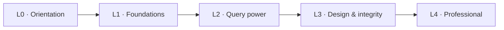

# MySQL Course — from first query to production habits


## About this course

A hands-on MySQL course — one purpose-built `shopdb`, runnable examples, exercises with solutions, L0→L4, Docker + CLI. Every concept is explained, every example runnable, every exercise solved; the original 17-class live teaching has been healed into a self-study edition.

> This site is not affiliated with MySQL or Oracle. See [NOTICE.md](NOTICE.md).

## Quickstart

```bash
make setup          # pull Docker Compose config, create network
make up             # start shopdb container
make seed           # apply schema + deterministic seed data
```

Or without `make`:

```bash
python dbctl.py setup   # docker compose config
python dbctl.py up      # start containers
python dbctl.py seed    # apply SQL
```

## Course map



## Module index

| # | Module | Level | You will learn |
|---|--------|-------|----------------|
| 00 | Orientation & Setup | L0 | relational model; install MySQL via Docker; connect from CLI/Workbench; databases, users, first query |
| 01 | Creating Tables (DDL) | L1 | `CREATE/ALTER/DROP/TRUNCATE`; column types; `DESCRIBE` |
| 02 | Loading Data | L1 | `INSERT`; `LOAD DATA`; CSV/source; idempotent seed scripts |
| 03 | Querying: SELECT, Filter, Sort | L1 | `SELECT`, `WHERE`, comparison/logic, `LIKE`/`IN`/`BETWEEN`, `ORDER BY`, `LIMIT` |
| 04 | Changing Data & NULLs | L1 | `UPDATE`/`DELETE`; NULL semantics; three-valued logic |
| 05 | Aggregation & Grouping | L2 | `COUNT/SUM/AVG/MIN/MAX`; `GROUP BY`; `HAVING` |
| 06 | Joins | L2 | inner/left/right; anti-joins; cross; self; `INSERT … SELECT` |
| 07 | Subqueries, CTEs & Window Functions | L2 | scalar/`IN`/`EXISTS`; `WITH`; window functions |
| 08 | Built-in Functions | L2 | string, numeric, date/time; `NULL`/`COALESCE`; `CASE` |
| 09 | Data Types & Precision | L1–L2 | numeric/string/date/JSON/`ENUM`; choosing types |
| 10 | Data Modeling & Normalization | L3 | entities/relationships, ER diagrams, 1NF/2NF/3NF |
| 11 | Keys, Constraints & Relationships | L3 | PK/FK; `ON DELETE/UPDATE` actions; `information_schema` |
| 12 | Indexes & Views | L3 | index types; covering/`EXPLAIN`; views |
| 13 | Transactions & Concurrency | L3 | ACID; `START TRANSACTION`/`COMMIT`/`ROLLBACK`; isolation levels |
| 14 | Stored Programs & Triggers | L4 | procedures, functions, triggers, events |
| 15 | Users, Privileges & Security | L4 | accounts, `GRANT`/`REVOKE`, roles; SQL injection |
| 16 | Performance & Query Tuning | L4 | reading `EXPLAIN`, index strategy, avoiding N+1 |
| 17 | Backup & Recovery | L4 | `mysqldump`/`mysqlpump`; physical backup; restore drill; point-in-time recovery |
| 18 | Server Administration & Operations | L4 | `my.cnf`; logs; monitoring; maintenance; storage engines; upgrades |
| 19 | Replication & High Availability | L4 | primary/replica; GTID; async vs semi-sync; read replicas; failover basics |
| 20 | MySQL from Applications | L4 | connecting from Python; pooled access; safe parameterized queries |
| 21 | Capstone | L4 | design → seed → query → optimize → secure → back up a small system |

## Documentation map

Start with the guide you need:

| Resource | What it contains |
|----------|-----------------|
| [docs/GETTING_STARTED.md](docs/GETTING_STARTED.md) | Set up Docker + Python, seed the database, run your first example, troubleshooting |
| [docs/STRUCTURE.md](docs/STRUCTURE.md) | How the repository is laid out |
| [docs/FILE_CATALOG.md](docs/FILE_CATALOG.md) | A one-line description of every file |
| [docs/DATASETS.md](docs/DATASETS.md) | The `shopdb` schema, seed counts and practice datasets |
| [docs/GLOSSARY.md](docs/GLOSSARY.md) | The vocabulary used across the course |
| [docs/STUDY_GUIDE.md](docs/STUDY_GUIDE.md) | How to study effectively |
| [SYLLABUS.md](SYLLABUS.md) | Full module syllabus with levels and prerequisites |
| [LEARNING_PATH.md](LEARNING_PATH.md) | Suggested study routes |
| [modules/](modules/) | The 22 modules |
| [docs/reference/legacy/](docs/reference/legacy/) | Sanitised original class transcripts (17 classes) |
| [NOTICE.md](NOTICE.md) | Attribution and third-party credits |
| [LICENSE](LICENSE) | MIT License terms |

## How to run an example

```bash
make sql FILE=modules/NN-slug/examples/01-x.sql   # or python dbctl.py sql --file ...
```

## License

MIT — see [LICENSE](LICENSE).
