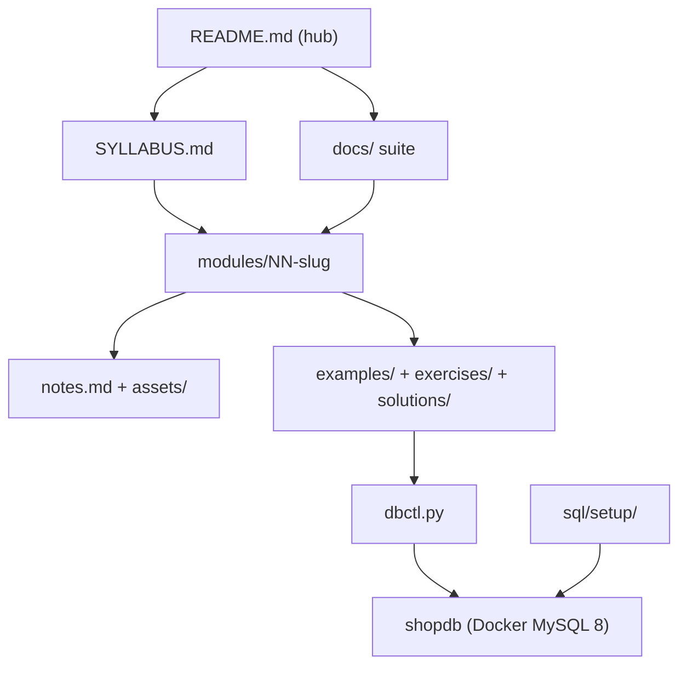

# Repository structure

A map of the repository: what lives where, and how the parts fit together.

## Directory tree

```text
mysql_class/
├── README.md                       # hub: course overview + module index
├── SYLLABUS.md                     # the 22-module syllabus
├── LEARNING_PATH.md                # suggested study routes
├── NOTICE.md                       # attribution + non-affiliation
├── LICENSE                         # MIT
├── Makefile                        # thin wrapper over dbctl.py
├── dbctl.py                        # stdlib-only CLI (setup/up/seed/reset/sql/examples/verify)
├── docker-compose.yml              # MySQL 8, host port 3310
├── mkdocs.yml                      # optional MkDocs Material site
│
├── modules/                        # the 22 course modules (00 … 21)
│   ├── README.md                   # module index
│   └── NN-slug/
│       ├── README.md               # module overview + how to run
│       ├── notes.md                # teaching notes + worked example
│       ├── checklist.md            # self-check items
│       ├── assets/                 # one-page memory aid (Mermaid)
│       ├── examples/01-*.sql       # runnable, net-neutral
│       ├── exercises/README.md     # practice tasks
│       └── solutions/01-*.sql      # worked answers
│
├── sql/setup/                      # schema + deterministic seed
│   ├── 00-schema.sql
│   └── 10-seed.sql
├── scripts/legacy_to_md.py         # legacy transcript → Markdown converter
├── data/dummy_data/                # the owner's synthetic source CSVs
├── assets/models/shopdb-model.mwb  # MySQL Workbench ER model
└── docs/
    ├── README.md                   # documentation hub
    ├── GETTING_STARTED.md          # set up and run
    ├── STRUCTURE.md                # this file
    ├── FILE_CATALOG.md             # every file, one line each
    ├── DATASETS.md                 # shopdb schema + practice datasets
    ├── GLOSSARY.md                 # vocabulary
    ├── STUDY_GUIDE.md              # how to study
    └── reference/legacy/           # sanitised original class transcripts
```

## How the parts fit



## The layers

| Layer | Where | Purpose |
|---|---|---|
| **Entry** | `README.md`, `SYLLABUS.md`, `LEARNING_PATH.md` | orient the reader and map the course |
| **Teaching** | `modules/NN-slug/` | one module per topic: notes, examples, exercises, solutions |
| **Infrastructure** | `dbctl.py`, `Makefile`, `docker-compose.yml`, `sql/setup/` | one reproducible `shopdb` |
| **Documentation** | `docs/` | setup, structure, catalogs, glossary, study guide |
| **Source material** | `docs/reference/legacy/`, `data/`, `assets/` | the original transcripts and datasets the course was built from |

## Conventions

- **Markdown is the source of truth**; result tables are real captured output rendered as GitHub-flavoured
  Markdown (never ASCII art).
- **Every SQL block is multi-line**, one clause per line.
- **Examples are net-neutral**: they drop what they create, so `shopdb` always returns to its 10-table
  baseline. `python dbctl.py examples` enforces this.
- **No external URLs** inside module content; links point at files in this repository.

See [FILE_CATALOG.md](FILE_CATALOG.md) for the full file inventory.
