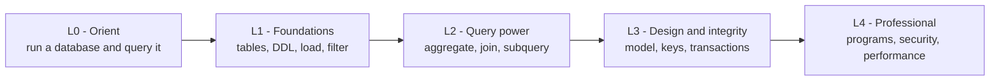

# Module 00 — Course map

This is the shape of the whole course. You are starting at **L0**. Each level builds on the one
before it, so a query you learn at L1 is still used at L4.

**You are here:** L0. Later modules will fill in each node with runnable examples against `shopdb`.
