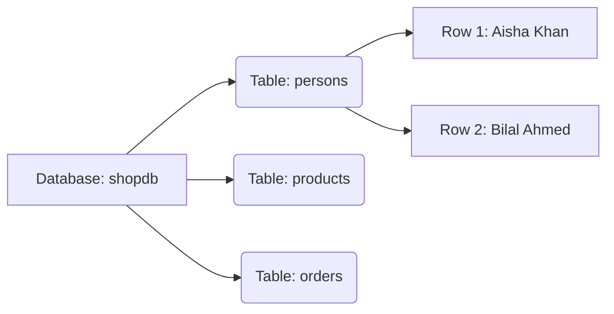

# Module 00 — Your First Queries · Notes

> Run the commands as you read. The worked example is the same one the checklist asks you to repeat.

## 1. Why this matters

Imagine it's a slow Tuesday afternoon at your favourite café. Aisha slides into her usual corner table, orders her usual flat white, and pulls out her phone. "Still no word from the shop?" she mutters. Bilal leans over: "I asked three times already." Chen, who works in tech, rolls his eyes: "You could just query the database." Dana laughs: "That's what I told my boss for years—until he actually believed me."

This module is your first step into speaking that language fluently.

## 2. The concept

A **database** is like a digital filing cabinet. A **table** is a drawer with labelled rows and columns. **MySQL** is the librarian who knows exactly where every file lives.



**Vocabulary:** `database` — a collection of related tables · `table` — a structured set of rows and columns · `row` — a single record in a table · `column` — a field with consistent data type.

> 🎯 Goal: Understand that MySQL is the tool that lets you ask questions about your data.

## 3. Worked example (do this)

Open your terminal and run these commands exactly as shown:

```bash
make up
```

Wait for MySQL to start, then:

```bash
make seed
```

Now query the database:

```bash
make sql FILE=modules/00-orientation-and-setup/examples/01-first-queries.sql
```

You should see exactly this output:

**What's running?**

```text
| Version() |
|-----------|
| 8.4.11    |
```

**Which databases exist?**

```text
| Database             |
|----------------------|
| information_schema   |
| performance_schema   |
| shopdb               |
```

**What tables are in our café database?**

```text
| Tables_in_shopdb      |
|-----------------------|
| addresses             |
| categories            |
| customers             |
| employees             |
| order_items           |
| orders                |
| payments              |
| persons               |
| products              |
| stores                |
```

**What does the `persons` table look like?**

```text
| Field         | Type        | Null  | Key  | Default       | Extra             |
|---------------|-------------|-------|------|---------------|-------------------|
| person_id     | int         | NO    | PRI  | NULL          | auto_increment    |
| first_name    | varchar(50) | NO    |      |               |                   |
| last_name     | varchar(50) | NO    |      |               |                   |
| dob           | date        | YES   |      | NULL          |                   |
| gender        | enum(...)   | YES   |      | NULL          |                   |
| email         | varchar(120)| NO    | UNI  | NULL          |                   |
| phone         | varchar(30) | YES   |      | NULL          |                   |
| created_at    | timestamp   | NO    |      | CURRENT_TIMESTAMP | DEFAULT_GENERATED |
```

**How many people do we know?**

```text
| COUNT(*) |
|----------|
| 12       |
```

**Who are our first five regulars?**

```text
| first_name | last_name   |
|------------|-------------|
| Aisha      | Khan        |
| Bilal      | Ahmed       |
| Chen       | Wei         |
| Dana       | Ortiz       |
| Emeka      | Okafor      |
```

> ⚠️ Gotcha: Don't skip the `make seed` step — without it, the tables will be empty and your queries return nothing.

## 4. How it works

Each command does one thing:
- `VERSION()` — asks the librarian "what edition are you?"
- `SHOW DATABASES` — lists all filing cabinets
- `SHOW TABLES` — opens our café cabinet and shows its drawers
- `DESCRIBE persons` — looks inside the persons drawer to see column labels and rules
- `SELECT COUNT(*) FROM persons` — counts every row (like tally marks)
- `SELECT first_name, last_name ... ORDER BY person_id LIMIT 5` — grabs specific columns, sorted by ID, only five rows

**The one insight:** MySQL executes commands sequentially. Each result is independent. You don't need to "remember" previous queries.

> 💡 Aha: SQL doesn't modify data unless you explicitly tell it to with UPDATE or DELETE — SELECT is always safe.

## 5. Common errors & fixes

| Symptom | Cause | Fix |
|---------|-------|-----|
| `ERROR 1044 (42000) at line 1: Access denied for user 'shop'@'%' to database 'no_such_db'` | You queried a database that doesn't exist (or you lack access). | Check the name with `SHOW DATABASES;` and use the seeded `shopdb`. |
| `ERROR 1146 (42S02) at line 1: Table 'shopdb.no_such_table' doesn't exist` | The table name is misspelled, or the table was never created. | List tables with `SHOW TABLES;` and copy the exact name. |
| `ERROR 1064 (42000) at line 1: You have an error in your SQL syntax; ... near 'SELCT 1' at line 1` | A typo — you wrote `SELCT` instead of `SELECT`. | Proofread the statement; MySQL points at the first token it can't parse. |

> 🧪 Try it: Introduce a deliberate typo (like `SELCT`) into one of the queries and read the error MySQL returns — it points at exactly where it got confused.

## 6. Try it yourself

Go to `exercises/` and work through the tasks there. Success means you can run queries on `shopdb` without help and read the results confidently.

## 7. Going deeper (L3/L4)

**Edge case:** What if two people have the same name? The `person_id` column is our unique identifier — it's like a customer loyalty card number, not just a name tag.

**Performance note:** `ORDER BY person_id LIMIT 5` is fast because IDs are stored sequentially. If you ordered by `last_name`, MySQL would need to scan and sort all 12 rows first.

**Real systems:** In production, tables can have millions of rows. The same commands work — just slower. That's why we learn indexing later (Module 04).

## References

- [MySQL 8.4 Documentation](https://dev.mysql.com/doc/) · [`../../README.md`](../../README.md) · [`../../SYLLABUS.md`](../../SYLLABUS.md)
