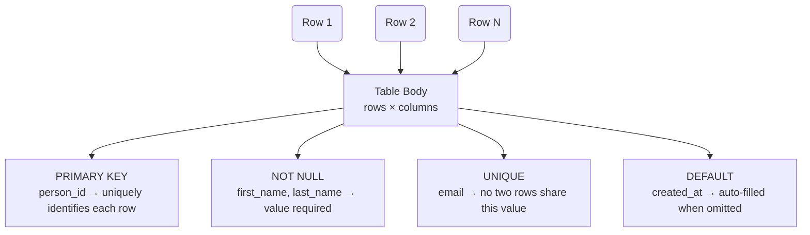

# Table Anatomy

A table is organized as **rows** (records) and **columns** (fields). The schema defines the column structure, while constraints enforce rules on how data can be stored in each column.

### Legend

| Constraint | What it does |
|------------|-------------|
| **PRIMARY KEY** | Uniquely identifies each row in the table (e.g., `person_id`). No two rows can share this value, and every row must have one. |
| **NOT NULL** | A column cannot contain empty values; a record is incomplete without it (e.g., `first_name`, `last_name`). |
| **UNIQUE** | Prevents duplicate entries across all rows in the table (e.g., `email` — no two people can have the same email). |
| **DEFAULT** | Supplies an automatic value when you omit that column during insert (e.g., `created_at` gets a timestamp by default). |
