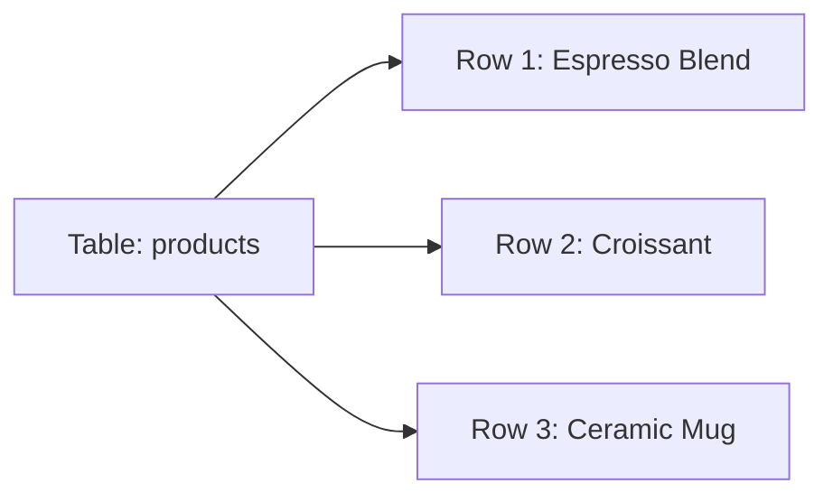

# Module 01 — Creating Tables (DDL) · Notes

> Run the commands as you read. The worked example is the same one the checklist asks you to repeat.

## 1. Why this matters

Aisha always orders a double espresso, but she doesn't like surprises. She wants her order logged every time — no more "Did we get your name right?" or "Is that the house roast today?"

Bilal runs the café. He needs to know at a glance: who's our regulars list, what's in stock, and when did each product launch?

You're about to build the foundation — a table where every espresso blend, croissant, and ceramic mug lives with its own story.

## 2. The concept

A **table** is just a container for rows of data. Each row has columns (fields) that define what kind of information it holds.



**Vocabulary:** `DDL` — Data Definition Language (commands that create, alter, or drop tables) · `schema` — the blueprint of your table's columns and types · `primary key` — a unique identifier for each row · `constraint` — a rule that data must follow (like "this column can't be empty")

## 3. Worked example (do this)

**Starting state:** The `shopdb` database exists with exactly 10 tables.

**Goal:** Create a new table called `practice_products`, inspect it, modify it, then clean up so we end where we started.

```sql
DROP TABLE IF EXISTS practice_products;
```

> 🧪 Try it: Run this first. It safely removes the table if it exists — no error either way.

```sql
CREATE TABLE practice_products (
  id            INT AUTO_INCREMENT PRIMARY KEY,
  sku           VARCHAR(20) NOT NULL UNIQUE,
  name          VARCHAR(80) NOT NULL,
  price         DECIMAL(10,2) NOT NULL DEFAULT 0.00,
  in_stock      BOOLEAN NOT NULL DEFAULT FALSE,
  created_at    TIMESTAMP NOT NULL DEFAULT CURRENT_TIMESTAMP
);
```

> 🎯 Goal: Create a table with an auto-incrementing ID, unique SKUs, decimal prices, and timestamps that record when each product was added.

```sql
DESCRIBE practice_products;
```

| Field   | Type           | Null  | Key     | Default         | Extra              |
|---------|----------------|-------|---------|-----------------|--------------------|
| id      | int            | NO    | PRI     | NULL            | auto_increment     |
| sku     | varchar(20)    | NO    | UNI     | NULL            |                    |
| name    | varchar(80)    | NO    |         |                 |                    |
| price   | decimal(10,2)  | NO    |         | 0.00            |                    |
| in_stock| tinyint(1)     | NO    |         | 0               |                    |
| created_at| timestamp    | NO    |         | CURRENT_TIMESTAMP| DEFAULT_GENERATED  |

```sql
SHOW CREATE TABLE practice_products;
```

```text
CREATE TABLE `practice_products` (
  `id` int NOT NULL AUTO_INCREMENT,
  `sku` varchar(20) NOT NULL,
  `name` varchar(80) NOT NULL,
  `price` decimal(10,2) NOT NULL DEFAULT '0.00',
  `in_stock` tinyint(1) NOT NULL DEFAULT '0',
  `created_at` timestamp NOT NULL DEFAULT CURRENT_TIMESTAMP,
  PRIMARY KEY (`id`),
  UNIQUE KEY `sku` (`sku`)  
) ENGINE=InnoDB DEFAULT CHARSET=utf8mb4 COLLATE=utf8mb4_0900_ai_ci
```

> 💡 Aha: The `ENGINE=InnoDB` line tells MySQL to use the most common storage engine. It supports transactions and foreign keys — perfect for a café that needs reliability.

Now let's add something new:

```sql
ALTER TABLE practice_products ADD COLUMN discontinued TINYINT(1) NOT NULL DEFAULT FALSE AFTER in_stock;
```

> ⚠️ Gotcha: If you forget `AFTER in_stock`, MySQL might put the column at the end. Be explicit about where it goes.

```sql
ALTER TABLE practice_products MODIFY COLUMN price DECIMAL(8,2) NOT NULL DEFAULT 0.00;
```

> 🎯 Goal: Shrink the price from `DECIMAL(10,2)` to `DECIMAL(8,2)` — still enough for any café product.

```sql
ALTER TABLE practice_products RENAME COLUMN discontinued TO is_discontinued;
```

```sql
DESCRIBE practice_products;
```

| Field        | Type           | Null  | Key     | Default         | Extra              |
|--------------|----------------|-------|---------|-----------------|--------------------|
| id           | int            | NO    | PRI     | NULL            | auto_increment     |
| sku          | varchar(20)    | NO    | UNI     | NULL            |                    |
| name         | varchar(80)    | NO    |         |                 |                    |
| price        | decimal(8,2)   | NO    |         | 0.00            |                    |
| in_stock     | tinyint(1)     | NO    |         | 0               |                    |
| is_discontinued| tinyint(1)  | NO    |         | 0               |                    |
| created_at   | timestamp      | NO    |         | CURRENT_TIMESTAMP| DEFAULT_GENERATED  |

```sql
DROP TABLE IF EXISTS practice_products;
```

```sql
SELECT COUNT(*) FROM information_schema.tables WHERE table_schema = 'shopdb';
```

| COUNT(*) |
|----------|
| 10       |

**Celebration:** You started with 10 tables, created one, modified it three times, and ended with exactly 10. That's net-neutral — you didn't leave any mess behind.

## 4. How it works

When you run `CREATE TABLE`, MySQL:

1. **Allocates space** for the new table in its data directory
2. **Writes the schema** (column names, types, constraints) to a metadata file
3. **Activates the primary key** — now every row must have a unique ID
4. **Enforces the UNIQUE constraint** on `sku` — no two products can share the same stock-keeping unit

The `AUTO_INCREMENT` keyword is magic: it means "give me the next number in sequence". For our first product, that's 1. For the second, 2. And so on.

> 💡 Aha: Think of `AUTO_INCREMENT` like a receipt counter at the café. You don't write numbers — you just hand in your order and get the next one automatically.

## 5. Common errors & fixes

| Symptom | Cause | Fix |
|---------|-------|-----|
| `ERROR 1050 (42S01) at line 1: Table 'practice_products' already exists` | You forgot to drop the table first, or ran the script twice without cleaning up. | Add `DROP TABLE IF EXISTS practice_products;` at the top of your script. |
| `ERROR 1060 (42S21) at line 1: Duplicate column name 'name'` | You tried to create a table with two columns named `name`. | Check your `CREATE TABLE` statement — each column needs a unique name. |
| `ERROR 1064 (42000) at line 1: You have an error in your SQL syntax... near 'SELCT 1'` | A typo like `SELCT` instead of `SELECT`. | Proofread carefully — MySQL is unforgiving of typos. |
| `ERROR 1146 (42S02) at line 1: Table 'shopdb.no_such_table' doesn't exist` | You tried to modify a table that was already dropped. | Double-check the table name, or recreate it first. |

## 6. Try it yourself

The exercises are in `exercises/`. Open `README.md` there and pick one challenge.

**Success looks like:**
- You can create a table with custom columns
- You can inspect its structure with `DESCRIBE`
- You know when to use `ALTER TABLE` vs. `CREATE TABLE`
- You clean up after yourself (always drop what you created)

## 7. Going deeper (L3/L4)

**Edge cases:**
- What happens if you try to insert a duplicate SKU? The UNIQUE constraint kicks in and rejects the row.
- Can you change a `PRIMARY KEY` later? Yes, but it's messy — best practice is to design your keys right from the start.
- `DROP TABLE` deletes the table **and** its structure; `TRUNCATE TABLE` empties every row but keeps the table and its columns — faster than a row-by-row `DELETE` because it doesn't log each row.

**Performance notes:**
- `AUTO_INCREMENT` columns are usually indexed automatically. This makes lookups fast.
- The `UNIQUE` constraint on `sku` creates an extra index — good for preventing duplicates, but slightly slower inserts.

**Real systems:**
In production cafés (or any business), tables grow beyond 10. You'll link them together with **foreign keys** — for example, the real `order_items` table references `products.product_id`. That's the focus of a later module.

## References

- [MySQL Data Definition Language](https://dev.mysql.com/doc/refman/8.0/en/data-definition-language.html)
- Next: **Module 02 — Loading Data** (inserting rows into your tables)
- Back to the syllabus: [`../../SYLLABUS.md`](../../SYLLABUS.md)