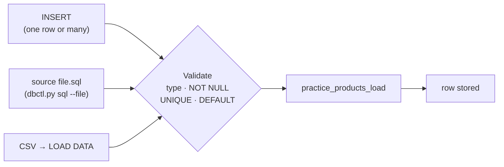

# Load Pipeline — How a Row Enters MySQL

A row enters a table through three routes: an `INSERT` statement, a `.sql` file run with `source` or `dbctl.py sql --file`, and a CSV file via `LOAD DATA`. Before any of them touches the table, every value passes through validation against the column's type and constraints.



### Sources — where the row comes from

Follow any of these nodes. An `INSERT` is a SQL command you type directly into the MySQL prompt or a Python script:

```sql
INSERT INTO practice_products_load (name, sku) VALUES ('Decaf','COF-003');
```

A `.sql` file is a batch — save your commands in a file and run it with `source file.sql` at the prompt or `python3 dbctl.py sql --file file.sql`. A CSV file gets imported with `LOAD DATA LOCAL INFILE '/path/to/file.csv' INTO table_name (columns);`.

### Validate — where errors are born

This is the stage that decides whether your row survives. MySQL checks each value against the column's type (`VARCHAR` can't become a number), then enforces every constraint: `NOT NULL` means you must supply a value or the column has its DEFAULT; `UNIQUE` rejects duplicates. If any check fails, the entire row is rejected — and that's where an [ERROR 1364](../notes.md) starts.

### Target table — where it ends up

Once validation passes, the row lands in your table's storage engine. The [idempotent seed pattern](../examples/01-insert-and-load.sql) uses `DROP TABLE IF EXISTS` so you can run scripts again without side effects — and that same pattern keeps `shopdb` at exactly 10 tables after every module ends.

### References

- Worked example: [`../examples/01-insert-and-load.sql`](../examples/01-insert-and-load.sql)
- Module notes: [`../notes.md`](../notes.md)
- Back to the syllabus: [`../../../SYLLABUS.md`](../../../SYLLABUS.md)