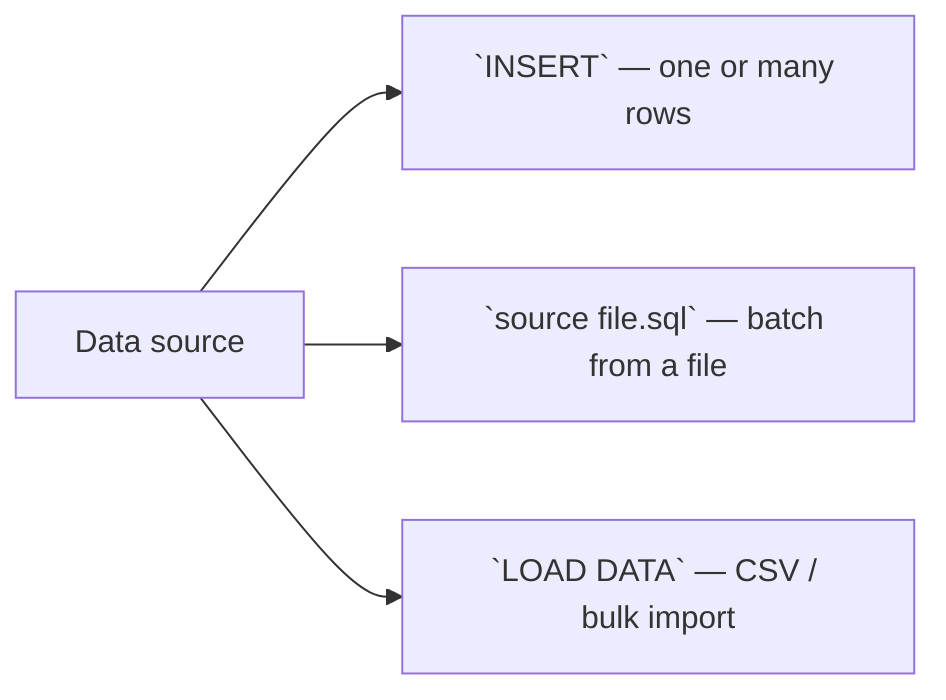

# Module 02 — Loading Data (L1) · Notes

> Run the commands as you read. The worked example is the same one the checklist asks you to repeat.

## 1. Why this matters

Aisha wants her espresso order logged every time she walks in at the café. Without a table, there's no way to look back and say "she ordered two blends last time." And Bilal needs that data to know which products are selling well — so he can stock more of them and drop the ones nobody buys.

You've built your tables (Module 01). Now you need to put data in them. A row is a record: one customer's order, one product's price, one employee's role. Data enters a table through three routes — `INSERT` for individual rows or batches, running a `.sql` file with `source` or `dbctl.py sql --file`, and `LOAD DATA` for CSV files. And the idempotent seed pattern (the script that truncates then re-inserts) lets you reset your database safely without losing your schema.

## 2. The concept

A **row** is a single record — one product, one order, one customer. Every row must fit every column's type and constraint. When it doesn't, MySQL rejects the whole row (it never leaves half-filled data in your table).

The three ways to put rows into a table:



**Vocabulary:** `INSERT` — the SQL command that adds one or more rows to a table · `AUTO_INCREMENT` — a column type that numbers each new row automatically (1, 2, 3…) · `DEFAULT` — a value MySQL uses when you omit a column in an INSERT · `idempotent seed` — a script that truncates then re-inserts data so it can be run again without error

## 3. Worked example (do this)

**Starting state:** The `shopdb` database exists with exactly 10 tables. No `practice_products_load` table yet.

**Goal:** Create the table, insert four rows using three different techniques, verify the output, then drop the table so we end where we started.

```sql
DROP TABLE IF EXISTS practice_products_load;

CREATE TABLE practice_products_load (
  product_id INT AUTO_INCREMENT PRIMARY KEY,
  name       VARCHAR(80) NOT NULL,
  sku        VARCHAR(20) NOT NULL UNIQUE,
  unit_price DECIMAL(10,2) NOT NULL DEFAULT 0.00,
  in_stock   BOOLEAN NOT NULL DEFAULT TRUE
);
```

> 🎯 Goal: Create a table with an auto-incrementing ID, unique SKUs, decimal prices (defaulting to `0.00`), and a boolean that defaults to "in stock."

Now insert four rows using different techniques:

```sql
-- Single-row INSERT (explicit column list)
INSERT INTO practice_products_load (name, sku, unit_price) VALUES ('Espresso Blend','COF-001',12.50);

-- Multi-row INSERT
INSERT INTO practice_products_load (name, sku, unit_price) VALUES
  ('House Roast','COF-002',10.00),
  ('Green Tea','TEA-001',8.00);

-- Insert omitting unit_price and in_stock — the DEFAULTs fill them
INSERT INTO practice_products_load (name, sku) VALUES ('Decaf','COF-003');
```

> 🧪 Try it: Run these three INSERT statements. The first is one row; the second packs two rows into a single command; the third deliberately omits columns to show how DEFAULTs work.

Now verify what's in the table:

```sql
SELECT * FROM practice_products_load;
```

| product_id | name             | sku     | unit_price | in_stock |
|---|---|---|---|---|
| 1 | Espresso Blend       | COF-001    | 12.50      | 1          |
| 2 | House Roast            | COF-002    | 10.00      | 1          |
| 3 | Green Tea              | TEA-001    | 8.00       | 1          |
| 4 | Decaf                | COF-003    | 0.00       | 1          |

> 💡 Aha: Row 4 omitted `unit_price` and `in_stock`. MySQL applied the DEFAULTs — `0.00` for price, `TRUE` (shown as `1`) for in stock. That's how you handle missing data gracefully without writing NULL checks everywhere.

Clean up so we end where we started:

```sql
DROP TABLE IF EXISTS practice_products_load;

SELECT COUNT(*) FROM information_schema.tables WHERE table_schema = 'shopdb';
```

| COUNT(*) |
|----------|
| 10       |

**Celebration:** You created a table, inserted four rows in three different ways, and ended with exactly 10 tables — net-neutral. That's the habit you'll carry into every module: create what you need, verify it works, then clean up.

## 4. How it works

When MySQL processes an `INSERT`, it runs these steps in order:

1. **Parse** the statement and match column names to values
2. **Validate** each value against the column's type (a string can't go into a DECIMAL)
3. **Apply constraints** — NOT NULL, UNIQUE, DEFAULTs for any missing columns
4. **Insert** the row(s) into the table's storage engine

The `AUTO_INCREMENT` keyword is magic: it means "give me the next number in sequence." For your first product, that's 1. For the second, 2. And so on — no manual counting needed.

After an insert, you can retrieve the last generated ID with `LAST_INSERT_ID()` (or `SELECT LAST_INSERT_ID();` as a query). This is how you link orders to customers: insert the customer first, grab their ID, then use it in the order row.

And every script stays net-neutral because of the `DROP TABLE IF EXISTS` at the top — run it once or ten times, your database ends up with exactly 10 tables and whatever data was seeded. That's why the real seed script (`sql/setup/10-seed.sql`) is safe to re-run: it truncates each table first, then inserts fresh rows.

## 5. Common errors & fixes

| Symptom | Cause | Fix |
|---------|-------|-----|
| `ERROR 1062 (23000): Duplicate entry 'A' for key 't_dup.sku'` | A UNIQUE constraint was violated — you tried to insert a row with an SKU that already exists. | Check your data for duplicates, or use `INSERT IGNORE` / `ON DUPLICATE KEY UPDATE`. |
| `ERROR 1364 (HY000): Field 'first_name' doesn't have a default value` | You inserted a row without supplying a NOT NULL column and that column has no DEFAULT. | Supply the missing column in your INSERT, or add `DEFAULT <value>` to the column definition. |
| `ERROR 1136 (21S01): Column count doesn't match value count at row 1` | Your `INSERT INTO table (...) VALUES (...);` has a different number of columns than values. | Count carefully — every column needs exactly one matching value. |
| `ERROR 1146 (42S02): Table 'shopdb.productz' doesn't exist` | You tried to insert into a table that was already dropped or never created. | Double-check the table name, or recreate it first. |

## 6. Try it yourself

The exercises are in `exercises/`. Open `README.md` there and pick one challenge.

**Success looks like:**
- You can create a table with custom columns and constraints
- You can insert rows using explicit column lists (single-row and multi-row)
- You understand how DEFAULTs fill missing data
- You know how to verify your inserts with `SELECT *`
- You clean up after yourself (always drop what you created)

**Practice tasks:**
1. Create a table called `practice_orders_load` with columns: order_id INT AUTO_INCREMENT PRIMARY KEY, customer_name VARCHAR(50), product_name VARCHAR(80), quantity INT DEFAULT 1. Insert three rows using multi-row INSERT and verify the output. Then drop the table.
2. Create a table called `practice_items_load` with columns: item_id INT AUTO_INCREMENT PRIMARY KEY, description VARCHAR(100) NOT NULL UNIQUE, price DECIMAL(10,4) NOT NULL DEFAULT 0.00, created_at TIMESTAMP NOT NULL DEFAULT CURRENT_TIMESTAMP. Insert two rows — one with all values, one omitting price and created_at to show the defaults. Verify the output.
3. Write a `.sql` file that creates a table called `practice_logs_load` (log_id INT AUTO_INCREMENT PRIMARY KEY, message VARCHAR(200) NOT NULL), inserts five log messages using multi-row INSERT, selects all rows, then drops the table. Run it with `python3 dbctl.py sql --file your_file.sql`.

## 7. Going deeper (L3/L4)

**`LOAD DATA LOCAL INFILE` for CSV:**
When you have a real CSV file to import — maybe a product catalog or customer list — MySQL's `LOAD DATA` command is the fastest way. But in this repo's container, it's disabled by default:

```sql
SHOW VARIABLES LIKE 'local_infile';
```

| Variable_name | Value  |
|---|-----|
| local_infile      | OFF         |

To enable it you need two steps — one on the server side and one in your connection string:

```sql
SET GLOBAL local_infile = 1;
```

Then connect with `--local-infile=1` (or add `local_infile=True` to your Python connector).

> ⚠️ Gotcha: you need **both** the server flag and the client flag. Miss either one and the import fails
> with exactly this error: `ERROR 3948 (42000): Loading local data is disabled; this must be enabled on both the client and server sides`

**Bulk-insert performance:**
Multi-row `INSERT` (the technique in the worked example) is faster than one-row inserts because it reduces round-trips to the server. For truly massive datasets, `LOAD DATA` beats even multi-row `INSERT`. But for the café's handful of products? Multi-row `INSERT` is fine — you're not going to scale past a few thousand rows any time soon.

**Wrapping a load in a transaction:**
If your import could fail halfway (bad data in one row), wrap it in `START TRANSACTION;` / `COMMIT;`. On failure, `ROLLBACK;` undoes every insert so you don't end up with half-loaded tables. The seed script doesn't need this because `TRUNCATE TABLE` is atomic — but real imports should always be transactional.

## References

- [MySQL INSERT Syntax](https://dev.mysql.com/doc/refman/8.0/en/insert.html)
- [MySQL LOAD DATA Syntax](https://dev.mysql.com/doc/refman/8.0/en/load-data.html)
- Next: **Module 03 — Querying: SELECT, Filter, Sort** (reading and filtering rows)
- Back to the syllabus: [`../../SYLLABUS.md`](../../SYLLABUS.md)
