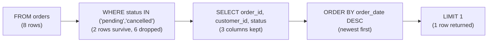

# Query Pipeline — How MySQL Reads Your Question

A query is a question in SQL. You tell MySQL *which* columns to keep, *where* they come from, *how* to
filter them, and *in what order*. But the clauses don't run in the order you type them — the rows flow
through an internal pipeline, and every stage changes what the next stage sees.



### Stage 1 — FROM: load the source

Here you name the table(s). MySQL loads the named rows into its working set. In the example above,
`orders` has **8 rows**, so all eight enter the pipeline. With a join, both tables are loaded and matched
on the join condition before anything else happens.

### Stage 2 — WHERE: filter rows

This is where rows are dropped. Every row that passes the condition survives; the rest are thrown away.
In the example, `WHERE status IN ('pending', 'cancelled')` narrows the **8 orders** to just **2**
(orders 4 and 6). Follow the `WHERE` node: **6 of the 8 rows are gone** before `SELECT` even runs. That's
why a tight `WHERE` matters — every row it evaluates costs work.

### Stage 3 — SELECT: pick columns and apply expressions

Now that only the surviving rows remain, `SELECT` decides which columns to keep and computes any
expressions:

```sql
SELECT order_id, (unit_price * 10) AS price_per_ounce FROM products;
```

Expressions in `SELECT` are evaluated row-by-row. Because this stage runs *after* `WHERE`, an alias you
define here can't be referenced in the same query's `WHERE` (more on that below).

### Stage 4 — ORDER BY: sort the rows

With the columns chosen, MySQL sorts the surviving rows by one or more keys. The example orders by
`order_date DESC`, so the newest order (2024-01-10) comes first. Give it two keys and ties are broken by
the second: `ORDER BY unit_price DESC, name ASC`.

### Stage 5 — LIMIT: trim the output

Finally, MySQL chops off everything after the Nth row. Here `LIMIT 1` returns a single row — the newest
matching order. Without it, both surviving orders would come back. This is the basis of pagination in real
applications (production code usually uses a cursor for safety).

### Why this order matters: aliases can't be used in WHERE

The pipeline order (`FROM → WHERE → SELECT → ORDER BY → LIMIT`) is why you can't reference a `SELECT`
alias in the same query's `WHERE`. MySQL reaches `WHERE` before it ever computes the alias, so the name
doesn't exist yet. Repeat the expression instead:

```sql
-- Works: repeat the expression in WHERE
SELECT unit_price * 10 AS price_per_ounce FROM products
WHERE unit_price * 10 > 100;

-- Fails: the alias isn't visible at the WHERE stage
SELECT unit_price * 10 AS price_per_ounce FROM products
WHERE price_per_ounce > 100;   -- ERROR 1054: Unknown column 'price_per_ounce' in 'where clause'
```

### References

- Worked example queries: [`../examples/01-select-and-filter.sql`](../examples/01-select-and-filter.sql)
- Module notes (errors, edge cases): [`../notes.md`](../notes.md)
- Back to the syllabus: [`../../../SYLLABUS.md`](../../../SYLLABUS.md)
