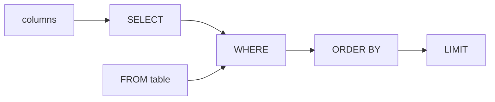

# Module 03 — Querying: SELECT, Filter, Sort · Notes

> Run the commands as you read. The worked example is the same one the checklist asks you to repeat.

## 1. Why this matters

Aisha orders a double espresso every time and wants it logged. Bilal needs to know who his regulars are, what's in stock, and when each product launched.

You're about to build the foundation — a table where every espresso blend, croissant, and ceramic mug lives with its own story. And you're going to learn how to ask that table questions.

## 2. The concept

A **query** is just a question in SQL. You tell MySQL *which* columns you want, *where* they should come from, *how* to filter them, and *in what order*.

The clause pipeline: `FROM → WHERE → SELECT → ORDER BY → LIMIT`.



**Vocabulary:** `query` — a SQL statement that asks the database for data · `clause` — a part of a query (SELECT, WHERE, ORDER BY) · `column` — a named field in a table · `row` — one record / line of data.

## 3. Worked example (do this)

**Starting state:** The `shopdb` database exists with exactly 10 tables. The `products` table has 10 rows; the `orders` table has 8 rows (2024-01-05 through 2024-01-12). One employee (the Downtown manager) has `supervisor_id IS NULL`.

**Goal:** Run a read-only tour of queries that tell you about the café's products and orders.

### Step 1 — SELECT specific columns: list active products, sorted by category then name

```sql
SELECT product_id, name, unit_price FROM products WHERE is_active = TRUE ORDER BY category_id, name ASC;
```

| product_id | name      | unit_price |
|------------|-----------|----------|
| 3        | Decaf       | 11.25     |
| 1        | Espresso Blend | 12.50    |
| 2        | House Roast   | 10.00    |
| 6        | Chai        | 9.00     |
| 5        | Earl Grey     | 8.50     |
| 4        | Green Tea     | 8.00     |
| 7        | Croissant   | 3.75     |
| 8        | Muffin      | 3.25     |
| 9        | Ceramic Mug   | 14.00    |
| 10       | Tote Bag    | 18.00    |

> 🎯 Goal: Only active products, sorted by category (1=coffee, 2=tea, 3=bakery, 4=merch) then name alphabetically within each category.

### Step 2 — WHERE with a comparison + ORDER BY: premium items over $10, most expensive first

```sql
SELECT product_id, name, sku, unit_price FROM products WHERE unit_price > 10.00 ORDER BY unit_price DESC;
```

| product_id | name      | sku     | unit_price |
|------------|-----------|---------|----------|
| 10       | Tote Bag    | MER-002   | 18.00    |
| 9        | Ceramic Mug | MER-001   | 14.00    |
| 1        | Espresso Blend | COF-001   | 12.50    |
| 3        | Decaf       | COF-003   | 11.25    |

### Step 3 — WHERE with AND/OR: coffee or tea items that are active, or any even-numbered product

```sql
SELECT product_id, name, category_id FROM products
WHERE (category_id IN (1, 2) AND is_active = TRUE) OR (product_id % 2 = 0);
```

| product_id | name      | category_id |
|------------|-----------|-------------|
| 1        | Espresso Blend | 1       |
| 2        | House Roast   | 1       |
| 3        | Decaf       | 1       |
| 4        | Green Tea     | 2       |
| 5        | Earl Grey     | 2       |
| 6        | Chai        | 2       |
| 8        | Muffin      | 3       |
| 10       | Tote Bag    | 4       |

### Step 4 — WHERE with LIKE: partial name match (no product contains "Blue" in this dataset)

```sql
SELECT product_id, name FROM products WHERE name LIKE '%Tea%' OR name LIKE '%Blue%';
```

| product_id | name     |
|------------|----------|
| 4        | Green Tea   |

### Step 5 — WHERE with IN (...): pick from a list of order statuses

```sql
SELECT order_id, customer_id, status FROM orders WHERE status IN ('pending', 'cancelled');
```

| order_id | customer_id | status    |
|----------|-------------|-----------|
| 4        | 3           | pending   |
| 6        | 5           | cancelled |

### Step 6 — WHERE with BETWEEN: orders placed 2024-01-07 through 2024-01-10

```sql
SELECT order_id, customer_id, store_id, order_date FROM orders
WHERE order_date BETWEEN '2024-01-07' AND '2024-01-10 23:59:59';
```

| order_id | customer_id | store_id | order_date           |
|----------|-------------|----------|----------------------|
| 3        | 1            | 2         | 2024-01-07 14:20:00 |
| 4        | 3            | 1         | 2024-01-08 08:45:00 |
| 5        | 4            | 2         | 2024-01-09 16:30:00 |
| 6        | 5            | 1         | 2024-01-10 11:10:00 |

> ⚠️ Gotcha: `order_date` is a DATETIME, so end the range at `23:59:59` to include the whole last day. Without it, MySQL would exclude anything on 2024-01-10 with hours > 0.

### Step 7 — WHERE with IS NULL: the manager who reports to no one

```sql
SELECT employee_id, store_id, role FROM employees WHERE supervisor_id IS NULL;
```

| employee_id | store_id | role     |
|-------------|----------|---------|
| 1          | 1        | manager   |

> ⚠️ Gotcha: `WHERE supervisor_id = NULL` returns **0 rows** — you must use `IS NULL`. This is a classic trap.

### Step 8 — ORDER BY two keys: price (highest first), then name alphabetically on ties

```sql
SELECT product_id, name, unit_price FROM products ORDER BY unit_price DESC, name ASC;
```

| product_id | name      | unit_price |
|------------|-----------|----------|
| 10       | Tote Bag    | 18.00    |
| 9        | Ceramic Mug   | 14.00    |
| 1        | Espresso Blend | 12.50    |
| 3        | Decaf       | 11.25    |
| 2        | House Roast   | 10.00    |
| 6        | Chai        | 9.00     |
| 5        | Earl Grey     | 8.50     |
| 4        | Green Tea     | 8.00     |
| 7        | Croissant   | 3.75     |
| 8        | Muffin      | 3.25     |

### Step 9 — LIMIT: the three most expensive active items

```sql
SELECT product_id, name, category_id, unit_price FROM products
WHERE is_active = TRUE ORDER BY unit_price DESC LIMIT 3;
```

| product_id | name      | category_id | unit_price |
|------------|-----------|-------------|----------|
| 10       | Tote Bag    | 4         | 18.00    |
| 9        | Ceramic Mug   | 4         | 14.00    |
| 1        | Espresso Blend | 1         | 12.50    |

### Step 10 — DISTINCT: every order status that has appeared

```sql
SELECT DISTINCT status FROM orders ORDER BY status;
```

| status     |
|------------|
| pending   |
| paid      |
| shipped   |
| cancelled |

## 4. How it works

MySQL evaluates clauses in this logical order:

1. **FROM** — load the table(s) into memory (or an index). This is where you name your source.
2. **WHERE** — filter rows before they ever reach `SELECT`. Every row that passes the condition survives; every other one is thrown away.
3. **SELECT** — pick which columns to keep and apply any expressions (`AS`, arithmetic, functions).
4. **ORDER BY** — sort the remaining rows by one or more keys (ASC = ascending, DESC = descending).
5. **LIMIT** — chop off everything after the Nth row.

> 💡 Aha: the evaluation order is logical, not written. You *write* `SELECT` first, but MySQL applies
> `WHERE` long before it — which is why a `SELECT` alias can't be used in that same query's `WHERE`.

### Filtering: WHERE with comparison operators

| Operator | Meaning | Example |
|----------|---------|------------------|
| `=` | equal to | `status = 'paid'` |
| `<>`, `!=` | not equal | `status <> 'pending'` |
| `<`, `<=`, `>`, `>=` | less / greater (than) | `unit_price > 10.00` |
| `LIKE 'pattern%'`   | pattern match (wildcards: `%` = any chars, `_` = one char) | `name LIKE '%Tea%'` |
| `IN (...)`       | membership in a list      | `status IN ('pending', 'cancelled')` |
| `BETWEEN x AND y`   | inclusive range        | `order_date BETWEEN '2024-01-07' AND '2024-01-10 23:59:59'` |
| `IS NULL` / `IS NOT NULL` | null checks (not `=`)     | `supervisor_id IS NULL` |

### Logical operators in WHERE

Use `AND` and `OR` to combine conditions. Parentheses control precedence — MySQL evaluates left-to-right otherwise:

```sql
WHERE (category_id IN (1, 2) AND is_active = TRUE) OR (product_id % 2 = 0);
-- ^^^^^^^^^^^^^^ parentheses force the AND before the OR
```

### Sorting: ORDER BY one or more keys

`ORDER BY unit_price DESC, name ASC` sorts first by price descending; when two rows have the same price, it breaks ties by name ascending.

### LIMIT and OFFSET

`LIMIT 3` keeps only the first three rows after sorting. `LIMIT 10 OFFSET 5` skips five then takes ten — useful for pagination (though in real code you'd use a cursor).

### DISTINCT vs GROUP BY

`SELECT DISTINCT status FROM orders` returns one row per unique value. **This is not** aggregate grouping — if you need counts, averages, or sums, that's `GROUP BY`, which belongs to Module 05.

## 5. Common errors & fixes

| Symptom | Cause | Fix |
|---------|-------|-----|
| `ERROR 1054 (42S22): Unknown column 'price' in 'field list'` | The column is named `unit_price`, not `price`. | Check the table schema with `DESCRIBE products;` first. |
| `ERROR 1064 (42000): You have an error in your SQL syntax; check the manual that corresponds to your MySQL server version for the right syntax to use near 'FORM products' at line 1` | Typo: `FORM` instead of `FROM`. | Proofread every clause — MySQL is unforgiving of typos. |
| `WHERE supervisor_id = NULL` returns **0 rows** (not all managers) | In SQL, `NULL` means "unknown" and cannot be compared with `=`. Use `IS NULL`. | `WHERE supervisor_id IS NULL` instead of `= NULL`. |

## 6. Try it yourself

The exercises are in `exercises/`. Open `README.md` there and pick one challenge.

**Success looks like:**
- You can filter rows with `WHERE`, sort them with `ORDER BY`, and trim results with `LIMIT`.
- You understand the clause evaluation order (FROM → WHERE → SELECT → ORDER BY → LIMIT).
- You know why `IS NULL` beats `= NULL`.

> 🧪 Try it: in Step 2, change `ORDER BY unit_price DESC` to `ORDER BY unit_price` and watch the rows
> flip — same rows, reversed order.

## 7. Going deeper (L3/L4)

**Edge cases:**
- **NULLs in arithmetic**: any expression involving a NULL evaluates to NULL. `SELECT supervisor_id + 1 FROM employees;` returns NULL for employee 1, whose `supervisor_id` is unknown — and unknown + 1 is still unknown.
- **LIKE is case-sensitive by default**: `'Tea' LIKE '%tea%'` is false on most MySQL configurations. Use `COLLATE` or `LOWER()` if you need case-insensitive matching.
- **BETWEEN is inclusive**: both endpoints are included in the range — that's why we ended at `23:59:59` to include the whole last day of 2024-01-10.

**Performance notes:**
- `SELECT *` is discouraged because it fetches every column (including BLOBs) and makes your queries brittle — if someone adds a new column, your code breaks. Always name only what you need.
- **Indexes** make WHERE and ORDER BY fast. A B-tree index on `(unit_price)` would let MySQL skip scanning all 10 rows for Step 9. That's the focus of Module 12 (Indexes & Views).

**Real systems:**
In production cafés, queries run against millions of orders, not ten products. The `WHERE` clause and any indexes together determine how many rows MySQL must read — that's called **query execution cost**. Modules 05 (aggregation) and 06 (joins) come next, and Module 12 covers indexing.

## References

- [MySQL SELECT Syntax](https://dev.mysql.com/doc/refman/8.0/en/select-query.html)
- [MySQL WHERE Clause](https://dev.mysql.com/doc/refman/8.0/en/where-clause.html)
- Next: **Module 04 — Changing Data & NULLs** (`UPDATE`, `DELETE`, three-valued logic)
- Back to the syllabus: [`../../SYLLABUS.md`](../../SYLLABUS.md)