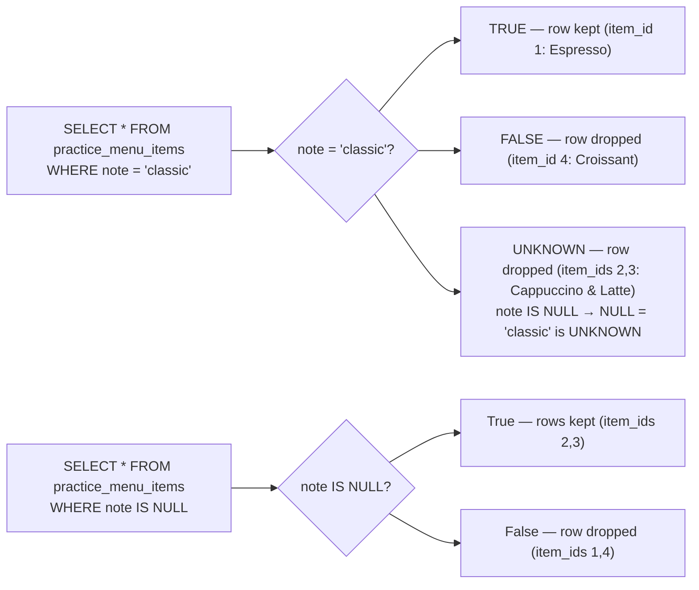

# Three-Valued Logic — Why `= NULL` Returns Zero Rows

A row reaches a comparison node and produces exactly one of three outcomes: **TRUE** (kept), **FALSE** (dropped), or **UNKNOWN** (also dropped). The first two are obvious; the third is where beginners trip. Follow the diagram carefully — it shows what happens when either side of an `=` is NULL, and why `= NULL` never matches.

### Outcome 1: **TRUE** — the row survives

When both sides of the comparison are known values and they match, the result is TRUE. In the diagram above, item_id 1 has `note = 'classic'`, so the comparison evaluates to **True** and the row stays in the output. This is what you'd expect from any language: equality works when it matches.

### Outcome 2: **FALSE** — the row is dropped

When both sides are known values but they don't match, the result is False. Item_id 4 has `note = 'house special'`, so `note = 'classic'` evaluates to **False**, and that row is thrown away before it reaches any later stage of the query. Nothing surprising here either — this is standard equality semantics.

### Outcome 3: **UNKNOWN** — the row is dropped (this is the trap)

Follow item_id 2 or 3 in the diagram. Their `note` column is **NULL**. When MySQL compares a NULL to any literal (`NULL = 'classic'`), it doesn't know whether they're equal or not — that's exactly what "unknown" means — so the result is **UNKNOWN**, which acts like False inside a WHERE clause: the row gets dropped.

That's why `WHERE note = NULL` returns zero rows and *not* all of them. The comparison isn't "does this column contain no value?" — it's "is this unknown thing equal to nothing?", which is itself unknown, so the row fails the filter.

### The correct way: `IS NULL` / `IS NOT NULL`

The diagram also shows the right path. A `WHERE note IS NULL` node doesn't compare values; it tests for the presence of the NULL marker directly, and always produces a definite True or False — never Unknown. Item_ids 2 and 3 match the `IS NULL` test (True), item_ids 1 and 4 do not (False). This is how you find rows that contain no value.

> 🧪 **Takeaway:** NULL means "unknown", so any comparison with it (`=`, `>`, `<`, etc.) evaluates to Unknown, which the WHERE clause treats as False — the row is filtered out. Use `IS NULL` / `IS NOT NULL` when you actually want to test for it.

## References

- Worked examples (update/delete/null): [`../examples/01-update-delete-null.sql`](../examples/01-update-delete-null.sql)
- Module notes (errors, edge cases): [`../notes.md`](../notes.md)
- Back to the syllabus: [`../../../SYLLABUS.md`](../../../SYLLABUS.md)
