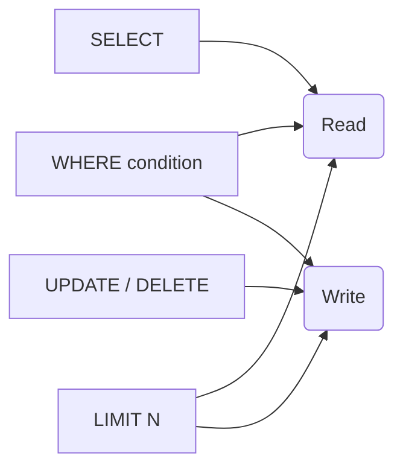

# Module 04 — Changing Data & NULLs · Notes

> Run the commands as you read. The worked example is the same one the checklist asks you to repeat.

## 1. Why this matters

Aisha orders a double espresso every time and wants it logged. Bilal needs to know who his regulars are, what's in stock, and when each product launched.

You've learned how to ask questions of the database — `SELECT` is a query, not a change. But cafés need more than reading: prices shift, orders get cancelled, staff gets reorganised. That's where `UPDATE` and `DELETE` come in. And with them comes **NULL** — the thing that means "unknown" rather than zero or empty string.

A write is always a decision. Every row you change has been changed forever (unless you wrap it in a transaction). Learning to write correct SQL, and to understand how NULL behaves inside arithmetic and comparison, is the foundation for every real system.

## 2. The concept

**`UPDATE`** changes existing rows — it picks rows with `WHERE`, then sets new values on those rows. **`DELETE`** removes rows entirely. Both are *write* operations (they modify data), unlike `SELECT`.

Both do exactly what their `WHERE` clause allows: no `WHERE` means every row in the table; `LIMIT` caps how many rows a write touches.



**Vocabulary:** `update` — a SQL statement that modifies existing rows (`SET col = val WHERE …`) · `delete` — a SQL statement that removes rows (`DELETE FROM table WHERE …`) · `where` — the clause that filters which rows are affected · `null` — a special marker meaning "unknown" or "not applicable", distinct from zero, empty string, or false · three-valued logic — the truth values in SQL: **TRUE**, **FALSE**, and **UNKNOWN** (the result of any comparison involving NULL) · `is null` / `is not null` — the correct way to check for NULLs (`WHERE col IS NULL`) · `coalesce(value, fallback)` — a function that returns the first non-NULL argument.

## 3. Worked example (do this)

**Starting state:** The `shopdb` database exists with exactly **10 tables**. This script is net-neutral: it creates `practice_menu_items`, does its work, then drops it at the end so the table count returns to 10.

The starting rows of `practice_menu_items`:

| item_id | name | price | is_vegan | note |
|---|---|---|---|---|
| 1 | Espresso | 2.50 | 0 | classic |
| 2 | Cappuccino | 3.75 | 1 | NULL |
| 3 | Matcha Latte | 4.25 | 1 | NULL |
| 4 | Chocolate Croissant | 3.00 | 0 | house special |

Rows 2 and 3 omitted `note`, so it is **NULL**. `is_vegan` shows as 0/1 (BOOLEAN).

### Step 1 — increase one price: just that row changes

```sql
UPDATE practice_menu_items SET price = price + 0.50 WHERE item_id = 2;
SELECT item_id, name, price FROM practice_menu_items WHERE item_id = 2;
```

| item_id | name | price |
|---|---|---|
| 2 | Cappuccino | 4.25 |

> 🎯 Goal: only the row with `item_id = 2` was touched — all other rows keep their original prices.

### Step 2 — fill the two NULL notes; confirm exactly 2 rows changed

```sql
UPDATE practice_menu_items SET note = 'chef pick' WHERE note IS NULL;
SELECT ROW_COUNT() AS rows_changed;
```

| rows_changed |
|---|
| 2 |

> 🎯 Goal: `note IS NULL` matched both row 2 and row 3. The update touched exactly two rows — confirmed by `ROW_COUNT()` returning **2**.

### Step 3 — the key trap: `= NULL` changes 0 rows, not all of them

```sql
UPDATE practice_menu_items SET note = 'never' WHERE note = NULL;
SELECT ROW_COUNT() AS rows_changed;
```

| rows_changed |
|---|
| 0 |

> ⚠️ Gotcha: `= NULL` never matches — because **NULL means "unknown"** and unknown is not equal to anything. This is the most common beginner mistake in SQL. Always use `IS NULL`.

### Step 4 — arithmetic with NULL yields NULL; COALESCE gives a fallback

```sql
SELECT name, price + NULL AS price_plus_unknown FROM practice_menu_items LIMIT 1;
SELECT name, COALESCE(note, '(none)') AS note_fixed FROM practice_menu_items;
```

| name | price_plus_unknown |
|---|---|
| Espresso | NULL |

| name | note_fixed |
|---|---|
| Espresso | classic |
| Cappuccino | chef pick |
| Matcha Latte | chef pick |
| Chocolate Croissant | house special |

> 💡 Aha: any arithmetic involving a NULL evaluates to **NULL** — `price + NULL` is unknown, not "price". `COALESCE(note, '(none)')` returns the first non-NULL value, which is exactly why it's useful for display.

### Step 5 — delete just the vegan rows; show what remains

```sql
DELETE FROM practice_menu_items WHERE is_vegan = TRUE;
SELECT * FROM practice_menu_items;
```

| item_id | name | price | is_vegan | note |
|---|---|---|---|---|
| 1 | Espresso | 2.50 | 0 | classic |
| 4 | Chocolate Croissant | 3.00 | 0 | house special |

> 🎯 Goal: only the two vegan rows (Cappuccino, Matcha Latte) were deleted — items 1 and 4 survived.

### Step 6 — cleanup; shopdb still has exactly 10 tables

```sql
DROP TABLE IF EXISTS practice_menu_items;
SELECT COUNT(*) AS tables_in_shopdb FROM information_schema.tables WHERE table_schema = 'shopdb';
```

| tables_in_shopdb |
|---|
| 10 |

## 4. How it works

### UPDATE and DELETE: the WHERE clause is effectively mandatory

A missing `WHERE` hits **every row** in the table — so a bare `UPDATE products SET unit_price = 9.99;` changes all ten rows, not just one. Always filter.

```sql
-- dangerous (no WHERE — changes every row)
UPDATE practice_menu_items SET price = 0;

-- safe (one row)
UPDATE practice_menu_items SET price = 0 WHERE item_id = 2;
```

### Three-valued logic: TRUE, FALSE, UNKNOWN

SQL has three truth values. Any comparison with a NULL evaluates to **UNKNOWN**, which acts like **FALSE** in `WHERE` — the row is filtered out. That's why `WHERE note = NULL` returns zero rows and not all of them.

| Expression | Result |
|---|---|
| `5 > 3` | TRUE |
| `5 < 3` | FALSE |
| `NULL = 'anything'` | UNKNOWN (filtered out) |
| `NULL IS NULL` | TRUE |
| `NULL IS NOT NULL` | False |

### Null propagation in arithmetic

Any expression involving a NULL evaluates to **NULL**:

```sql
SELECT price + NULL FROM practice_menu_items LIMIT 1;
-- Espresso | NULL   (unknown price + unknown = unknown)
```

**COALESCE** is the safe fallback — it returns the first non-NULL argument:

```sql
SELECT COALESCE(note, '(none)') AS note_fixed FROM practice_menu_items;
```

### Transaction wrapper for reversible writes

Wrap an `UPDATE` or `DELETE` in a transaction to undo it with `ROLLBACK`:

```sql
START TRANSACTION;
UPDATE practice_menu_items SET price = 0 WHERE item_id = 2;
SELECT * FROM practice_menu_items WHERE item_id = 2;
-- now inspect — if wrong:
ROLLBACK;
-- if right:
COMMIT;
```

Full transactions are covered in Module 13. For small experiments, the `START TRANSACTION … ROLLBACK` pattern is your safety net.

## 5. Common errors & fixes

| Symptom | Cause | Fix |
|---|---|---|
| `ERROR 1048 (23000): Column 'name' cannot be null` | Inserting NULL into a column declared `NOT NULL`. | Supply a value or allow the column to accept NULLs. |
| `ERROR 1451 (23000): Cannot delete or update a parent row: a foreign key constraint fails (…CONSTRAINT \`fk_product_category\`…)` | Deleting or updating a row that other rows reference via FOREIGN KEY. | Delete the referencing child rows first, or use `ON DELETE CASCADE`. |
| `ERROR 1062 (23000): Duplicate entry 'COF-002' for key 'products.sku'` | Inserting a value into a UNIQUE column that already exists. | Use `INSERT IGNORE`, `REPLACE INTO`, or check first. |
| `ERROR 1054 (42S22): Unknown column 'price' in 'field list'` | The column is named `unit_price`, not `price`. | Check the schema with `DESCRIBE products;` before writing. |
| `ERROR 1064 (42000): You have an error in your SQL syntax; check the manual that corresponds to your MySQL server version for the right syntax to use near 'UPDTE products SET unit_price = 9.99 WHERE product_id=1' at line 1` | Typo: `UPDTE` instead of `UPDATE`. | Proofread every clause — MySQL is unforgiving of typos. |
| `ERROR 1146 (42S02): Table 'shopdb.productz' doesn't exist` | Misspelled table name (`productz`). | Verify the exact name with `SHOW TABLES IN shopdb;`. |

## 6. Try it yourself

The exercises are in `exercises/`. Open `README.md` there and pick one challenge.

**Success looks like:**
- You can write an `UPDATE` with a correct `WHERE` clause that changes exactly the rows you want.
- You understand why `= NULL` returns 0 rows while `IS NULL` matches everything — and you use it correctly.
- You know how to wrap writes in `START TRANSACTION … ROLLBACK` so experiments are reversible.

> 🧪 Try it: create a table with one column that is NOT NULL, try inserting a row with NULL into that column, then alter the table to allow NULLs and insert again — watch the error become success.

## 7. Going deeper (L3/L4)

**Edge cases:**
- **`REPLACE INTO` vs `INSERT … ON DUPLICATE KEY UPDATE`**: both handle duplicates without throwing an error (`REPLACE INTO` deletes then inserts; `ON DUPLICATE KEY UPDATE` does an upsert). They're useful in real systems where you want to "create or update" a row atomically.
- **`LIMIT` on writes**: MySQL lets you add `LIMIT N` to `UPDATE` and `DELETE`. This is handy for batch jobs (e.g., "cancel the first 100 expired orders") but it's not guaranteed to be deterministic across engines — always use an explicit `ORDER BY` alongside a `LIMIT` on a write.
- **Soft deletes**: In production cafés, rows are rarely physically deleted. Instead you add a boolean column like `is_active` and set it to FALSE when something is cancelled or retired. That's the pattern behind every "trash" button in modern software — it's an `UPDATE`, not a `DELETE`.

**Performance notes:**
- A bare `UPDATE table SET col = val;` (no WHERE) writes every row, which means MySQL must read and write all of them — that's **O(n)** work. An index on the column you filter by lets MySQL skip scanning the rest: that's the focus of Module 12 (Indexes & Views).
- `DELETE` is generally expensive because it removes rows from indexes too. If you need frequent "deletions", a soft-delete flag (`is_active = FALSE`) avoids index churn and makes rollback trivial.

**Real systems:**
In production cafés, writes run against millions of orders, not ten products. The combination of `WHERE` + an index determines how many rows MySQL must read — that's called **query execution cost**. Modules 05 (aggregation) and 06 (joins) come next, and Module 12 covers indexing.

## References

- [MySQL UPDATE Syntax](https://dev.mysql.com/doc/refman/8.0/en/update.html)
- [MySQL DELETE Syntax](https://dev.mysql.com/doc/refman/8.0/en/delete.html)
- [MySQL NULL Handling](https://dev.mysql.com/doc/refman/8.0/en/using-null.html)
- Next: **Module 05 — Aggregation & Grouping** (`COUNT`, `SUM`, `GROUP BY`)
- Back to the syllabus: [`../../SYLLABUS.md`](../../SYLLABUS.md)