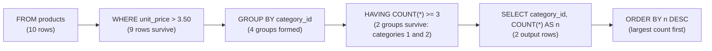

# Aggregation Pipeline — How MySQL Groups Rows into Answers

Aggregation is how you turn many rows into a few answers: "how many products does this café have?", "what's the average price of tea items?". You tell MySQL *which* columns to aggregate, *how* to group them, and *in what order*. But again, the clauses don't run in the order you type them — the rows flow through an internal pipeline.



### Stage 1 — FROM: load the source table(s)

You name the tables. MySQL loads every row into its working set. In the diagram above, `products` has **10 rows** so all ten enter the pipeline before anything else happens.

### Stage 2 — WHERE: filter individual rows *before* grouping

This is where rows are dropped — but crucially, it drops them *before* any grouping can happen. In the example, `WHERE unit_price > 3.50` narrows the **10 products** to **9** (the $3.25 Muffin is excluded). Those nine enter the groups; the excluded row never sees a group at all. That's why WHERE matters in aggregation: every row you filter out saves work downstream.

### Stage 3 — GROUP BY: collapse rows into groups

Now that only the surviving rows remain, MySQL partitions them by their grouping key values. In the example, `GROUP BY category_id` creates **four groups** (one per unique category). Every row in a group shares the same value for every column listed after `GROUP BY`.

### Stage 4 — HAVING: filter *groups* after aggregation

This is where whole groups are dropped. `HAVING COUNT(*) >= 3` keeps only categories with at least three products — so **categories 1 and 2 survive**, while categories 3 and 4 (each having fewer than three) are thrown away entirely. Follow the HAVING node: two of the four groups vanish before SELECT ever runs.

**Where vs Having is the whole difference:** `WHERE` sees rows, `HAVING` sees groups. That's why you can't put a count condition in WHERE — aggregation hasn't happened yet and there are no counts to filter on.

### Stage 5 — SELECT: produce one row per surviving group

With only the filtered groups remaining, MySQL applies aggregate functions (`COUNT`, `SUM`, `AVG`, `MIN`, `MAX`) *per group*, producing exactly one output row per group. In the example, `SELECT category_id, COUNT(*) AS n` yields two rows — one for each surviving category — with the count of products in that category.

### Stage 6 — ORDER BY: sort the final output

With the columns chosen and the groups collapsed, MySQL sorts the resulting rows by one or more keys. The example orders by `n DESC`, so the category with the most products comes first. Without explicit ordering, MySQL returns groups in whatever order the engine processes them — which is not guaranteed to be stable across executions.

### Why this order matters: aliases can't be used in WHERE

The pipeline order (`FROM → WHERE → GROUP BY → HAVING → SELECT → ORDER BY`) explains a common surprise: a `SELECT` alias is not visible to `WHERE`, because `WHERE` runs before `SELECT`. (MySQL *does* allow the alias later, in `HAVING` and `ORDER BY`.) Repeat the raw column in `WHERE` instead:

```sql
-- Works: filter on the real column, which exists at the WHERE stage
SELECT category_id, COUNT(*) AS n FROM products
WHERE unit_price > 3.50 GROUP BY category_id;

-- Fails: the alias 'n' isn't computed yet when WHERE runs
SELECT category_id, COUNT(*) AS n FROM products
WHERE n >= 3 GROUP BY category_id;   -- ERROR 1054: Unknown column 'n' in 'where clause'
```

### References

- Worked example queries: [`../examples/01-aggregate.sql`](../examples/01-aggregate.sql)
- Module notes (errors, edge cases): [`../notes.md`](../notes.md)
- Back to the syllabus: [`../../../SYLLABUS.md`](../../../SYLLABUS.md)
