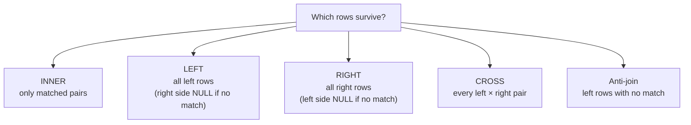

# Join types at a glance

A `JOIN` answers one question: **which row pairs survive?** In `shopdb`, every customer has a matching
person — but six people (persons 7–12) are **not** customers. Whether those unmatched people appear depends
entirely on the join type you choose.



## INNER JOIN

**Keeps:** only rows that match on **both** sides. Reach for it when the relationship is required — "every
order with its customer". In `shopdb`, customers 1–6 all have a person row, so an inner join returns all 6.

```sql
SELECT c.customer_id, p.first_name
FROM customers c
JOIN persons p ON p.person_id = c.person_id;   -- 6 rows
```

## LEFT JOIN

**Keeps:** every row from the **left** table; unmatched right columns become `NULL`. Use it for "all X, even
those without a Y".

```sql
SELECT p.person_id, p.first_name, c.customer_id
FROM persons p
LEFT JOIN customers c ON c.person_id = p.person_id;   -- 12 rows; persons 7–12 show NULL
```

## RIGHT JOIN

**Keeps:** every row from the **right** table. It is a `LEFT JOIN` with the tables swapped — prefer `LEFT`
for consistency, but know it when you meet it.

```sql
SELECT c.customer_id, p.first_name
FROM customers c
RIGHT JOIN persons p ON p.person_id = c.person_id;   -- 12 rows; same as the LEFT JOIN above, swapped
```

## CROSS JOIN

**Keeps:** every possible pair — `rows_left × rows_right`, with no condition at all. Two stores × four
categories = 8 rows. Use it deliberately, and never by *forgetting* the `ON` clause.

```sql
SELECT s.name AS store, c.name AS category
FROM stores s
CROSS JOIN categories c;   -- 8 rows
```

## Anti-join

**Keeps:** left rows with **no** match on the right. It is a `LEFT JOIN` plus `WHERE right_key IS NULL` —
the join manufactures `NULL` for the missing side, and `WHERE` keeps only those rows. In `shopdb` that is
the six people who are not customers.

```sql
SELECT p.person_id, p.first_name
FROM persons p
LEFT JOIN customers c ON c.person_id = p.person_id
WHERE c.customer_id IS NULL;   -- 6 rows (persons 7–12)
```

> 💡 Aha: every join type here is the same matching machine — they differ only in **which unmatched rows
> they refuse to throw away**. Once you see that, you only need to remember `ON` (what is a match) and the
> keep rule (inner / left / right).

---

Next: the syntax and worked examples live in [`../notes.md`](../notes.md); the full module list is in
[`../../../SYLLABUS.md`](../../../SYLLABUS.md).
