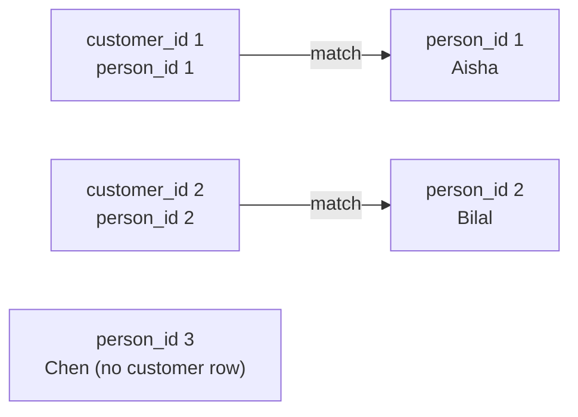

# Module 06 — Joins · Notes

> Run the commands as you read. The worked example is the same one the checklist asks you to repeat.

## 1. Why this matters

Aisha's receipt shows "order #3, Espresso Blend" — but behind that data, the order table only has `order_id` and `product_id`. Her name lives in a separate `persons` table; the product price is stored in `products`; the order status is in `orders`. If SQL could only look at one table at a time, you'd have to fetch each piece separately, stitch it in Python, and lose all the convenience of asking questions directly.

**Joins are how SQL stitches multiple tables into one readable answer.** They match rows from different tables by a condition (usually a shared key), so you can pull names, prices, statuses, and quantities together — exactly what Aisha needs on her receipt. Almost every query here is **read-only**; the one write you'll meet (Step 10) just demonstrates `INSERT … SELECT`.

## 2. The concept

A **join** matches rows from two (or more) tables by a condition. Without it, you can't combine information that lives in separate tables.

```sql
-- INNER JOIN: keep only matched pairs
SELECT c.customer_id, p.first_name, c.date_joined
FROM customers c
JOIN persons p ON p.person_id = c.person_id;
```

The `ON` clause is the join condition — it says *which rows to match*. The keyword `JOIN` (short for `INNER JOIN`) means "only keep pairs where both sides have a matching row." If Aisha has no customer record, she won't appear in this result.

Here is the idea on two tiny tables. The arrows are the matched pairs; Chen has no customer row, so an inner join drops him:



### Different kinds of joins

**LEFT JOIN** keeps every row from the left table even if there's no match on the right side — unmatched rows get `NULL` for the right-hand columns:

```sql
SELECT p.person_id, p.first_name, c.customer_id
FROM persons p
LEFT JOIN customers c ON c.person_id = p.person_id;
-- Giorgio, Hana, Igor, Juana, Kwame, Lena all appear with NULL customer_id
```

**RIGHT JOIN** is the mirror — it keeps every row from the right table. It's equivalent to swapping the tables and using `LEFT JOIN`:

```sql
SELECT c.customer_id, p.first_name
FROM customers c
RIGHT JOIN persons p ON p.person_id = c.person_id;
-- Same as LEFT JOIN with the tables swapped
```

**CROSS JOIN** pairs *every* row from one table with *every* row from another — no matching condition. The result size is `rows_A × rows_B`. Use it when you genuinely want all combinations (like generating every store-category pairing).

### Self-join: a table joined to itself

Sometimes the relationship lives within one table — employees who supervise other employees, for instance:

```sql
SELECT e.employee_id,
       CONCAT(p.first_name, ' ', p.last_name) AS employee,
       CONCAT(s.first_name, ' ', s.last_name) AS supervisor
FROM employees e
JOIN persons p ON p.person_id = e.person_id
LEFT JOIN employees sup ON sup.employee_id = e.supervisor_id
LEFT JOIN persons s   ON s.person_id = sup.person_id;
-- Giorgio has no supervisor (NULL); Hana's supervisor is Giorgio
```

### Vocabulary

- `JOIN` — shorthand for `INNER JOIN`; keeps only matched pairs.
- **Inner join** (`INNER JOIN`) — the default: rows must match on both sides to appear in the result.
- **Left join** (`LEFT JOIN`) — keeps every row from the left table; unmatched right-hand columns become `NULL`.
- **Right join** (`RIGHT JOIN`) — keeps every row from the right table; equivalent to swapping tables and using `LEFT JOIN`.
- **Outer** — any join that preserves rows even without a match (left or right).
- `CROSS JOIN` — pairs every row from one table with every row from another; result size is `rows_A × rows_B`.
- **ON** — the clause that specifies which rows to match between tables. Without it, you get a cartesian product (every possible pair).
- **Anti-join** — finding rows in one table that have *no* matching row in another. The most common pattern is `LEFT JOIN … WHERE right_key IS NULL`.
- **Self-join** — joining a table to itself; useful for hierarchical relationships like parent-child or supervisor-employee.
- **Cartesian product** — the result of joining two tables without an `ON` condition: every row from one paired with every row from another (`rows_A × rows_B`).
- **Driving table** — in a join, the table that determines how many output rows exist (left for left join, right for right join).

## 3. Worked example (do this)

**Starting state:** The `shopdb` database has exactly 10 tables: `persons`, `addresses`, `customers`, `stores`, `employees`, `categories`, `products`, `orders`, `order_items`, and `payments`. The `customers` table links to `persons` via `person_id`; the `orders` table links to `customers` via `customer_id`; the `order_items` table links to both `orders` (via `order_id`) and `products` (via `product_id`).

**Goal:** Run a tour of join queries that stitch together the café's data — customer names with orders, line items with product prices, employees with supervisors.

### Step 1 — Inner join: customers matched to their person records

```sql
SELECT c.customer_id, p.first_name, p.last_name, c.date_joined
FROM customers c
JOIN persons p ON p.person_id = c.person_id
ORDER BY c.customer_id;
```

| customer_id | first_name | last_name | date_joined |
|---|---|---|---|
| 1 | Aisha | Khan | 2023-06-01 |
| 2 | Bilal | Ahmed | 2023-08-14 |
| 3 | Chen | Wei | 2023-09-30 |
| 4 | Dana | Ortiz | 2023-11-11 |
| 5 | Emeka | Okafor | 2024-01-02 |
| 6 | Fatima | Noor | 2024-02-20 |

> 🎯 Goal: every customer with their full name. The join condition `p.person_id = c.person_id` is the key that links these tables — without it, you'd get 72 rows (6 customers × 12 persons).

### Step 2 — Three-table join: orders → customers → persons

```sql
SELECT o.order_id, CONCAT(p.first_name, ' ', p.last_name) AS customer, o.status
FROM orders o
JOIN customers c ON c.customer_id = o.customer_id
JOIN persons p ON p.person_id = c.person_id
ORDER BY o.order_id;
```

| order_id | customer | status |
|---|---|---|
| 1 | Aisha Khan | paid |
| 2 | Bilal Ahmed | paid |
| 3 | Aisha Khan | shipped |
| 4 | Chen Wei | pending |
| 5 | Dana Ortiz | paid |
| 6 | Emeka Okafor | cancelled |
| 7 | Fatima Noor | paid |
| 8 | Bilal Ahmed | shipped |

Every order with the customer's name and status. You can see Aisha has two orders (paid, shipped) — she's a regular. The join chain stitches three tables into one answer.

### Step 3 — `order_items` joined to `products`: line totals = quantity × unit_price

```sql
SELECT oi.order_item_id, oi.order_id, p.name AS product,
       oi.quantity, p.unit_price, (oi.quantity * p.unit_price) AS line_total
FROM order_items oi
JOIN products p ON p.product_id = oi.product_id
ORDER BY oi.order_item_id;
```

| order_item_id | order_id | product | quantity | unit_price | line_total |
|---|---|---|---|---|---|
| 1 | 1 | Espresso Blend | 2 | 12.50 | 25.00 |
| 2 | 1 | Croissant | 1 | 3.75 | 3.75 |
| 3 | 2 | House Roast | 1 | 10.00 | 10.00 |
| 4 | 2 | Ceramic Mug | 1 | 14.00 | 14.00 |
| … | | | | | |

(14 rows in total)

Each line item with the product name and its computed total (quantity × price). This is how receipts calculate how much Aisha actually bought — without this join, you'd only see `product_id = 3` and not know it's "Espresso Blend."

### Step 4 — Left join: persons who are *not* customers (the NULLs)

```sql
SELECT p.person_id, p.first_name, c.customer_id
FROM persons p
LEFT JOIN customers c ON c.person_id = p.person_id;
```

| person_id | first_name | customer_id |
|---|---|---|
| 1 | Aisha | 1 |
| 2 | Bilal | 2 |
| … | … | … |
| 6 | Fatima | 6 |
| 7 | Giorgio | NULL |
| 8 | Hana | NULL |
| 9 | Igor | NULL |
| 10 | Juana | NULL |
| 11 | Kwame | NULL |
| 12 | Lena | NULL |

(12 rows)

> 🎯 Goal: every person, with their customer_id if they have one — and NULL otherwise. Giorgio through Lena are in the persons table but haven't opened a customer account yet.

### Step 5 — Anti-join: people who are NOT customers (6 rows)

```sql
SELECT p.person_id, p.first_name, p.last_name
FROM persons p
LEFT JOIN customers c ON c.person_id = p.person_id
WHERE c.customer_id IS NULL;
```

| person_id | first_name | last_name |
|---|---|---|
| 7 | Giorgio | Rossi |
| 8 | Hana | Sato |
| 9 | Igor | Petrov |
| 10 | Juana | Lopez |
| 11 | Kwame | Mensah |
| 12 | Lena | Kashi |

> 🎯 Goal: the anti-join pattern — a left join followed by `WHERE right_key IS NULL`. This is how you find "rows in A with no match in B." It's one of the most common patterns in real-world queries.

### Step 6 — Cross join: every store × every category (8 rows)

```sql
SELECT s.name AS store, c.name AS category
FROM stores s
CROSS JOIN categories c;
```

| store | category |
|---|---|
| Downtown | Coffee |
| Downtown | Tea |
| Downtown | Bakery |
| Downtown | Merch |
| Riverside | Coffee |
| Riverside | Tea |
| Riverside | Bakery |
| Riverside | Merch |

Every possible combination. Two stores × four categories = eight rows. Use `CROSS JOIN` when you genuinely want all pairs — like generating a report that asks "which products should we stock at which store?"

### Step 7 — Self-join: employees linked to their supervisors

```sql
SELECT e.employee_id,
       CONCAT(p.first_name, ' ', p.last_name) AS employee,
       e.role,
       CONCAT(s.first_name, ' ', s.last_name) AS supervisor
FROM employees e
JOIN persons p ON p.person_id = e.person_id
LEFT JOIN employees sup ON sup.employee_id = e.supervisor_id
LEFT JOIN persons s   ON s.person_id = sup.person_id
ORDER BY e.employee_id;
```

| employee_id | employee | role | supervisor |
|---|---|---|---|
| 1 | Giorgio Rossi | manager | NULL |
| 2 | Hana Sato | associate | Giorgio Rossi |
| 3 | Igor Petrov | manager | Giorgio Rossi |
| 4 | Juana Lopez | associate | Giorgio Rossi |
| 5 | Kwame Mensah | associate | Igor Petrov |

Every employee with their supervisor's name (or NULL if none). Self-joins are how you represent hierarchical relationships in SQL — parent-child, department hierarchy, and so on.

### Step 8 — Orders per customer with LEFT JOIN + COUNT

```sql
SELECT c.customer_id, p.first_name, COUNT(o.order_id) AS orders
FROM customers c
JOIN persons p ON p.person_id = c.person_id
LEFT JOIN orders o ON o.customer_id = c.customer_id
GROUP BY c.customer_id, p.first_name
ORDER BY c.customer_id;
```

| customer_id | first_name | orders |
|---|---|---|
| 1 | Aisha | 2 |
| 2 | Bilal | 2 |
| 3 | Chen | 1 |
| 4 | Dana | 1 |
| 5 | Emeka | 1 |
| 6 | Fatima | 1 |

> 🎯 Goal: how many orders each customer has placed. Starting from `customers` and using a `LEFT JOIN` to `orders` guarantees every customer appears — a customer with no orders would show `orders = 0`. This is join + aggregation: two ideas working together.

### Step 9 — The cartesian warning: missing `ON` pairs every row with every other

```sql
SELECT COUNT(*) FROM orders JOIN customers;
-- Returns 48 (8 × 6) without an ON clause!
```

> ⚠️ Gotcha: without an `ON` condition, SQL pairs *every* order with *every* customer — the cartesian product. Eight orders times six customers equals 48 rows. That's why you always need a join condition (or explicitly declare `CROSS JOIN` when you want all combinations).

### Step 10 — Write from a query: INSERT … SELECT into a practice table

```sql
DROP TABLE IF EXISTS practice_top_products;
CREATE TABLE practice_top_products (
  product_id INT PRIMARY KEY,
  name       VARCHAR(80) NOT NULL,
  total_qty  INT NOT NULL
);
INSERT INTO practice_top_products (product_id, name, total_qty)
SELECT p.product_id, p.name, SUM(oi.quantity)
FROM products p JOIN order_items oi ON oi.product_id = p.product_id
GROUP BY p.product_id, p.name
HAVING SUM(oi.quantity) >= 3
ORDER BY p.product_id;
SELECT * FROM practice_top_products ORDER BY product_id;
DROP TABLE practice_top_products;
```

| product_id | name | total_qty |
|---|---|---|
| 1 | Espresso Blend | 3 |
| 2 | House Roast | 3 |
| 4 | Green Tea | 3 |
| 7 | Croissant | 3 |

A practice table of the four products ordered at least three times. `INSERT … SELECT` writes data *produced by a query* — you'll use it more in later modules. The table is created and then `DROP`ped, so `shopdb` still has exactly 10 tables (net-neutral).

## 4. How it works

MySQL works through a join in this logical order:

1. **FROM + JOIN … ON** — load the tables and match rows using the join condition. Only pairs that satisfy the `ON` clause are kept for an inner join; unmatched left-hand rows (left join) or right-hand rows (right join) are preserved with `NULL` on the opposite side. For chained joins (three or more tables), MySQL works left to right: each join produces an intermediate result that feeds the next.
2. **WHERE** — filter the joined result set *after* matching. For outer joins, this is where you test whether a match exists (`WHERE right_key IS NULL`).
3. **SELECT / ORDER BY** — choose and name the columns, then sort the final rows.

### Why `ON` ≠ `WHERE` for outer joins

In an inner join, moving a condition from `ON` to `WHERE` usually has no effect — both filter out non-matching rows. But in an outer join they behave differently:

```sql
-- LEFT JOIN with condition in ON: preserves all left-hand rows
SELECT p.first_name, c.customer_id
FROM persons p
LEFT JOIN customers c ON p.person_id = c.person_id AND p.last_name LIKE '%Khan';
-- Result: Aisha (1), and all other persons with NULL customer_id

-- LEFT JOIN with condition in WHERE: filters AFTER the join — effectively an inner join
SELECT p.first_name, c.customer_id
FROM persons p
LEFT JOIN customers c ON p.person_id = c.person_id
WHERE p.last_name LIKE '%Khan';
-- Result: only Aisha (1) — Giorgio through Lena are dropped because they have no customer record
```

The rule of memory: **`ON` decides *which rows to match*; `WHERE` decides *which matched rows to keep*.** For outer joins, conditions that should affect matching go into `ON`; conditions that filter the final result go into `WHERE`.

### The anti-join insight (one to remember)

**`LEFT JOIN … WHERE right_key IS NULL` = "rows with no match."** This is the most common pattern for finding orphan records — orders without customers, products not in any category, and so on. It's a left join followed by a simple `IS NULL` test.

> 💡 Aha: the anti-join is just the `LEFT JOIN` you already know plus one `IS NULL` test. Learn the pattern once and you can find *any* missing relationship.

## 5. Common errors & fixes

| Symptom | Cause | Fix |
|---|---|---|
| `ERROR 1052 (23000): Column 'name' in field list is ambiguous` | `name` exists in both joined tables (e.g., `products.name` and `categories.name`). | Qualify every column with its table alias: `SELECT products.name, categories.name FROM products JOIN categories ON …;` |
| `ERROR 1054 (42S22): Unknown column 'c.id' in 'on clause'` | Wrong column name in the `ON` condition. The `customers` table has `customer_id`, not `id`. | Check the schema first with `DESCRIBE customers;` — then use the correct column names. |
| `COUNT(*)` returns 48 instead of 8 | You forgot the `ON` clause → cartesian product (every order paired with every customer). | Always give a join condition, or explicitly declare `CROSS JOIN` on purpose. |
| A `LEFT JOIN` silently loses its NULL rows | You filtered the right-hand column in `WHERE` (e.g., `WHERE c.customer_id = 1`). The `WHERE` runs *after* the join and drops all the unmatched rows that have `NULL`. | Move the condition into `ON`, or keep it in `WHERE` only when you *want* to drop nulls. |

## 6. Try it yourself

The exercises are in `exercises/`. Open `README.md` there and pick one challenge.

**Success looks like:**
- You can join two tables using `JOIN … ON` with the correct key columns.
- You understand left/right joins and when to use them (preserving unmatched rows).
- You know why `ON` ≠ `WHERE` for outer joins — conditions in `ON` decide matching; conditions in `WHERE` filter after joining.
- You can write an anti-join (`LEFT JOIN … WHERE right_key IS NULL`) to find orphans.
- You understand cartesian products and how a missing `ON` creates them.

> 🧪 Try it: take Step 9 (the cartesian warning) and add the correct `ON` clause — watch the result drop from 48 rows back to exactly 8, one row per order. That's the difference between "every possible pair" and "only matched pairs."

## 7. Going deeper (L3/L4)

**Using columns from both sides:** A joined row exposes columns from every table in the join, so you can mix them in expressions: `SELECT oi.order_id, pr.name, oi.quantity * oi.unit_price AS line_total FROM order_items oi JOIN products pr ON pr.product_id = oi.product_id;`. This is how you compute derived values like line totals.

**`USING(col)` syntax (MySQL 8):** When the join key has the same name in both tables, you can shorten `ON t1.col = t2.col` to `JOIN … USING (col)`. It's cleaner but does the same thing — purely syntactic sugar.

**Why `NATURAL JOIN` is risky:** A natural join matches on *all* columns with the same name in both tables. This can silently match on unintended columns (e.g., a shared `code` column that has different meanings), producing wrong results without any warning. Most codebases avoid it and write explicit `ON` clauses instead.

**`INSERT … SELECT`:** You've seen this in Step 10 — creating a summary table from query results. The full syntax is `INSERT INTO target_table (col_list) SELECT col_list FROM source_table WHERE condition;`. It's useful for materializing computed data, but it runs the select first and then inserts all matching rows at once — so there are no per-row triggers.

**Join keys and indexes:** Joins perform best when the join key is indexed. MySQL uses the index to find matching rows instead of scanning every row in the table — this turns an `O(n²)` scan into something much faster. Indexes on foreign-key columns (like `order_items.product_id`) are almost always a good idea.

**Forward pointer:** When you only need to ask *does a match exist* (e.g., "is Aisha's order paid?"), a subquery with `EXISTS` or an `IN` clause can be clearer than a join — and it avoids creating duplicate rows that you then have to deduplicate. You'll meet these patterns in Module 07 (Subqueries).

## References

- The four join types at a glance: [`assets/join-types.md`](assets/join-types.md)
- Back to the syllabus: [`../../SYLLABUS.md`](../../SYLLABUS.md)
- The learning path: [`../../LEARNING_PATH.md`](../../LEARNING_PATH.md)