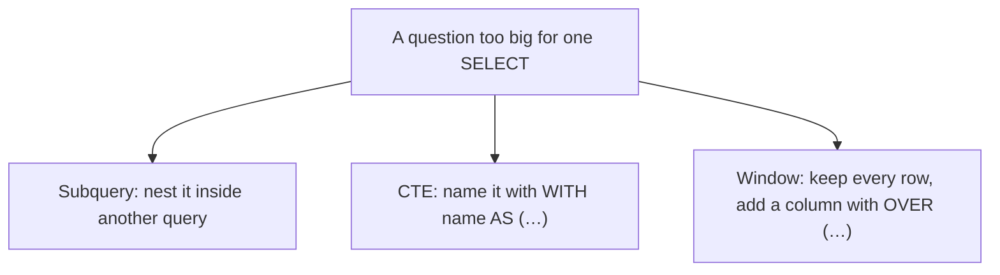

# Subqueries, CTEs & Window Functions at a glance

Aisha wants to know which products cost more than the average — or which customers bought Merch items — or where employees sit in the hiring tree. All three questions need something beyond a plain `SELECT`. This page shows why you'd reach for each tool.



## Subqueries — "nest it"

A subquery is a complete `SELECT` placed inside another query's FROM, WHERE, or SELECT clause. The inner query runs first and feeds its result back to the outer one. Common patterns:

- **Scalar subquery** (`WHERE unit_price > (SELECT AVG(unit_price) FROM products)`): expects exactly one value; used with comparison operators.
- **`IN` / `EXISTS`**: set-membership checks — `EXISTS` stops on the first match, making it faster than `IN` on large lists.
- **Correlated subquery** (references an outer alias like `p.product_id`): re-evaluates once per outer row; powerful but expensive on millions of rows.

Reach for a subquery when you need one nested value or list — it's the simplest way to let MySQL compute something before your main filter can use it.

## CTEs — "name it"

A Common Table Expression is defined with `WITH name AS (SELECT …)` and referenced by that name anywhere in your main query, as if it were a real table:

```sql
WITH order_totals AS (
  SELECT o.order_id, SUM(oi.quantity * oi.unit_price) AS total
  FROM orders o JOIN order_items oi ON oi.order_id = o.order_id
  GROUP BY o.order_id
)
SELECT c.customer_id, p.first_name, SUM(ot.total) AS spent
FROM order_totals ot
JOIN customers c ON c.customer_id = ot.customer_id
JOIN persons p   ON p.person_id = c.person_id
GROUP BY c.customer_id, p.first_name;
```

CTEs are evaluated once — unlike correlated subqueries that may execute per-row. They also enable recursive traversal (the `WITH RECURSIVE` pattern in the employee hierarchy example). Reach for a CTE when the same intermediate result is used more than once or you want readability over nesting.

## Window Functions — "add a column"

A window function (`ROW_NUMBER`, `RANK`, `SUM`, `LAG`, etc.) goes inside an `OVER` clause that tells MySQL how to spread the computation across rows:

```sql
SELECT category_id, name, unit_price,
       ROW_NUMBER() OVER (PARTITION BY category_id ORDER BY unit_price DESC) AS rn
FROM products;
```

Unlike `GROUP BY`, which collapses many rows into one output row and drops data by design, a window function keeps every original row and *adds* a computed column alongside it. The key options:

- **`PARTITION BY`**: groups rows into partitions before applying the computation within each partition (e.g., per category).
- **`ORDER BY`**: defines the sort order within each partition so `ROW_NUMBER`, `LAG`, etc. have a clear "next" and "previous."
- **Frame** (`ROWS BETWEEN N PRECEDING AND M FOLLOWING`): limits how far back or forward the function looks at any given row.

Reach for a window function when you must keep every row but also compute across rows — running totals, rankings, deltas, and previous/next values are all built-in patterns.

> 💡 Aha: window functions and GROUP BY are fundamentally different. Grouping collapses many rows into one output row — it drops data by design. Window functions keep every original row and *add* a computed column — no data loss. Choose whichever matches your goal.

Which to use? Subquery when you need one nested value/list; CTE when the same intermediate result is used more than once or you want readability; window function when you must keep every row but also compute across rows.

[../notes.md](../notes.md) · [../../../SYLLABUS.md](../../../SYLLABUS.md)