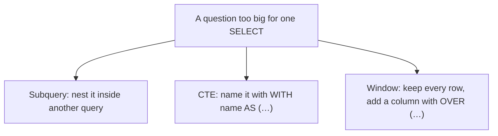

# Module 07 — Subqueries, CTEs & Window Functions · Notes

> Run the commands as you read. The worked example is the same one the checklist asks you to repeat.

## 1. Why this matters

Aisha wants a list of products that cost more than the average price — but she doesn't want the average hard-coded in her query; if prices change tomorrow, she shouldn't have to edit anything. Or maybe she needs to find every customer who bought a "Merch" product (category 4), or identify employees at the bottom of the hierarchy with no supervisor above them.

These questions can't be answered by a single `SELECT`. You need either:
- **A subquery**: a query nested inside another query, letting the inner one compute something the outer one then filters on.
- **A CTE** (Common Table Expression): a named pipeline — you define it with `WITH name AS (…)`, then refer to it by name in your main query. It's like creating a temporary table that lives only for this statement.
- **A window function**: a calculation that runs *across* rows while keeping every row visible. Unlike `GROUP BY` which collapses many rows into one, a window function adds a computed column alongside each original row — it never drops anything.

## 2. The concept

**Subquery:** a query placed inside another query's FROM, WHERE, or SELECT clause. It runs first and feeds its result back to the outer query. A **correlated subquery** references a column from an outer table alias — for every row of that table, MySQL re-evaluates the inner query with fresh values.

**CTE:** `WITH name AS (SELECT …)`. You give it a name and write the definition in parentheses; then you can refer to `name` anywhere in your main SELECT as if it were a real table. CTEs are evaluated once, so they're efficient — unlike subqueries that may execute per-row when correlated.

**Window function:** an aggregate-like function (ROW_NUMBER, RANK, SUM, AVG, LAG, LEAD) placed inside `OVER (…)`. The `OVER` clause tells MySQL *how* to spread the computation across rows: which rows belong together (`PARTITION BY`), in what order (`ORDER BY`), and how far back or forward to look (the **frame** — e.g., `ROWS BETWEEN 1 PRECEDING AND CURRENT ROW`). Window functions never collapse rows; they add a computed column alongside every row.

> 🎯 Goal: subqueries let you nest queries, CTEs give you named pipelines for readability and reuse, window functions compute across rows without dropping any data. Learn all three — each solves a different class of problems elegantly.

**Vocabulary:** **subquery** — a query nested inside another query's FROM, WHERE, or SELECT clause · **correlated subquery** — a subquery that references an outer table alias, re-evaluating once per outer row (can be slow) · **scalar subquery** — a subquery expected to return exactly one value in one column; used with `=`, `<`, etc. · `EXISTS` / `ANY` / `ALL` — set-membership operators that avoid returning full result sets, making them faster than `IN` on large tables · **CTE** (Common Table Expression) — a named pipeline defined with `WITH name AS (…)`, referenced by name in the main query · **recursive CTE** — a CTE whose definition references itself via `UNION ALL`; used for hierarchical traversal and depth counting · **window function** — an aggregate-like function (`ROW_NUMBER`, `RANK`, `SUM`, `LAG`, etc.) that computes across rows while keeping every row visible, placed inside `OVER (…)` · **`OVER`** — the clause window functions go inside; it defines the partitioning and ordering · **`PARTITION BY`** — a window function option that groups rows into partitions before applying the computation within each partition · **frame** — the subset of rows a window function considers at any given row (e.g., `ROWS BETWEEN 1 PRECEDING AND CURRENT ROW` means "this row plus one row above") · `RANK` / `DENSE_RANK` — ranking functions that assign rank numbers to ordered values; `RANK` skips numbers on ties, `DENSE_RANK` does not · **`LAG`** — a window function that returns the value from N rows before the current row (useful for running totals and deltas).



## 3. Worked example (do this)

**Starting state:** The `shopdb` database has exactly 10 tables. The `products` table has 10 rows across four categories; the `orders` table has 8 rows with statuses pending, paid, shipped, and cancelled; the `order_items` table has 14 line items totalling 20 units (quantities from 1 to 3); the `employees` table has 5 rows where employee 1's `supervisor_id` is NULL.

**Goal:** Run a tour of subqueries, CTEs, and window functions that answer questions about products, customers, orders, and employees — without changing anything.

### Part A — Subqueries (6 queries)

#### Step 1 — Scalar subquery: products above the average price (the average is 9.825)

```sql
SELECT name, unit_price FROM products
WHERE unit_price > (SELECT AVG(unit_price) FROM products)
ORDER BY unit_price DESC;
```

| name | unit_price |
|------|----------|
| Tote Bag | 18.00 |
| Ceramic Mug | 14.00 |
| Espresso Blend | 12.50 |
| Decaf | 11.25 |
| House Roast | 10.00 |

> 🎯 Goal: the inner subquery computes the average (9.825) first, then the outer query finds products pricier than that — five rows. The average is a moving target; if prices change tomorrow, this query adapts automatically.

#### Step 2 — `IN` subquery: customers who bought a Merch product (category_id = 4)

```sql
SELECT DISTINCT c.customer_id, p.first_name
FROM orders o
JOIN customers c ON c.customer_id = o.customer_id
JOIN persons p   ON p.person_id = c.person_id
WHERE o.order_id IN (
  SELECT oi.order_id FROM order_items oi
  WHERE oi.product_id IN (SELECT product_id FROM products WHERE category_id = 4)
)
ORDER BY c.customer_id;
```

| customer_id | first_name |
|-------------|------------|
| 2          | Bilal      |
| 4          | Dana       |
| 6          | Fatima     |

Three nested subqueries, each narrowing the search. The innermost finds category 4 product IDs; the middle one finds order_ids that contain those products; the outermost filters orders and joins back to customer names. `IN` is fast for small lists but consider `EXISTS` (Step 3) when the list could be large.

#### Step 3 — `EXISTS`: customers with a shipped order

```sql
SELECT c.customer_id, p.first_name
FROM customers c JOIN persons p ON p.person_id = c.person_id
WHERE EXISTS (SELECT 1 FROM orders o WHERE o.customer_id = c.customer_id AND o.status = 'shipped')
ORDER BY c.customer_id;
```

| customer_id | first_name |
|-------------|------------|
| 1          | Aisha      |
| 2          | Bilal      |

> ⚠️ Gotcha: `EXISTS` stops scanning as soon as it finds one matching row — it never returns a full result set. That's why it's faster than `IN` on large tables. The subquery selects the literal value `1` (not a column) because you only care about existence, not content.

#### Step 4 — `NOT EXISTS`: customers with no cancelled order

```sql
SELECT c.customer_id, p.first_name
FROM customers c JOIN persons p ON p.person_id = c.person_id
WHERE NOT EXISTS (SELECT 1 FROM orders o WHERE o.customer_id = c.customer_id AND o.status = 'cancelled')
ORDER BY c.customer_id;
```

| customer_id | first_name |
|-------------|------------|
| 1          | Aisha      |
| 2          | Bilal      |
| 3          | Chen       |
| 4          | Dana       |
| 6          | Fatima     |

The opposite of Step 3 — five customers whose orders were never cancelled. `NOT EXISTS` is the standard SQL idiom for "has no matching record."

#### Step 5 — Correlated subquery: times each product was ordered

```sql
SELECT p.product_id, p.name,
       (SELECT COUNT(*) FROM order_items oi WHERE oi.product_id = p.product_id) AS times_ordered
FROM products p ORDER BY p.product_id;
```

| product_id | name | times_ordered |
|------------|------|---------------|
| 1          | Espresso Blend | 2   |
| 2          | House Roast    | 2   |
| 3          | Decaf          | 1   |
| 4          | Green Tea      | 1   |
| 5          | Earl Grey      | 1   |
| 6          | Chai           | 1   |
| 7          | Croissant      | 2   |
| 8          | Muffin         | 1   |
| 9          | Ceramic Mug    | 2   |
| 10         | Tote Bag       | 1   |

> ⚠️ Gotcha: this subquery re-evaluates once per product row — so for a table with N products, the inner query runs N times. It's fine for small tables but becomes expensive on millions of rows; later modules cover alternatives that avoid per-row evaluation.

#### Step 6 — `ANY`: products pricier than any Merch item (category_id = 4)

```sql
SELECT name, unit_price FROM products
WHERE unit_price > ANY (SELECT unit_price FROM products WHERE category_id = 4)
ORDER BY unit_price;
```

| name | unit_price |
|------|----------|
| Tote Bag | 18.00 |

`> ANY` is true when the value beats *at least one* Merch price — with `>`, that means beating the cheapest. `> ALL` would be stricter: the value must beat *every* Merch price, i.e. the most expensive one. Here only the 18.00 Tote Bag clears the cheapest Merch item (14.00).

### Part B — CTEs (3 queries)

#### Step 7 — CTE → total spent per customer

```sql
WITH order_totals AS (
  SELECT o.order_id, o.customer_id, SUM(oi.quantity * oi.unit_price) AS total
  FROM orders o JOIN order_items oi ON oi.order_id = o.order_id
  GROUP BY o.order_id, o.customer_id
)
SELECT c.customer_id, p.first_name, SUM(ot.total) AS spent
FROM order_totals ot
JOIN customers c ON c.customer_id = ot.customer_id
JOIN persons p   ON p.person_id = c.person_id
GROUP BY c.customer_id, p.first_name
ORDER BY c.customer_id;
```

| customer_id | first_name | spent |
|-------------|------------|-------|
| 1          | Aisha      | 46.50 |
| 2          | Bilal      | 44.00 |
| 3          | Chen       | 24.00 |
| 4          | Dana       | 26.50 |
| 5          | Emeka      | 9.00  |
| 6          | Fatima     | 34.00 |

> 🎯 Goal: the CTE `order_totals` computes one row per order (total dollars spent). The main query then joins back to customer names and sums across orders — giving a grand total per customer. Without the CTE, you'd have to repeat the join-and-aggregate logic or nest it in another subquery; this keeps the code readable and the engine evaluates `order_totals` once, not per-row.

#### Step 8 — Same CTE + HAVING: only customers spending more than $25

```sql
WITH order_totals AS (
  SELECT o.order_id, SUM(oi.quantity * oi.unit_price) AS total
  FROM orders o JOIN order_items oi ON oi.order_id = o.order_id
  GROUP BY o.order_id
)
SELECT c.customer_id, p.first_name, SUM(ot.total) AS spent
FROM order_totals ot
JOIN customers c ON c.customer_id = ot.customer_id
JOIN persons p   ON p.person_id = c.person_id
GROUP BY c.customer_id, p.first_name
HAVING SUM(ot.total) > 25
ORDER BY c.customer_id;
```

| customer_id | first_name | spent |
|-------------|------------|-------|
| 1          | Aisha      | 46.50 |
| 2          | Bilal      | 44.00 |
| 4          | Dana       | 26.50 |
| 6          | Fatima     | 34.00 |

`HAVING` filters groups after aggregation — it keeps only the rows where the total exceeds 25. Compare with Step 7 to see how CTEs + `HAVING` together make complex filtering readable without nesting.

#### Step 9 — Recursive CTE: the employee hierarchy from the top

```sql
WITH RECURSIVE org AS (
  SELECT employee_id, person_id, supervisor_id, role, 1 AS depth
  FROM employees WHERE supervisor_id IS NULL
  UNION ALL
  SELECT e.employee_id, e.person_id, e.supervisor_id, e.role, org.depth + 1
  FROM employees e JOIN org ON e.supervisor_id = org.employee_id
)
SELECT org.employee_id, p.first_name, org.role, org.depth
FROM org JOIN persons p ON p.person_id = org.person_id
ORDER BY org.employee_id;
```

| employee_id | first_name | role | depth |
|-------------|------------|---------|-------|
| 1          | Giorgio    | manager   | 1   |
| 2          | Hana       | associate | 2   |
| 3          | Igor       | manager   | 2   |
| 4          | Juana      | associate | 2   |
| 5          | Kwame      | associate | 3   |

A recursive CTE has two parts — an **anchor** (the base case, here employees with no supervisor) and a **recursive step** (join the CTE to itself to find children). `UNION ALL` is required between them. This traversal computes a depth column without any application code — it's one of the most powerful SQL patterns for hierarchical data.

### Part C — Window functions (3 queries)

#### Step 10 — `ROW_NUMBER()`: price rank within each category

```sql
SELECT category_id, name, unit_price,
       ROW_NUMBER() OVER (PARTITION BY category_id ORDER BY unit_price DESC) AS rn
FROM products ORDER BY category_id, rn;
```

| category_id | name | unit_price | rn |
|-------------|------|----------|---|
| 1          | Espresso Blend | 12.50 | 1   |
| 1          | Decaf        | 11.25 | 2   |
| 1          | House Roast    | 10.00 | 3   |
| 2          | Chai         | 9.00  | 1   |
| 2          | Earl Grey      | 8.50  | 2   |
| 2          | Green Tea      | 8.00  | 3   |
| 3          | Croissant    | 3.75  | 1   |
| 3          | Muffin       | 3.25  | 2   |
| 4          | Tote Bag     | 18.00 | 1   |
| 4          | Ceramic Mug    | 14.00 | 2   |

> 🎯 Goal: `PARTITION BY category_id` groups rows into four partitions (one per category). Within each partition, `ORDER BY unit_price DESC` orders from highest to lowest price, and `ROW_NUMBER()` assigns sequential numbers starting at 1. The result is a rank column that resets for every category — exactly what you want when comparing products within their own group.

#### Step 11 — `RANK` vs `DENSE_RANK` on order totals (there's a tie at 24.00)

```sql
WITH order_totals AS (
  SELECT o.order_id, SUM(oi.quantity * oi.unit_price) AS total
  FROM orders o JOIN order_items oi ON oi.order_id = o.order_id
  GROUP BY o.order_id
)
SELECT order_id, total,
       RANK()           OVER (ORDER BY total DESC) AS rnk,
       DENSE_RANK() OVER (ORDER BY total DESC) AS drnk
FROM order_totals ORDER BY total DESC;
```

| order_id | total  | rnk | drnk |
|----------|--------|-----|------|
| 7        | 34.00    | 1   | 1    |
| 1        | 28.75    | 2   | 2    |
| 5        | 26.50    | 3   | 3    |
| 2        | 24.00    | 4   | 4    |
| 4        | 24.00    | 4   | 4    |
| 8        | 20.00    | 6   | 5    |
| 3        | 17.75    | 7   | 6    |
| 6        | 9.00     | 8   | 7    |

Orders 2 and 4 both have total 24.00 — that's a tie. `RANK` skips numbers on ties (jumps to 6 after the tie), while `DENSE_RANK` does not (continues at 5). Choose carefully depending on how you want ties handled downstream.

#### Step 12 — Running total: cumulative sum across orders

```sql
WITH order_totals AS (
  SELECT o.order_id, SUM(oi.quantity * oi.unit_price) AS total
  FROM orders o JOIN order_items oi ON oi.order_id = o.order_id
  GROUP BY o.order_id
)
SELECT order_id, total,
       SUM(total) OVER (ORDER BY order_id) AS running_total
FROM order_totals ORDER BY order_id;
```

| order_id | total | running_total |
|----------|-------|---------------|
| 1          | 28.75    | 28.75     |
| 2          | 24.00    | 52.75     |
| 3          | 17.75    | 70.50     |
| 4          | 24.00    | 94.50     |
| 5          | 26.50    | 121.00    |
| 6          | 9.00     | 130.00    |
| 7          | 34.00    | 164.00    |
| 8          | 20.00    | 184.00    |

`SUM(total) OVER (ORDER BY order_id)` is a running total — it adds up the current row and every row before it, in ascending order by `order_id`. This is one of the most common window-function patterns and appears everywhere from financial reports to sales dashboards.

#### Step 13 — `LAG`: previous order's total (NULL for the first row)

```sql
WITH order_totals AS (
  SELECT o.order_id, SUM(oi.quantity * oi.unit_price) AS total
  FROM orders o JOIN order_items oi ON oi.order_id = o.order_id
  GROUP BY o.order_id
)
SELECT order_id, total, LAG(total) OVER (ORDER BY order_id) AS previous_total
FROM order_totals ORDER BY order_id;
```

| order_id | total | previous_total |
|----------|-------|----------------|
| 1          | 28.75    | NULL           |
| 2          | 24.00    | 28.75        |
| 3          | 17.75    | 24.00        |
| 4          | 24.00    | 17.75        |
| 5          | 26.50    | 24.00        |
| 6          | 9.00     | 26.50        |
| 7          | 34.00    | 9.00         |
| 8          | 20.00    | 34.00        |

> 🎯 Goal: `LAG(total)` returns the value from one row before the current row (the default offset is 1). The first row has NULL because there's no previous row. This pattern — computing deltas, trends, and comparisons between adjacent rows without self-joins — is what window functions were designed for.

## 4. How it works

**Subqueries:** MySQL evaluates the inner query first (unless correlated), then uses its result in the outer query. A scalar subquery must return exactly one value; otherwise you get `ERROR 1242`. Correlated subqueries reference an outer table alias and re-evaluate once per row — powerful but potentially slow on large tables.

**CTEs:** defined with `WITH name AS (SELECT …)`, evaluated once, then referenced by name in the main query. MySQL treats them as named temporary tables that live only for this statement. They're efficient because they don't re-evaluate like correlated subqueries do — and unlike derived tables (subqueries in FROM), CTEs can be referenced multiple times.

**Window functions:** `func() OVER (PARTITION BY … ORDER BY …)` tells MySQL how to spread the computation across rows. The engine processes every row, applying the function within each partition defined by `PARTITION BY`. The **frame** — optionally specified as `ROWS BETWEEN N PRECEDING AND M FOLLOWING` or `RANGE BETWEEN …` — determines which subset of rows the function considers at any given position. Window functions never collapse rows like `GROUP BY` does; they add a computed column alongside every row, keeping all data visible.

> 💡 Aha: window functions and GROUP BY are fundamentally different. Grouping collapses many rows into one output row — it drops data by design. Window functions keep every original row and *add* a computed column — no data loss. Choose whichever matches your goal.

## 5. Common errors & fixes

| Symptom | Cause | Fix |
|---|---|---|
| `ERROR 1242 (21000): Subquery returns more than 1 row` | A scalar subquery (used with `=`) returned several rows | Use `IN`, or add `LIMIT 1`, or aggregate it (`MAX`, `MIN`) |
| `ERROR 1222 (21000): The used SELECT statements have a different number of columns` | The two halves of a `UNION` / recursive CTE select a different number of columns | Make both branches select the same columns, in the same order |
| `ERROR 1111 (HY000): Invalid use of group function` | You put an aggregate like `COUNT(*)` in `WHERE` | Filter groups with `HAVING`, or wrap it in a subquery |

## 6. Try it yourself

The exercises are in `exercises/`. Open `README.md` there and pick one challenge — the subqueries, CTEs, or window function section.

**Success looks like:**
- You can write scalar subqueries (`WHERE unit_price > (SELECT AVG(unit_price) FROM products)`), correlated subqueries (`(SELECT COUNT(*) FROM order_items oi WHERE oi.product_id = p.product_id)`), and `EXISTS` / `NOT EXISTS`.
- You understand CTEs as named pipelines defined with `WITH name AS (…)`, including recursive ones for hierarchical traversal.
- You know window functions — `ROW_NUMBER() OVER (PARTITION BY … ORDER BY …)`, `RANK`, `SUM() OVER (ORDER BY …)` for running totals, and `LAG()` for previous-row values.

> 🧪 Try it: in Step 10, remove `PARTITION BY category_id` from the window function's `OVER` clause — watch every row get a global rank across all ten products instead of per-category ranks. Add `ROWS BETWEEN 2 PRECEDING AND CURRENT ROW` to limit the frame and see how `ROW_NUMBER()` resets within each frame boundary.

## 7. Going deeper (L3/L4)

**Counting distinct values:** `SELECT COUNT(DISTINCT category_id) FROM products;` returns 4 — the number of unique categories, skipping duplicates. Useful for cardinality estimates but slower than `COUNT(*)` because MySQL must track every value seen so far.

**Named windows (MySQL 8+):** you can give a window function an alias and refer to it in other window functions:
```sql
SELECT category_id, name, unit_price,
       ROW_NUMBER() OVER w AS rn
FROM products WINDOW w AS (PARTITION BY category_id ORDER BY unit_price DESC);
```
This is cleaner than repeating the `OVER` clause and lets you compose windows — e.g., ranking within a partition that itself was defined by another window.

**LEAD:** a window function that returns the value from N rows *after* the current row (the opposite of `LAG`). Useful for "next event" calculations in financial, sports, or medical data where future values matter.

**Recursive depth guard:** recursive CTEs can loop infinitely on bad data (e.g., circular supervisor references). MySQL's default recursion limit is 32 levels; you can raise it with `SET SESSION max_recursive_cte_depth = 100`. A common pattern is to add a maximum depth check in the recursive step:
```sql
WITH RECURSIVE org AS (
  SELECT employee_id, person_id, supervisor_id, role, 1 AS depth
  FROM employees WHERE supervisor_id IS NULL
  UNION ALL
  SELECT e.employee_id, e.person_id, e.supervisor_id, e.role, org.depth + 1
  FROM employees e JOIN org ON e.supervisor_id = org.employee_id
  WHERE org.depth < 5
)
```

**CTE vs derived table:** a CTE (`WITH t AS (SELECT …) SELECT * FROM t`) reads better than a subquery in `FROM` — you can reference it multiple times without repeating the definition. Derived tables (subqueries in FROM) are evaluated once per reference, so they're slower if used more than once. Use CTEs for readability and reuse; use derived tables only when MySQL's optimizer can't materialize the CTE efficiently.

## References

- The three tools, visualised: [`assets/window-concepts.md`](assets/window-concepts.md)
- Back to the syllabus: [`../../SYLLABUS.md`](../../SYLLABUS.md)
- The learning path for this course: [`../../LEARNING_PATH.md`](../../LEARNING_PATH.md)
