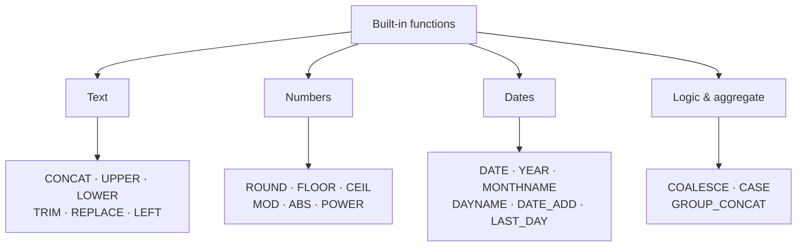

# Function cheatsheet — at a glance

MySQL 8 ships dozens of built-in functions that let you reshape text, round numbers, slice dates, and fill gaps without leaving the database. This page maps the families so you can pick one in under a second. For worked examples, see [notes.md](../notes.md).

## A quick sketch

Each box is a family of functions — the tables below give every function's signature and a quick example.

## Text functions

| Function | Signature | Example | Result |
|---|---|---|---|
| `CONCAT` | `CONCAT(s1, s2, …)` | `CONCAT(first_name,' ',last_name)` | `'Aisha Khan'` |
| `UPPER / LOWER` | `UPPER(str)`, `LOWER(str)` | `UPPER(last_name)` | `'KHAN'` |
| `TRIM` | `TRIM(str [, char ])` | `TRIM('  hello  ')` | `'hello'` |
| `REPLACE` | `REPLACE(s, old, new)` | `REPLACE(name,' ','-')` | `'House-Roast'` |
| `LEFT` | `LEFT(str, n)` | `LEFT(sku,3)` | `'COF'` |
| `SUBSTRING_INDEX` | `SUBSTRING_INDEX(s, substr [, pos ])` | `SUBSTRING_INDEX(sku,'-',-1)` | `'001'` |

**Gotcha:** `CONCAT(NULL,'A')` returns `NULL`. Use `CONCAT_WS` or wrap with `COALESCE`.

## Number functions

| Function | Signature | Example | Result |
|---|---|---|---|
| `ROUND` | `ROUND(n, d)` | `ROUND(9.832, 2)` | `9.83` |
| `FLOOR` | `FLOOR(n)` | `FLOOR(9.83)` | `9` |
| `CEIL` | `CEIL(n)` | `CEIL(9.83)` | `10` |
| `MOD` | `MOD(a, b)` | `MOD(10, 3)` | `1` |
| `ABS` | `ABS(n)` | `ABS(-14)` | `14` |
| `POWER` | `POWER(base, exp)` | `POWER(2, 5)` | `32` |

**Gotcha:** `ROUND(AVG(unit_price),0)` returns a **DECIMAL**, not an INT. Cast to `CAST(... AS SIGNED INTEGER)` if you need integer arithmetic downstream.

## Date functions

| Function | Signature | Example | Result |
|---|---|---|---|
| `DATE` | `DATE(dt)` | `DATE('2024-01-05')` | `'2024-01-05'` (DATE) |
| `YEAR` | `YEAR(dt)` | `YEAR('2024-01-05')` | `2024` |
| `MONTHNAME` | `MONTHNAME(dt)` | `MONTHNAME('2024-01-05')` | `'January'` |
| `DAYNAME` | `DAYNAME(dt)` | `DAYNAME('2024-01-05')` | `'Friday'` |
| `DATE_ADD` | `DATE_ADD(dt, INTERVAL n unit)` | `DATE_ADD('2024-01-05', INTERVAL 7 DAY)` | `'2024-01-12'` |
| `DATE_SUB` | `DATE_SUB(dt, INTERVAL n unit)` | `DATE_SUB('2024-01-05', INTERVAL 1 DAY)` | `'2024-01-04'` |
| `LAST_DAY` | `LAST_DAY(dt)` | `LAST_DAY('2024-01-05')` | `'2024-01-31'` |
| `TIMESTAMPDIFF` | `TIMESTAMPDIFF(unit, dt1, dt2)` | `TIMESTAMPDIFF(YEAR, dob, '2024-01-01')` | age in years |

**Gotcha:** `TIMESTAMPDIFF` returns **NULL** if any argument is `NULL`. Guard with `COALESCE` when a nullable date could reach it.

## Logic & aggregation

| Function | Signature | Example | Result |
|---|---|---|---|
| `COALESCE` | `COALESCE(a1, a2, …)` | `COALESCE(p.phone, 'n/a')` | the phone, or `'n/a'` if NULL |
| `CASE` | `CASE WHEN cond THEN val END` | `CASE WHEN unit_price<5 THEN 'budget' ELSE 'mid' END` | band label |
| `GROUP_CONCAT` | `GROUP_CONCAT(col ORDER BY col SEPARATOR ', ')` | `GROUP_CONCAT(product_name ORDER BY product_name SEPARATOR ', ')` | `'Decaf, Espresso Blend, House Roast'` |

**Gotcha:** `CASE` evaluates conditions top-to-bottom and stops at the first match. Put the most specific branches first; otherwise a catch-all `ELSE` can swallow legitimate cases.

## Going deeper

- [notes.md](../notes.md) — worked examples with real output tables
- [SYLLABUS.md](../../../SYLLABUS.md) — course index and next modules

> 💡 Aha: built-in functions are deterministic when their inputs are deterministic (except for `NOW()`, `RAND()`, and the like), which makes them safe to treat as pure expressions in views and stored programs.