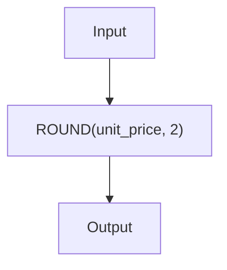

# Module 08 — Built-in Functions · Notes

## Why this matters

So far you've written queries that join tables, filter rows, and aggregate numbers. That's powerful, but real-world data is rarely clean enough to feed straight into a report or an app. Names have trailing spaces, SKUs need to be parsed, prices must be rounded to two decimal places, and dates often arrive as strings instead of proper date types. Built-in functions are MySQL's way of cleaning, reshaping, and interpreting that messy data — all inside the database so your application code stays lean.

Think of a function as a tiny calculator: it takes one or more inputs (called **arguments**) and returns a single value. Some functions are *deterministic* — given the same input they always return the same output (like `UPPER('hello')`). Others are *non-deterministic*, meaning their result can change from run to run even with identical data (for example, `RAND()`). Understanding this distinction helps you reason about caching, indexing, and when it's safe to call a function in an indexable expression.

## The concept

A MySQL built-in function is a named operation that lives inside the server. You invoke it by name, passing arguments separated by commas. The function does its work — parsing text, rounding numbers, extracting date parts — and returns a value you can use anywhere a column or literal is expected: in `SELECT`, `WHERE`, `JOIN ON`, `GROUP BY`, and beyond.



*Diagram explanation:* The input column `unit_price` (a raw number from the database) is fed into the `ROUND(...)` function with a second argument of `2`, telling MySQL to keep two decimal places. The function returns the rounded value, which becomes part of your result set. Every built-in function works this way: **input(s) → function → output**.

**Vocabulary.**

- *function* — a named operation that transforms values (e.g. `UPPER`, `ROUND`).
- *argument* — the value you pass into a function; functions may take zero, one, or many arguments.
- *deterministic* — a function whose output is fully determined by its input; safe to index and cache (`UPPER('abc')` always returns `'ABC'`).
- *non-deterministic* — a function whose output can change between calls even with identical inputs (`RAND()`, `NOW()`).
- *NULL propagation* — many functions return `NULL` if any argument is `NULL`; you must guard against this (e.g. with `COALESCE` or `CONCAT_WS`).

## Worked example

The file `examples/01-built-in-functions.sql` runs clean on the seed data and produces the tables below.

### Step 1 — formatting names and lengths

```sql
SELECT p.person_id,
       CONCAT(p.first_name, ' ', p.last_name) AS full_name,
       UPPER(p.last_name)                     AS last_upper,
       CHAR_LENGTH(p.email)                   AS email_len
FROM persons p
ORDER BY p.person_id;
```

| person_id | full_name | last_upper | email_len |
|---|---|---|---|
| 1 | Aisha Khan | KHAN | 22 |
| 2 | Bilal Ahmed | AHMED | 23 |
| 3 | Chen Wei | WEI | 20 |
| 4 | Dana Ortiz | ORTIZ | 22 |
| 5 | Emeka Okafor | OKAFOR | 24 |
| 6 | Fatima Noor | NOOR | 23 |
| 7 | Giorgio Rossi | ROSSI | 25 |
| 8 | Hana Sato | SATO | 21 |
| 9 | Igor Petrov | PETROV | 23 |
| 10 | Juana Lopez | LOPEZ | 23 |
| 11 | Kwame Mensah | MENSAH | 24 |
| 12 | Lena Fischer | FISCHER | 24 |

### Step 2 — slicing SKU codes

```sql
SELECT pr.product_id,
       pr.sku,
       LEFT(pr.sku, 3)                  AS code,
       SUBSTRING_INDEX(pr.sku, '-', -1) AS number
FROM products pr
ORDER BY pr.product_id;
```

| product_id | sku | code | number |
|---|---|---|---|
| 1 | COF-001 | COF | 001 |
| 2 | COF-002 | COF | 002 |
| 3 | COF-003 | COF | 003 |
| 4 | TEA-001 | TEA | 001 |
| 5 | TEA-002 | TEA | 002 |
| 6 | TEA-003 | TEA | 003 |
| 7 | BAK-001 | BAK | 001 |
| 8 | BAK-002 | BAK | 002 |
| 9 | MER-001 | MER | 001 |
| 10 | MER-002 | MER | 002 |

### Step 3 — trimming and replacing text

```sql
SELECT TRIM('   House Roast   ')        AS trimmed,
       REPLACE('House Roast', ' ', '-') AS slug,
       LOWER('ESP-LEND')                AS lowered;
```

| trimmed | slug | lowered |
|---|---|---|
| House Roast | House-Roast | esp-lend |

### Step 4 — rounding the average price

```sql
SELECT ROUND(AVG(unit_price), 2) AS avg_2dp,
       ROUND(AVG(unit_price), 0) AS avg_whole,
       FLOOR(AVG(unit_price))    AS floored,
       CEIL(AVG(unit_price))     AS ceiled
FROM products;
```

| avg_2dp | avg_whole | floored | ceiled |
|---|---|---|---|
| 9.83 | 10 | 9 | 10 |

### Step 5 — numeric helpers

```sql
SELECT MOD(10, 3)  AS remainder,
       ABS(-14.00) AS absolute,
       POWER(2, 5) AS two_to_five;
```

| remainder | absolute | two_to_five |
|---|---|---|
| 1 | 14.00 | 32 |

### Step 6 — extracting date parts

```sql
SELECT order_id,
       DATE(order_date)      AS day,
       MONTHNAME(order_date) AS month_name,
       DAYNAME(order_date)   AS weekday,
       YEAR(order_date)      AS yr
FROM orders
ORDER BY order_id;
```

| order_id | day | month_name | weekday | yr |
|---|---|---|---|---|
| 1 | 2024-01-05 | January | Friday | 2024 |
| 2 | 2024-01-06 | January | Saturday | 2024 |
| 3 | 2024-01-07 | January | Sunday | 2024 |
| 4 | 2024-01-08 | January | Monday | 2024 |
| 5 | 2024-01-09 | January | Tuesday | 2024 |
| 6 | 2024-01-10 | January | Wednesday | 2024 |
| 7 | 2024-01-11 | January | Thursday | 2024 |
| 8 | 2024-01-12 | January | Friday | 2024 |

### Step 7 — date arithmetic

```sql
SELECT DATE_ADD('2024-01-05', INTERVAL 7 DAY) AS plus_week,
       DATE_SUB('2024-01-05', INTERVAL 1 DAY) AS minus_day,
       LAST_DAY('2024-01-05')                 AS month_end;
```

| plus_week | minus_day | month_end |
|---|---|---|
| 2024-01-12 | 2024-01-04 | 2024-01-31 |

### Step 8 — age at a fixed date

```sql
SELECT first_name,
       dob,
       TIMESTAMPDIFF(YEAR, dob, '2024-01-01') AS age_at_2024
FROM persons
ORDER BY person_id;
```

| first_name | dob | age_at_2024 |
|---|---|---|
| Aisha | 1990-05-14 | 33 |
| Bilal | 1985-11-02 | 38 |
| Chen | 1992-03-21 | 31 |
| Dana | 1996-07-30 | 27 |
| Emeka | 1988-01-19 | 35 |
| Fatima | 1994-09-09 | 29 |
| Giorgio | 1983-04-27 | 40 |
| Hana | 1997-12-01 | 26 |
| Igor | 1979-06-15 | 44 |
| Juana | 1991-02-08 | 32 |
| Kwame | 1986-10-23 | 37 |
| Lena | 1993-08-05 | 30 |

### Step 9 — filling missing supervisors with COALESCE

```sql
SELECT e.employee_id,
       CONCAT(p.first_name, ' ', p.last_name) AS employee,
       COALESCE(sup_p.first_name, '— none —') AS supervisor
FROM employees e
JOIN persons p          ON p.person_id = e.person_id
LEFT JOIN employees sup ON sup.employee_id = e.supervisor_id
LEFT JOIN persons sup_p ON sup_p.person_id = sup.person_id
ORDER BY e.employee_id;
```

| employee_id | employee | supervisor |
|---|---|---|
| 1 | Giorgio Rossi | — none — |
| 2 | Hana Sato | Giorgio |
| 3 | Igor Petrov | Giorgio |
| 4 | Juana Lopez | Giorgio |
| 5 | Kwame Mensah | Igor |

### Step 10 — labeling price bands with CASE

```sql
SELECT name,
       unit_price,
       CASE
         WHEN unit_price < 5.00  THEN 'budget'
         WHEN unit_price < 12.00 THEN 'mid'
         ELSE 'premium'
       END AS price_band
FROM products
ORDER BY unit_price, name;
```

| name | unit_price | price_band |
|---|---|---|
| Muffin | 3.25 | budget |
| Croissant | 3.75 | budget |
| Green Tea | 8.00 | mid |
| Earl Grey | 8.50 | mid |
| Chai | 9.00 | mid |
| House Roast | 10.00 | mid |
| Decaf | 11.25 | mid |
| Espresso Blend | 12.50 | premium |
| Ceramic Mug | 14.00 | premium |
| Tote Bag | 18.00 | premium |

### Step 11 — conditional aggregation

```sql
SELECT SUM(CASE WHEN status = 'paid'      THEN 1 ELSE 0 END) AS paid,
       SUM(CASE WHEN status = 'shipped'   THEN 1 ELSE 0 END) AS shipped,
       SUM(CASE WHEN status = 'pending'   THEN 1 ELSE 0 END) AS pending,
       SUM(CASE WHEN status = 'cancelled' THEN 1 ELSE 0 END) AS cancelled
FROM orders;
```

| paid | shipped | pending | cancelled |
|---|---|---|---|
| 4 | 2 | 1 | 1 |

### Step 12 — per-category product lists with GROUP_CONCAT

```sql
SELECT c.name AS category,
       GROUP_CONCAT(pr.name ORDER BY pr.name SEPARATOR ', ') AS products
FROM categories c
JOIN products pr ON pr.category_id = c.category_id
GROUP BY c.category_id, c.name
ORDER BY c.category_id;
```

| category | products |
|---|---|
| Coffee | Decaf, Espresso Blend, House Roast |
| Tea | Chai, Earl Grey, Green Tea |
| Bakery | Croissant, Muffin |
| Merch | Ceramic Mug, Tote Bag |

## How it works

Every built-in function in MySQL follows the same pattern: **name** followed by parentheses containing its arguments. Some functions have no arguments (like `NOW()`), some take one argument (like `UPPER(text)`), and others need several (`ROUND(value, decimal_places)`, `SUBSTRING_INDEX(str, separator, position)`). The key thing to remember is that MySQL evaluates expressions from the inside outward — so in `CONCAT(UPPER(first_name),' ',last_name)`, the innermost call `UPPER(first_name)` runs first and feeds its result into `CONCAT`.

Functions also integrate with SQL clauses. You can put a function in `SELECT` to transform output, in `WHERE` to filter on derived values (though this prevents index use), and in `GROUP BY` to group by date parts or text categories. The most common pitfall is *NULL propagation*: if any argument to a function is `NULL`, the result is usually `NULL`. Use `COALESCE(value, default)` to supply a fallback before calling string functions, and remember that `CONCAT(null, 'hello')` returns `NULL` — use `CONCAT_WS` instead.

## Common errors & fixes

| Error | Fix |
|---|---|
| `ERROR 1305 (42000): FUNCTION shopdb.SUBSTR does not exist` | MySQL uses `SUBSTRING_INDEX`, not `SUBSTR`. Check the function name in the reference. |
| `ERROR 1064 ... near 'DATE_FORMAT(...) AS ... '` with a trailing comma | Extra commas after `SELECT` columns cause syntax errors. Count your commas: one between each column, none at the end. |
| Unexpected `NULL` from `CONCAT` when any argument is `NULL` | Use `COALESCE(column_name, '')` before concatenating, or use `CONCAT_WS` which treats `NULL` as an empty string. |

## Try it yourself

Work through the four exercises in `exercises/README.md`. Each task has a goal, a hint (if you need one), and a verification step that tells you exactly how many rows to expect — this is your safety net while coding. Solutions live in `solutions/01-exercises.sql`; try yourself first before peeking at the answers.

> 🧪 Try it: pick any exercise, write the query from scratch, run it against the seed database, and check that you get the expected row count. If you don't match, ask for a hint — but resist the temptation to copy-paste an answer without understanding what it does.

## Going deeper (L3 / L4)

- **MySQL 8 Analytic Functions** (`ROW_NUMBER`, `RANK`, `LEAD`/`LAG`) for windowing calculations on ordered partitions — see Module 07.
- **Regular expressions** with `REGEXP_LIKE` and `REGEXP_REPLACE` for multi-pattern text cleaning (L3).
- **JSON functions** in MySQL 8 (`JSON_EXTRACT`, `JSON_MERGE_PATCH`) when your data is stored as JSON blobs inside a column (L4).
- **Custom functions** — writing a user-defined function in SQL or C++ to encapsulate a complex transformation you reuse across many queries (L3/L4).

## References

- [MySQL Built-in Functions Reference](../../SYLLABUS.md)
- [Module 07 — Subqueries, CTEs & Window Functions](../07-subqueries-ctes-window-functions/README.md)
- [Module 09 — Data Types & Precision](../09-data-types-precision/README.md)
