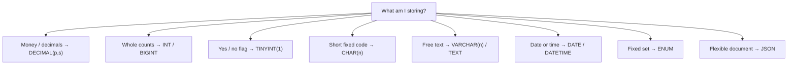

# Type selection at a glance

Choosing a column type is a contract: it fixes the storage, the allowed values, and the behaviour on insert
and comparison. This page is the one-screen memory aid — the reasoning lives in [notes.md](../notes.md).

## Numbers

| Store… | Use | Why |
|---|---|---|
| Money, prices, anything you sum | `DECIMAL(p,s)` | Exact fixed-point; no floating-point drift |
| Whole counts, IDs, flags | `INT` / `BIGINT` / `TINYINT(1)` | Compact, exact, fast to compare |
| Scientific measurements | `FLOAT` / `DOUBLE` | Approximate binary floating point — never for money |

`shopdb` uses `DECIMAL(10,2)` for `products.unit_price` and `INT` for `order_items.quantity`.

## Text

| Store… | Use | Why |
|---|---|---|
| Short fixed-width code (SKU, country, phone) | `CHAR(n)` | Fixed length, no length prefix |
| Free text of varying length | `VARCHAR(n)` | Stores only what it needs |
| Long articles / descriptions | `TEXT` | Beyond `VARCHAR` limits |

## Dates, sets and documents

| Store… | Use | Why |
|---|---|---|
| A calendar date | `DATE` | 3 bytes, no time component |
| Date + time, timezone-free | `DATETIME` | 5 bytes + fractional seconds |
| A UTC instant (1970–2038) | `TIMESTAMP` | Stored UTC, converted to the session timezone |
| One of a fixed list | `ENUM('a','b',…)` | Compact integer index; rejects bad values |
| A flexible document | `JSON` | Binary storage + `JSON_EXTRACT`; index via a generated column |

## The two rules worth memorising

1. **Money is always `DECIMAL`** — `0.1 + 0.2` is exactly `0.3` in `DECIMAL` and `0.30000000000000004` in
   `DOUBLE`.
2. **Pick the smallest type that fits, on purpose** — not by defaulting everything to `VARCHAR(255)`.

> 💡 Aha: you can read a column's real type back from the database itself
> (`information_schema.COLUMNS.COLUMN_TYPE`) — the schema is the source of truth, not the docs.

---

Next: the worked example is in [`../notes.md`](../notes.md); the full module list is in
[`../../../SYLLABUS.md`](../../../SYLLABUS.md).
