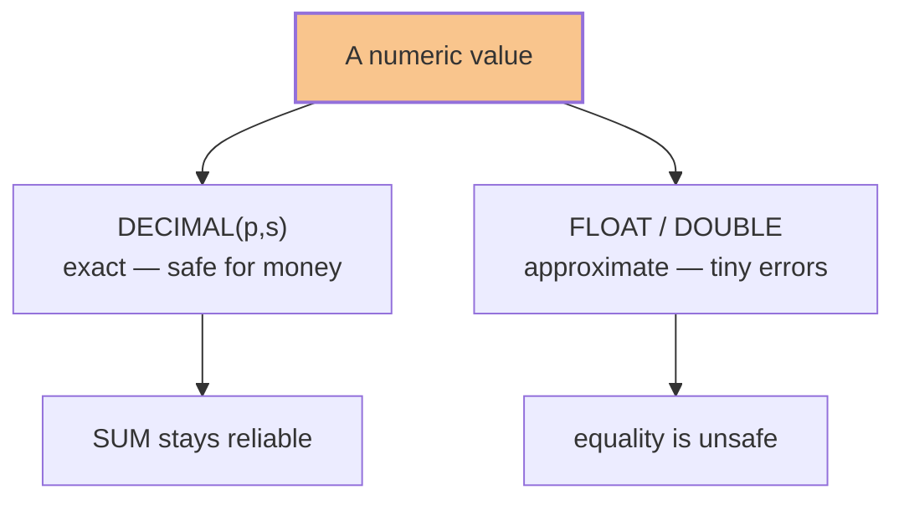

# Module 09 — Data Types & Precision · Notes

## Why this matters

Every column you create has a **type**, and that type decides three things: how much space the value takes,
which values are allowed, and how the value behaves in arithmetic and comparisons. In `shopdb`, a product's
price lives in `products.unit_price`, declared `DECIMAL(10,2)` — money must be **exact**. A line item's
count lives in `order_items.quantity`, declared `INT` — a whole number, never a fraction. Get the type right
and the database protects you; get it wrong and you get silent truncation, rounding drift, or a query that
suddenly returns the wrong rows.

Picking the wrong type is one of the most common beginner mistakes — it wastes disk, slows queries, and can
quietly lose data. This module shows you how to **read a column's declared type straight from MySQL**
(`information_schema.COLUMNS`) and how to choose the right one before you write your first `CREATE TABLE`.

> 🎯 Goal: understand why every column has a type, how precision and scale work for numbers, and how
> characters differ from the bytes that store them.

## The concept — declared type → storage → behaviour

Think of a type as three linked decisions:

1. **Declared type** — what you write in `CREATE TABLE` (`DECIMAL(10,2)`, `VARCHAR(80)`, `ENUM('pending','paid')`).
2. **Storage** — how MySQL keeps the bytes on disk (a fixed-point number, a variable-length string, a small integer index).
3. **Behaviour** — what happens on insert/compare (`DECIMAL` is exact; `FLOAT` drifts; a bad `ENUM` value is rejected).

The declared type is your contract with MySQL; the storage is the engine's business; the behaviour is where
bugs hide. Here is the choice that matters most:



**Why `DECIMAL` beats `FLOAT` for money:** floating-point numbers store values approximately, so
`0.1 + 0.2` can come back as `0.30000000000000004`. For a coffee price that is harmless; for an invoice it is
not. `DECIMAL(10,2)` stores exactly two decimal places and arithmetic is exact — no surprises when you sum a
thousand line items.

### Vocabulary

- **Data type** — the declared column type (`INT`, `VARCHAR`, `DECIMAL`, `ENUM`, JSON, …).
- **Precision (p)** — the total number of significant digits a `DECIMAL` stores (the `10` in `DECIMAL(10,2)`).
- **Scale (s)** — how many of those digits sit after the decimal point (the `2` in `DECIMAL(10,2)`); the integer part gets `p - s` digits.
- **Exact numeric** (`DECIMAL(p,s)`) — stored exactly; arithmetic is exact. Use it for money and anything where rounding matters.
- **Approximate numeric** (`FLOAT`, `DOUBLE`) — stored in binary floating-point; tiny rounding errors are possible. Fine for measurements, not for money.
- **Character set / collation** — how bytes map to characters (UTF-8 is the norm) and the rules for sorting/comparison.
- **`CHAR(n)` vs `VARCHAR(n)`** — `CHAR(n)` pads every value to exactly *n* characters; `VARCHAR(n)` stores only what it needs (plus a short length prefix). Both are truncated/errored if a value is too long, and both can be `NULL` unless you say `NOT NULL`.
- **`ENUM('a','b','c')`** — a fixed set of allowed string values, stored internally as a small integer index. Self-documenting and rejected at the database level.
- **`JSON`** — MySQL 8 stores JSON documents in an internal binary form, with functions to read them (`JSON_EXTRACT`, `JSON_UNQUOTE`).
- **`UNSIGNED`** — an integer type that cannot go negative. Surprising: `CAST(-1 AS UNSIGNED)` gives the maximum positive value, not `-1`.

> 💡 Aha: if the question is "how do I store money?" the answer is `DECIMAL(p,s)` — never `FLOAT`. It is the
> classic source of rounding bugs in every language.

## Worked example — real output from `shopdb`

The file `examples/01-data-types-precision.sql` runs clean on the seed data and produces the tables below.

**Step 1 — DECIMAL is exact**

```sql
SELECT 0.1 + 0.2 AS decimal_sum;
```

| decimal_sum |
|---|
| 0.3 |

**Step 2 — DOUBLE is approximate**

```sql
SELECT CAST(0.1 AS DOUBLE) + CAST(0.2 AS DOUBLE) AS double_sum;
```

| double_sum |
|---|
| 0.30000000000000004 |

> ⚠️ Gotcha: that stray `…000000000004` is why you should never compare money with `=` on `FLOAT`/`DOUBLE`
> — the values will not match exactly. Compare `DECIMAL` with `DECIMAL`.

**Step 3 — money is `DECIMAL(10,2)`**

```sql
SELECT COLUMN_NAME, COLUMN_TYPE, NUMERIC_PRECISION, NUMERIC_SCALE, IS_NULLABLE
FROM information_schema.COLUMNS
WHERE TABLE_SCHEMA = 'shopdb'
  AND TABLE_NAME = 'products'
  AND COLUMN_NAME = 'unit_price';
```

| COLUMN_NAME | COLUMN_TYPE | NUMERIC_PRECISION | NUMERIC_SCALE | IS_NULLABLE |
|---|---|---|---|---|
| unit_price | decimal(10,2) | 10 | 2 | NO |

**Step 4 — rounding to a scale**

```sql
SELECT CAST(10 / 3 AS DECIMAL(6,2)) AS third_2dp,
       ROUND(10 / 3, 4)             AS third_4dp;
```

| third_2dp | third_4dp |
|---|---|
| 3.33 | 3.3333 |

**Step 5 — SUM of DECIMAL stays exact**

```sql
SELECT SUM(quantity * unit_price) AS total
FROM order_items;
```

| total |
|---|
| 184.00 |

**Step 6 — characters vs bytes (é is two bytes in UTF-8)**

```sql
SELECT CHAR_LENGTH(_utf8mb4'café') AS chars,
       LENGTH(_utf8mb4'café')      AS bytes;
```

| chars | bytes |
|---|---|
| 4 | 5 |

**Step 7 — integer widths**

```sql
SELECT TABLE_NAME, COLUMN_NAME, COLUMN_TYPE
FROM information_schema.COLUMNS
WHERE TABLE_SCHEMA = 'shopdb'
  AND COLUMN_NAME IN ('is_active', 'quantity')
ORDER BY TABLE_NAME, COLUMN_NAME;
```

| TABLE_NAME | COLUMN_NAME | COLUMN_TYPE |
|---|---|---|
| customers | is_active | tinyint(1) |
| order_items | quantity | int |
| products | is_active | tinyint(1) |

**Step 8 — ENUM**

```sql
SELECT COLUMN_NAME, COLUMN_TYPE
FROM information_schema.COLUMNS
WHERE TABLE_SCHEMA = 'shopdb'
  AND TABLE_NAME = 'orders'
  AND COLUMN_NAME = 'status';
```

| COLUMN_NAME | COLUMN_TYPE |
|---|---|
| status | enum('pending','paid','shipped','cancelled') |

**Step 9 — the temporal family**

```sql
SELECT CAST('2024-01-05' AS DATE)             AS as_date,
       CAST('2024-01-05 09:15:00' AS DATETIME) AS as_datetime;
```

| as_date | as_datetime |
|---|---|
| 2024-01-05 | 2024-01-05 09:15:00 |

**Step 10 — JSON is a first-class type**

```sql
SELECT CAST('{"name":"Aisha","tier":"gold"}' AS JSON) AS doc,
       JSON_UNQUOTE(JSON_EXTRACT(CAST('{"name":"Aisha","tier":"gold"}' AS JSON), '$.tier')) AS tier,
       JSON_UNQUOTE(JSON_EXTRACT(CAST('{"name":"Aisha","tier":"gold"}' AS JSON), '$.name')) AS name;
```

| doc | tier | name |
|---|---|---|
| {"name": "Aisha", "tier": "gold"} | gold | Aisha |

## How it works

MySQL fixes a column's type when the table is created, and that choice drives everything afterwards.

- **`DECIMAL(p,s)`** is stored as an exact fixed-point number — never in binary floating point — so addition
  and subtraction of money never drift. Choose the scale to match the currency (2 for dollars/cents).
- **`VARCHAR(n)`** keeps a short length prefix plus only the bytes it needs; **`CHAR(n)`** always reserves
  *n* characters and pads with spaces (trailing spaces are stripped when you read the value back). Use `CHAR`
  only for genuinely fixed-width codes.
- **`ENUM`** is stored as a small integer index into its list of allowed values, which makes it compact and
  fast to compare; an invalid value is rejected (or truncated, depending on SQL mode).
- **Dates and times** are stored as packed integers, not text: `DATE` is 3 bytes, `DATETIME` is 5 bytes plus
  any fractional seconds. Neither `DATE` nor `DATETIME` carries a timezone; `TIMESTAMP` does store UTC and
  converts to the session timezone, but it only covers roughly 1970–2038 — so use `DATETIME` for dates far
  outside that range.
- **`JSON`** is stored in an internal binary format and read with `JSON_EXTRACT`; a JSON column cannot be
  indexed directly — mirror a field into a generated column and index that if you need to search it often.
- **`UNSIGNED`** removes the sign bit; `CAST(-1 AS UNSIGNED)` wraps to the largest positive value, which is a
  useful trivia answer and a nasty bug if you meant `-1`.

## Common errors & fixes

| Error | Cause | Fix |
|---|---|---|
| `CAST(-1 AS UNSIGNED)` → `18446744073709551615` | `UNSIGNED` has no minus sign; `-1` wraps to the maximum positive value. | Use a signed type when negative numbers are possible. |
| `ERROR 1264 (22003): Out of range value for column 'n' at row 1` | A value larger than the declared integer type (e.g. `200` into `TINYINT`). | Widen the type to `INT`/`BIGINT`, or fix the data. |
| `ERROR 1265 (01000): Data truncated for column 'status' at row 1` | An `ENUM` value that is not in the definition (e.g. `'refunded'`). | Use an allowed value, or extend the `ENUM`. |
| `DECIMAL(4,1)` stores `12.34` as `12.3` | The declared scale rounds on insert — silently, without an error. | Choose a scale that fits the data, or round deliberately before inserting. |
| `FLOAT`/`DOUBLE` equality fails for money | Floating-point arithmetic introduces tiny errors. | Compare `DECIMAL` with `DECIMAL`; if you must compare floats, use `ABS(a - b) < 0.01`. |

> 💡 Aha: `SELECT CAST(-1 AS UNSIGNED);` returns `18446744073709551615` — proof that the type, not the value,
> is in charge.

## Try it yourself

Run these against `shopdb` (for example `python3 dbctl.py sql --sql "…"`):

1. List every `orders` column with its declared type — inspect a schema without guessing:

   ```sql
   SELECT COLUMN_NAME, COLUMN_TYPE
   FROM information_schema.COLUMNS
   WHERE TABLE_SCHEMA = 'shopdb' AND TABLE_NAME = 'orders'
   ORDER BY ORDINAL_POSITION;
   ```

2. Find every `DECIMAL` column in `shopdb` — audit money types before a migration:

   ```sql
   SELECT TABLE_NAME, COLUMN_NAME, COLUMN_TYPE
   FROM information_schema.COLUMNS
   WHERE TABLE_SCHEMA = 'shopdb' AND DATA_TYPE = 'decimal'
   ORDER BY TABLE_NAME, ORDINAL_POSITION;
   ```

3. Compare characters vs bytes for a non-ASCII string:

   ```sql
   SELECT CHAR_LENGTH(_utf8mb4'naïve') AS chars,
          LENGTH(_utf8mb4'naïve')      AS bytes;
   ```

4. Extract a field from a JSON document:

   ```sql
   SELECT JSON_UNQUOTE(JSON_EXTRACT(CAST('{"sku":"MER-002","qty":3}' AS JSON), '$.sku')) AS sku;
   ```

## Going deeper (L3 / L4)

- **Implicit casting** — MySQL converts types automatically in expressions (comparing a string with a number
  casts the string). Convenient, but a common source of bugs when formats or collations differ.
- **Generated columns & JSON indexes** — mirror a JSON field into a stored/virtual generated column and index
  it to make document queries fast.
- **Timezone discipline** — store instants consistently (UTC in a `TIMESTAMP`, or a fixed reference in
  `DATETIME`) and convert at the application edge, not in ad-hoc SQL.

## References

- [Module 08 — Built-in Functions](../08-built-in-functions/README.md)
- [Module 01 — Creating Tables (DDL)](../01-creating-tables-ddl/README.md)
- [Course index](../../SYLLABUS.md)
