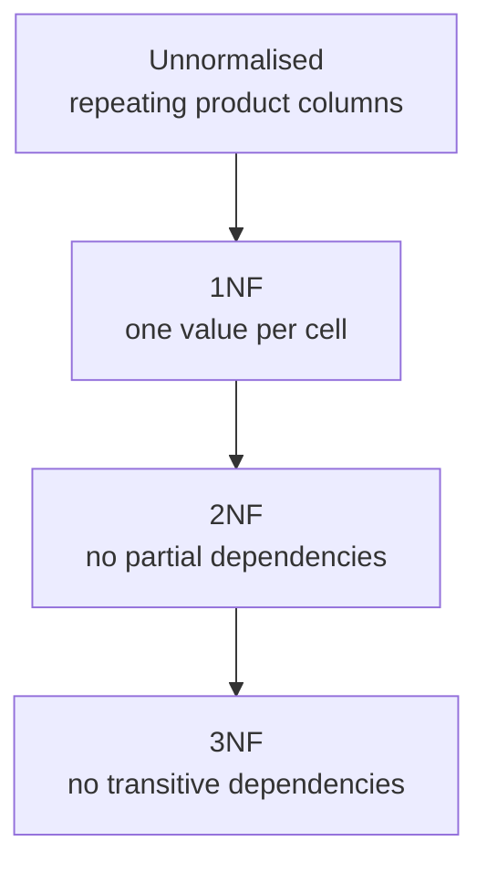

# Normal Forms at a glance — the ladder that keeps your data clean

The normalization ladder is a four-step path from an unnormalised table to one where every piece of information lives on its own row, and no fact depends on another.

This diagram shows the ladder from top to bottom. Each arrow is a step you take when you find an anti-pattern in your data — a repeating group, a column that depends on something other than the primary key, or a chain of lookups where one value stands for another. The goal is always **D**: every row's information must be determined entirely by its own primary key.

## 1NF — One Value Per Cell

The first step removes **repeating groups** — columns that can hold more than one related item in the same row (e.g. `product_1, product_2, product_3`). In 1NF every combination of foreign keys gets exactly one row. This is why `order_items` exists as a separate table instead of three product columns on `orders`.

> 🎯 **Goal:** Every column in the table holds at most one value per row. If you can write "and" between two items and they belong to the same entity, split them into a new table.

## 2NF — No Partial Dependencies

A partial dependency occurs when a non-key attribute depends on only *part* of a composite primary key. In `practice_order_line(order_id, product, quantity)`, the column `product` determines the price per unit — but that fact doesn't depend on which order you're in. Move it to `products(product_id, name, sku, unit_price)` and keep only `order_items(order_item_id, order_id, product_id, quantity)` as 2NF.

> ⚠️ **Gotcha:** A partial dependency is a column that answers the same question for every row with the same key — it belongs to a different entity entirely.

## 3NF — No Transitive Dependencies

Transitive happens when one non-key attribute determines another, which in turn determines something else: `product_id → product_name → category_name`. Break it out into separate tables so that no lookup chain exists between non-key attributes. The `categories` table and the foreign key on `products.category_id` are exactly how you fix this.

> 💡 **Aha:** Once every column is determined solely by its own primary key, adding a new row or changing an existing one can never cause data to drift — that's why 3NF is the sweet point between normalisation and performance.

## Denormalization — When You Trade Off Cleanliness for Speed

Sometimes you need the same join graph on every query — reporting dashboards, audit logs, or cached views. The trade-off is **data integrity**: denormalized copies can fall out of sync with their source tables if an update misses a step. Use it when the read cost outweighs the write risk, and always guard the source with triggers or application logic that keeps the copy consistent.

> 🧪 **Try it:** Take any query from `shopdb` that joins more than two tables and ask yourself — is there a denormalized view worth building? Name the table you'd create and what columns it would hold.

See [notes](../notes.md) for worked examples, or return to the [module index](../../../SYLLABUS.md).