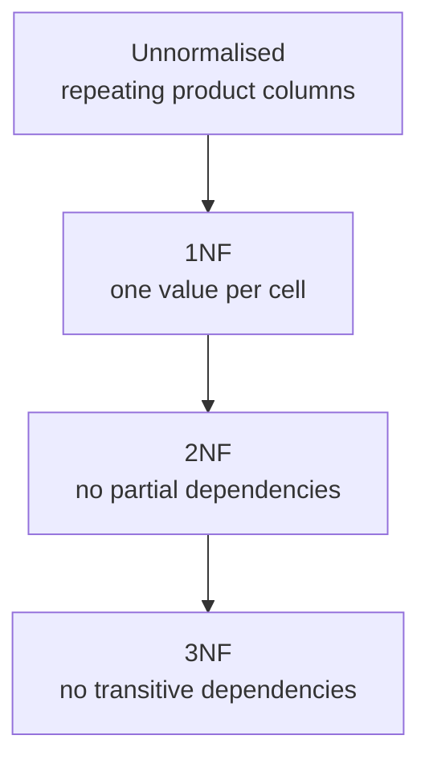

# Module 10 — Data Modeling & Normalization · Notes

## Why this matters

Flat tables are tempting at first glance — they look like spreadsheets and you can shove data straight into them. But every time a customer buys something the flat row grows, and every new dish gets another column. Before long the table is wide, slow, and impossible to reason about.

Normal forms give us a principled way to **split** that flat table into smaller ones linked by keys. The result is a set of tables where each one has exactly one responsibility: orders say who bought, line items say which product, products carry their own attributes. You trade a little join complexity for correctness, speed, and maintainability.

## The concept: normal forms & relationships

A **relationship** is simply how two entities connect. In `shopdb`, an order belongs to one customer and can contain many items — a *one-to-many* relationship. A product can appear in many orders, but each line references exactly one product — again one-to-many. These are the building blocks of every real-world schema.

The **normalization ladder** tells us how to break a flat table apart:



### Vocabulary

| Term | Definition |
|---|---|
| **Entity** | A table that represents a logical thing (e.g. `customers`, `products`) |
| **Relationship** | The link between entities, usually expressed as a foreign key |
| **Repeating group** | Multiple values in one cell or across columns — violates 1NF |
| **Partial dependency** | A non-key attribute that depends on only *part* of a composite key |
| **Transitive dependency** | A chain `A → B → C` where `C` should depend on `A`, not through `B` |

### 1NF — one value per cell

The first step removes repeating groups. If a row has three product columns, you need **three rows**, each with exactly one product. The only rule of 1NF is that every cell holds a single atomic value.

### 2NF — no partial dependencies

Once each cell is atomic, check for attributes that depend on *part* of a composite key. In a line table keyed by `(order_id, product)`, the `customer_name` depends only on `order_id` — that is a partial dependency. Move it to a header table keyed by `order_id`.

### 3NF — no transitive dependencies

Finally, break chains where a non-key attribute depends on another non-key attribute (for example `store_id → store_city` on a customer). Give each entity its own table and reference it by key: `customer → customer_id`, never `customer → store_id → store_city`.

## Worked example: normalising a café order table

### Step 1 — read the model that already exists

```sql
SELECT table_name
FROM information_schema.tables
WHERE table_schema = 'shopdb'
ORDER BY table_name;
```

| table_name |
|---|
| addresses |
| categories |
| customers |
| employees |
| order_items |
| orders |
| payments |
| persons |
| products |
| stores |

That's **10 tables**, each with a clear purpose.

### Step 2 — read the relationships

```sql
SELECT
  table_name,
  constraint_name,
  referenced_table_name
FROM information_schema.key_column_usage
WHERE table_schema = 'shopdb'
  AND referenced_table_name IS NOT NULL
ORDER BY table_name, constraint_name;
```

| table_name | constraint_name | referenced_table_name |
|---|---|---|
| addresses | fk_address_person | persons |
| customers | fk_customer_person | persons |
| employees | fk_employee_person | persons |
| employees | fk_employee_store | stores |
| employees | fk_employee_super | employees |
| order_items | fk_item_order | orders |
| order_items | fk_item_product | products |
| orders | fk_order_customer | customers |
| orders | fk_order_store | stores |
| payments | fk_payment_order | orders |
| products | fk_product_category | categories |

**11 foreign keys**, every one pointing from a child table back to its parent. This is the schema's relationship map — every join in `shopdb` traces through one of these.

### Step 3 — an unnormalised flat table

Imagine a café order sheet where each customer buys several products on one row:

```sql
DROP TABLE IF EXISTS practice_order_flat;

CREATE TABLE practice_order_flat (
  order_id      INT,
  customer_name VARCHAR(80),
  product_1     VARCHAR(80),
  product_2     VARCHAR(80),
  product_3     VARCHAR(80)
);

INSERT INTO practice_order_flat VALUES
  (1, 'Aisha Khan', 'Espresso Blend', 'Croissant', NULL),
  (2, 'Aisha Khan', 'Green Tea',      'Muffin',    'Ceramic Mug');
```

| order_id | customer_name | product_1 | product_2 | product_3 |
|---|---|---|---|---|
| 1 | Aisha Khan | Espresso Blend | Croissant | NULL |
| 2 | Aisha Khan | Green Tea | Muffin | Ceramic Mug |

The numbered `product_N` columns are a **repeating group**: hard to query, hard to constrain, and a violation of 1NF.

### Step 4 — 1NF: one row per item

```sql
DROP TABLE IF EXISTS practice_order_line;

CREATE TABLE practice_order_line (
  order_id INT,
  product  VARCHAR(80),
  quantity INT
);

INSERT INTO practice_order_line VALUES
  (1, 'Espresso Blend', 1),
  (1, 'Croissant',      1),
  (2, 'Green Tea',      1),
  (2, 'Muffin',         1),
  (2, 'Ceramic Mug',    1);
```

| order_id | product | quantity |
|---|---|---|
| 1 | Croissant | 1 |
| 1 | Espresso Blend | 1 |
| 2 | Ceramic Mug | 1 |
| 2 | Green Tea | 1 |
| 2 | Muffin | 1 |

**5 rows** — one per item. The repeating group is gone; every cell holds exactly one value.

### Step 5 — 2NF: lift the order's own attributes out

The customer belongs to the *order*, not to each line item. Split the header from the lines:

```sql
DROP TABLE IF EXISTS practice_order_header;

CREATE TABLE practice_order_header (
  order_id      INT PRIMARY KEY,
  customer_name VARCHAR(80) NOT NULL
);

INSERT INTO practice_order_header VALUES
  (1, 'Aisha Khan'),
  (2, 'Aisha Khan');
```

| order_id | customer_name |
|---|---|
| 1 | Aisha Khan |
| 2 | Aisha Khan |

### Step 6 — 3NF: give customers their own table

`customer_name` is still repeated on every order — a **transitive dependency**. Give customers a table and reference it by key:

```sql
DROP TABLE IF EXISTS practice_order;
DROP TABLE IF EXISTS practice_customer;

CREATE TABLE practice_customer (
  customer_id INT PRIMARY KEY,
  name        VARCHAR(80) NOT NULL
);

CREATE TABLE practice_order (
  order_id    INT PRIMARY KEY,
  customer_id INT NOT NULL,
  CONSTRAINT fk_practice_order_customer
    FOREIGN KEY (customer_id) REFERENCES practice_customer (customer_id)
);

INSERT INTO practice_customer VALUES
  (1, 'Aisha Khan'),
  (2, 'Bilal Ahmed');

INSERT INTO practice_order VALUES
  (1, 1),
  (2, 1);
```

### Step 7 — join the 3NF model back together

```sql
SELECT
  o.order_id,
  c.name AS customer
FROM practice_order AS o
JOIN practice_customer AS c ON c.customer_id = o.customer_id
ORDER BY o.order_id;
```

| order_id | customer |
|---|---|
| 1 | Aisha Khan |
| 2 | Aisha Khan |

The information is identical to the flat table — but now each fact lives in exactly one place.

### Step 8 — stay net-neutral

The example drops every `practice_*` table it created, so `shopdb` is left exactly as it started:

```sql
SELECT COUNT(*) AS shopdb_tables
FROM information_schema.tables
WHERE table_schema = 'shopdb';
```

| shopdb_tables |
|---|
| 10 |

### When to denormalize

Sometimes you *want* a wide row — an invoice where every product, quantity, and price sits on one page. Denormalization is the deliberate act of joining tables into a flat shape for display or reporting. **Rule of thumb:** denormalize for *views and reports*, not for *storage*. A join always reflects the latest product name; a copied value drifts the moment the source changes.

## How it works

A **join** is SQL's way of putting related rows together. The `JOIN … ON` clause matches rows between two tables on a shared key. In `shopdb` the shape already exists: `orders ⋈ order_items = orders.order_id = order_items.order_id`, and `order_items ⋈ products = order_items.product_id = products.product_id`.

For example, this lists each order line with the product's real name:

```sql
SELECT
  oi.order_id,
  p.name AS product,
  oi.quantity
FROM order_items AS oi
JOIN products AS p ON p.product_id = oi.product_id
ORDER BY oi.order_id, p.name;
```

Every `JOIN` is a key lookup under the hood, and the keys you'll meet in Module 11 are what make it fast and safe.

## Common errors & fixes

| Error | Cause | Fix |
|---|---|---|
| `ERROR 1050 (42S01): Table 'practice_order_flat' already exists` | re-running `CREATE TABLE` without dropping first | start with `DROP TABLE IF EXISTS practice_order_flat;` |
| `ERROR 1136 (21S01): Column count doesn't match value count at row 1` | an `INSERT` supplies fewer values than the table has columns | match the value list to the column count exactly |
| `ERROR 1452 (23000): Cannot add or update a child row: a foreign key constraint fails ('shopdb'.'practice_order', CONSTRAINT 'fk_practice_order_customer' ...)` | inserting an order whose `customer_id` is not in `practice_customer` | insert the parent row first, or use a valid id |
| `ERROR 1064 (42000): ... near 'lines, ...' at line 3` | using the reserved word `LINES` as a column alias | rename the column (e.g. `line_count`) or wrap it in backticks |

## Try it yourself

> 🧪 **Try it:** create `practice_product_reviews (review_id INT PRIMARY KEY, product_id INT, rating DECIMAL(3,1))`, insert a few ratings for products 1 and 2, then write a query that returns the average rating per product. Grouping by `product_id` is exactly the discipline normalization asks for.

## Going deeper (L4)

- **Functional dependencies** — the formal notation (`A → B`) behind every normal form.
- **Decomposition algorithms** — how tools derive a 3NF/BCNF schema from a dependency set.
- **Materialised views** — denormalization as a precomputed snapshot, refreshed on a schedule.

## References

- [Normal forms at a glance](assets/normal-forms.md)
- [Module 11 — Keys, Constraints & Relationships](../11-keys-constraints-relationships/notes.md)
- [Course syllabus](../../SYLLABUS.md)
