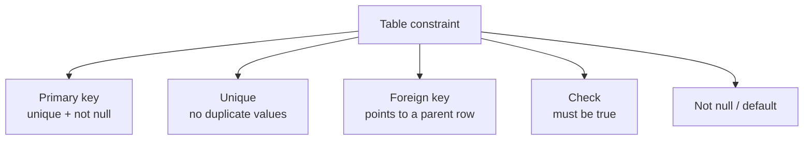

# Constraint Map at a glance

Table constraints are the guardrails that keep data honest — they enforce rules before any query can slip past them, so you never have to check for bad values in your application code.

## Primary key
A primary key combines two guarantees: the column cannot contain `NULL` and no two rows can share the same value. Every table should have exactly one — it is how MySQL identifies a row, builds indexes on it, and lets other tables refer to it. In practice you declare it with `PRIMARY KEY (column)` when creating or altering a table.

> 💡 Aha: `PRIMARY` implies both `NOT NULL` and `UNIQUE`. If you already have a `UNIQUE` column and want to make it the primary key, use `ALTER TABLE … ADD PRIMARY KEY`.

## Unique
A unique constraint says "this column cannot hold duplicate values" but does allow `NULL` (multiple rows can each be `NULL`). Use it on natural identifiers like email addresses or phone numbers. You declare it with `UNIQUE(column)` in a table definition, or later with `CREATE UNIQUE INDEX`.

## Foreign key
A foreign key enforces referential integrity: every value in the child column must exist as a primary (or unique) key value in the parent table. Without it you can insert orphan rows that point to non-existent parents — a silent data bug waiting to happen. Declare with `FOREIGN KEY(child_col) REFERENCES parent(parent_key)` and optionally add an action (`ON DELETE CASCADE`, `RESTRICT`, or `SET NULL`) to control what happens when the parent row is deleted or updated.

## Check
A check constraint is any boolean expression evaluated on every insert and update — if it returns false, MySQL rejects the row with a clear error message. The most common use case is domain validation: `CHECK(price > 0)` on an amount column, or `CHECK(status IN ('active','inactive'))` on a status field. You declare it inline in the table definition (`CONSTRAINT chk_name CHECK (expr)`) and later read its text from `information_schema.table_constraints`.

## Not null / default
These are the simplest constraints: `NOT NULL` says a column must always have a value, while `DEFAULT` supplies one automatically when you omit the column from an insert. Together they prevent the kind of silent failures that come from missing values — and in many cases they let you skip boilerplate application logic entirely.

## ON DELETE / ON UPDATE actions
When a parent row is deleted or updated, MySQL needs to decide what to do with matching child rows. The default for InnoDB is `NO ACTION` (which rejects the operation), but you can override it:

- **CASCADE** — delete or update the child rows automatically (`ON DELETE CASCADE`)
- **RESTRICT** — reject the parent change if any children exist (the same as the default)
- **SET NULL** — set the foreign key column to `NULL` on matching child rows

Choose carefully: `CASCADE` is convenient but can silently cascade through many tables; `RESTRICT` is safer but requires you to clean up children first. Always read a table's constraints from `information_schema.table_constraints` before deleting data in production.

[Back to notes](../notes.md) | [Course syllabus](../../../SYLLABUS.md)