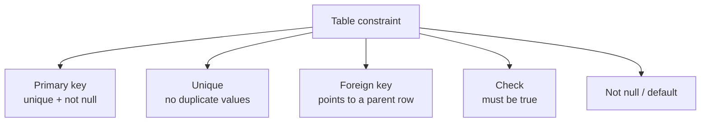

# Module 11 — Keys, Constraints & Relationships · Notes

## Why this matters

You've been building tables that *look* right but silently let in the wrong data — a customer with no email, an order with no store, a negative price. Keys and constraints turn a schema from a sketch into a guardrail: they tell MySQL "this column must be unique", "this value cannot be null", "this row must point to another real row".

Once you can write them — and, just as important, *read the errors* when they fire — you stop debugging phantom bugs and start trusting your database.

## The concept

A constraint is a rule baked into the table definition. It runs every time data changes — insert, update, delete — and MySQL rejects any change that breaks it. There are five families, plus the foreign key:

| Constraint | What it enforces |
|---|---|
| `PRIMARY KEY` | unique **and** not null; one per table, and it identifies each row |
| `UNIQUE` | no duplicate values (multiple `NULL`s are allowed) |
| `NOT NULL` | the column must always have a value |
| `DEFAULT` | a fallback value when none is supplied |
| `CHECK` | an expression that must evaluate to true |
| `FOREIGN KEY` | every value must exist as a key in the referenced parent table |

A foreign key ties two tables together. Without one you can insert an order whose customer doesn't exist; with one, MySQL does the lookup and rejects the row.

> 🎯 **Goal:** give every child table a `FOREIGN KEY` on its parent-reference column — it is not optional once real data is involved.



When a parent row is deleted or updated, MySQL consults the **referential action** declared on the foreign key:

| Action | What happens to child rows |
|---|---|
| `CASCADE` | delete/update them too |
| `RESTRICT` / `NO ACTION` | reject the parent change if any children exist |
| `SET NULL` | set the child's foreign-key column to `NULL` |

### Vocabulary

| Term | Meaning |
|---|---|
| **Referential integrity** | every child row points to a valid parent (guaranteed by a foreign key) |
| **Constraint violation** | a change that breaks a rule — MySQL errors out before touching the data |
| **`information_schema`** | the system database that describes your tables, columns, and constraints |

## Worked example: every key kind in one small schema

We build two practice tables (an author and their books), add every constraint kind, read what MySQL actually enforces from `information_schema`, then watch a cascade fire. The script is net-neutral — it drops its own tables at the end.

### Step 1 — the keys that already exist

```sql
SELECT
  table_name,
  constraint_name
FROM information_schema.table_constraints
WHERE table_schema = 'shopdb'
  AND constraint_type = 'PRIMARY KEY'
ORDER BY table_name;
```

| table_name | constraint_name |
|---|---|
| addresses | PRIMARY |
| categories | PRIMARY |
| customers | PRIMARY |
| employees | PRIMARY |
| order_items | PRIMARY |
| orders | PRIMARY |
| payments | PRIMARY |
| persons | PRIMARY |
| products | PRIMARY |
| stores | PRIMARY |

**10 rows** — every table has a primary key, and they all carry MySQL's default name `PRIMARY`.

### Step 2 — declare every constraint kind

```sql
DROP TABLE IF EXISTS practice_book;
DROP TABLE IF EXISTS practice_author;

CREATE TABLE practice_author (
  author_id INT AUTO_INCREMENT PRIMARY KEY,
  name      VARCHAR(80) NOT NULL UNIQUE
);

CREATE TABLE practice_book (
  book_id   INT AUTO_INCREMENT PRIMARY KEY,
  author_id INT NOT NULL,
  title     VARCHAR(120) NOT NULL,
  isbn      CHAR(13) NOT NULL UNIQUE,
  price     DECIMAL(6,2) NOT NULL DEFAULT 0.00,
  in_print  TINYINT(1) NOT NULL DEFAULT 1,
  CONSTRAINT chk_practice_book_price CHECK (price >= 0),
  CONSTRAINT fk_practice_book_author
    FOREIGN KEY (author_id) REFERENCES practice_author (author_id)
    ON DELETE CASCADE
    ON UPDATE CASCADE
);
```

### Step 3 — insert rows that satisfy every rule

```sql
INSERT INTO practice_author (name) VALUES
  ('Naomi Okafor'),
  ('Ravi Menon');

INSERT INTO practice_book (author_id, title, isbn, price) VALUES
  (1, 'The Normal Form',  '9780000000001', 24.99),
  (1, 'Keys and Indexes', '9780000000002', 19.50),
  (2, 'Transactions',     '9780000000003', 31.00);
```

```sql
SELECT
  b.book_id,
  b.title,
  a.name AS author,
  b.price,
  b.in_print
FROM practice_book AS b
JOIN practice_author AS a ON a.author_id = b.author_id
ORDER BY b.book_id;
```

| book_id | title | author | price | in_print |
|---|---|---|---|---|
| 1 | The Normal Form | Naomi Okafor | 24.99 | 1 |
| 2 | Keys and Indexes | Naomi Okafor | 19.50 | 1 |
| 3 | Transactions | Ravi Menon | 31.00 | 1 |

### Step 4 — read the constraints MySQL compiled

```sql
SELECT
  table_name,
  constraint_name,
  constraint_type
FROM information_schema.table_constraints
WHERE table_schema = 'shopdb'
  AND table_name IN ('practice_author', 'practice_book')
ORDER BY table_name, constraint_type, constraint_name;
```

| table_name | constraint_name | constraint_type |
|---|---|---|
| practice_author | PRIMARY | PRIMARY KEY |
| practice_author | name | UNIQUE |
| practice_book | chk_practice_book_price | CHECK |
| practice_book | fk_practice_book_author | FOREIGN KEY |
| practice_book | PRIMARY | PRIMARY KEY |
| practice_book | isbn | UNIQUE |

**6 rows** — the exact rules MySQL enforces, including the names you gave (`chk_practice_book_price`, `fk_practice_book_author`) and the defaults it supplied (`PRIMARY`, and the unique key named after its column).

### Step 5 — which columns the keys protect

```sql
SELECT
  table_name,
  constraint_name,
  column_name
FROM information_schema.key_column_usage
WHERE table_schema = 'shopdb'
  AND table_name IN ('practice_author', 'practice_book')
ORDER BY table_name, constraint_name, ordinal_position;
```

| table_name | constraint_name | column_name |
|---|---|---|
| practice_author | name | name |
| practice_author | PRIMARY | author_id |
| practice_book | fk_practice_book_author | author_id |
| practice_book | isbn | isbn |
| practice_book | PRIMARY | book_id |

**5 rows.** Note that `fk_practice_book_author` maps to `practice_book.author_id` — the *child* column. A foreign key references a parent but lives on the child table.

### Step 6 — the referential actions

```sql
SELECT
  constraint_name,
  delete_rule,
  update_rule
FROM information_schema.referential_constraints
WHERE constraint_schema = 'shopdb'
  AND constraint_name = 'fk_practice_book_author';
```

| constraint_name | delete_rule | update_rule |
|---|---|---|
| fk_practice_book_author | CASCADE | CASCADE |

### Step 7 — watch a cascade fire

Deleting author 2 (`Ravi Menon`) removes their book too, because the key was declared `ON DELETE CASCADE`:

```sql
DELETE FROM practice_author
WHERE author_id = 2;

SELECT COUNT(*) AS books_after_cascade
FROM practice_book;
```

| books_after_cascade |
|---|
| 2 |

Had the rule been `RESTRICT`, that delete would have failed with a foreign-key error. Cascading is convenient but can quietly remove data; restricting protects it but costs more work on delete.

### Step 8 — audit every foreign key in the seed

```sql
SELECT
  k.table_name,
  k.column_name,
  r.constraint_name,
  r.delete_rule,
  r.update_rule
FROM information_schema.key_column_usage AS k
JOIN information_schema.referential_constraints AS r
  ON r.constraint_name = k.constraint_name
 AND r.constraint_schema = k.table_schema
WHERE k.table_schema = 'shopdb'
  AND k.referenced_table_name IS NOT NULL
ORDER BY k.table_name, k.constraint_name;
```

| table_name | column_name | constraint_name | delete_rule | update_rule |
|---|---|---|---|---|
| addresses | person_id | fk_address_person | NO ACTION | NO ACTION |
| customers | person_id | fk_customer_person | NO ACTION | NO ACTION |
| employees | person_id | fk_employee_person | NO ACTION | NO ACTION |
| employees | store_id | fk_employee_store | NO ACTION | NO ACTION |
| employees | supervisor_id | fk_employee_super | NO ACTION | NO ACTION |
| order_items | order_id | fk_item_order | NO ACTION | NO ACTION |
| order_items | product_id | fk_item_product | NO ACTION | NO ACTION |
| orders | customer_id | fk_order_customer | NO ACTION | NO ACTION |
| orders | store_id | fk_order_store | NO ACTION | NO ACTION |
| payments | order_id | fk_payment_order | NO ACTION | NO ACTION |
| products | category_id | fk_product_category | NO ACTION | NO ACTION |

**11 rows, all `NO ACTION`** — the InnoDB default, which behaves like `RESTRICT`. Deleting a customer or store that still has orders will fail, protecting you from accidental data loss.

### Step 9 — back to baseline

The example drops its practice tables, so `shopdb` is unchanged:

```sql
SELECT COUNT(*) AS shopdb_tables
FROM information_schema.tables
WHERE table_schema = 'shopdb';
```

| shopdb_tables |
|---|
| 10 |

## How it works

On every `INSERT`, `UPDATE`, or `DELETE`, MySQL evaluates the affected row's constraints before writing anything:

1. **Primary key / unique** — a duplicate value is rejected.
2. **Not null** — a `NULL` in a non-null column is rejected.
3. **Foreign key** — the referenced parent row must exist.
4. **Check** — the expression must be true.
5. **Referential action** (deletes/updates only) — cascade, restrict, or set null.

All of it happens inside one statement: if any rule fails, the whole statement is rolled back and no rows change. That is why a batched insert is all-or-nothing.

## Common errors & fixes

| Error | Cause |
|---|---|
| `ERROR 1062 (23000): Duplicate entry 'Naomi Okafor' for key 'practice_author.name'` | a value collides with a `UNIQUE` key |
| `ERROR 1452 (23000): Cannot add or update a child row: a foreign key constraint fails ('shopdb'.'practice_book', CONSTRAINT 'fk_practice_book_author' ...)` | a child row's foreign-key value has no matching parent |
| `ERROR 3819 (HY000): Check constraint 'chk_practice_book_price' is violated.` | a `CHECK` expression evaluates to false (e.g. `price = -5.00`) |
| `ERROR 1048 (23000): Column 'isbn' cannot be null` | inserting `NULL` into a `NOT NULL` column |

> 💡 **Aha:** every constraint error is an early warning — the bad data never reached disk. Read the error as the database telling you which rule your application just broke.

## Try it yourself

> 🧪 **Try it:** create `practice_cuisine (cuisine_id INT AUTO_INCREMENT PRIMARY KEY, name VARCHAR(40) NOT NULL UNIQUE)`, insert two cuisines, then try to insert a third with a name you already used and read the `1062` error. Then add a `practice_dish` table with a foreign key to `practice_cuisine` and try inserting a dish with a `cuisine_id` that doesn't exist — that's `1452`.

## Going deeper (L4)

- **Indexes on constraints** — primary and unique keys are indexed automatically; Module 12 builds on that.
- **`ON DELETE`/`ON UPDATE` in production** — declare actions explicitly at schema level rather than simulating them with triggers.
- **Schema migrations** — adding and changing constraints on a live database without downtime.

## References

- [Constraint map at a glance](assets/constraint-map.md)
- [Module 10 — Data Modeling & Normalization](../10-data-modeling-normalization/notes.md)
- [Course syllabus](../../SYLLABUS.md)
