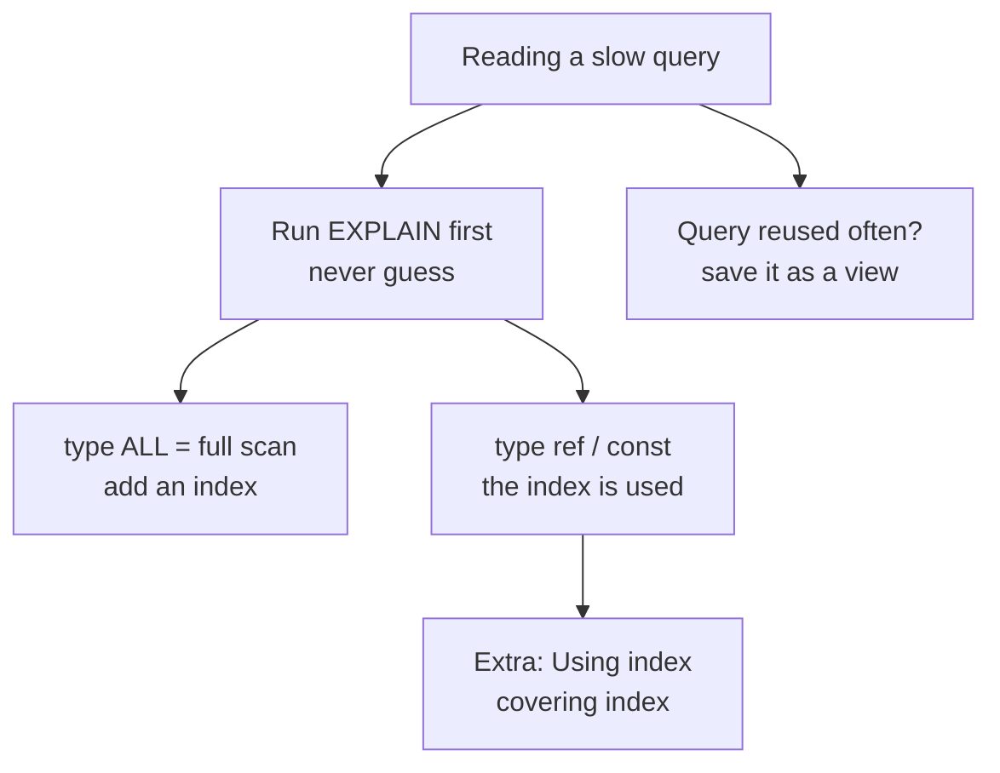

# Indexes & views at a glance

Indexes are the secret sauce that turns a slow query into a fast one — they're like bookmarks in a book, pointing straight to where you want to be. Views are saved queries, so you don't have to write them over again. Let's see how these fit together in this diagram:

> 💡 Aha Indexes and views are two different kinds of helpers — indexes help the database find data faster, while views let you save complex queries for later use.

This diagram shows the journey from a slow query to something fast. You start by running EXPLAIN to see what's happening, then either find that you need an index (if you see `ALL` — full scan) or confirm the index is already in use (`ref` / `const`). When you even get lucky with a covering index (`Extra: Using index`), you can skip reading the table entirely. If your query gets used often, save it as a view so you don't have to rewrite it every time.

## What an index is

An index is a sorted copy of one or more columns that lets the database look for data without scanning every row. A primary key on `user_id` — MySQL creates an index automatically because it needs to enforce uniqueness and find rows by ID. A foreign key like `order.user_id` gets an index too, so JOINs can match rows quickly instead of comparing every order against every user.

Think of a table as a grocery list without categories: you have to read every item to find "espresso." An indexed column is like putting the items into shelves — now you go straight to "Espresso Blend" and skip everything else. That's the difference between reading a whole book versus finding a chapter by its number in the index.

## Reading a plan

EXPLAIN shows MySQL's path before it runs your query. The `type` column tells you what kind of access it uses — some are fast, some are slow:

| `type` | Meaning |
|---|---|
| `ALL` | full table scan — no usable index |
| `ref` | index lookup, may match several rows |
| `const` | at most one row via a unique index |

`All` is the worst type — the database reads every single row to find what you want. If you see it on a small table (under 50 or so rows) that's fine; for larger tables, add an index. `Ref` means MySQL uses an index but may still scan several rows in the result set (for example, looking by `customer_name`). The best type is `const`: exactly one row found through a unique index — this is what you want for primary key lookups and WHERE clauses on UNIQUE columns.

When EXPLAIN shows `Extra: Using index`, that means your query is served entirely from the index without reading any table data. This happens with covering indexes, which we'll cover next.

## Composite & covering indexes

A composite (or multi-column) index spans several columns — you can use it for queries that filter on a prefix of those columns, or sort by one column then another. MySQL uses composite indexes left-to-right; the first column gets used first, and subsequent columns help when the first column is equal across many rows.

A covering index stores all the columns your query needs inside the index itself (plus the primary key to tie back to the row). This means no table access at all — MySQL reads only the index pages, which are smaller than full rows. The `Extra: Using index` signal from EXPLAIN tells you this is happening.

Think of a phone book indexed by last name first, then first name. Looking for "Bilal" gets you to one entry immediately; looking for all customers whose last name starts with "C" (Chen and Chen) uses the same index but finds multiple entries. A covering version would also include area codes so you don't have to look back in the main book.

## What a view is

A view is a named, saved SELECT statement — MySQL treats it like any other table in subsequent queries. Create or replace one with `CREATE OR REPLACE VIEW` and delete one with `DROP VIEW`. Views are read-only (no INSERT/UPDATE/DELETE through them) because the database can't always figure out which underlying row to change.

The main benefit is reuse: if a query gets called from three different places, save it as a view so you don't maintain five copies of the same logic. The downside is that views are materialized on every call — they're just shortcuts for writing the SELECT again, not cached results (for caching, look at MySQL's own cache or an external tool like Redis).

> 🎯 Goal Use views to capture query logic you reuse often; don't use them when a view would force an expensive calculation.

## When not to add an index

Indexes speed reads but cost writes and eat disk space. Every time you INSERT, UPDATE, or DELETE a row, the database must maintain every index on that table — if your table has 20 indexes, each write touches all of them. For heavily-written tables (thousands of inserts per second), the write amplification can become a bottleneck.

Also consider whether an index is worth it for small tables (under 50 rows or so) — scanning every row is fast enough that an index doesn't buy much. And don't index columns with high selectivity loss: if you're searching by gender and half your users are male, the index barely narrows the search at all.

> 🧪 Try it Run EXPLAIN on a slow query against a table with 10,000+ rows — notice how much faster it is after adding an appropriate index, then try inserting thousands of rows yourself to see how writes got slower too.

Next: the worked example is in [`../notes.md`](../notes.md); the full course list is in
[`../../../SYLLABUS.md`](../../../SYLLABUS.md).
