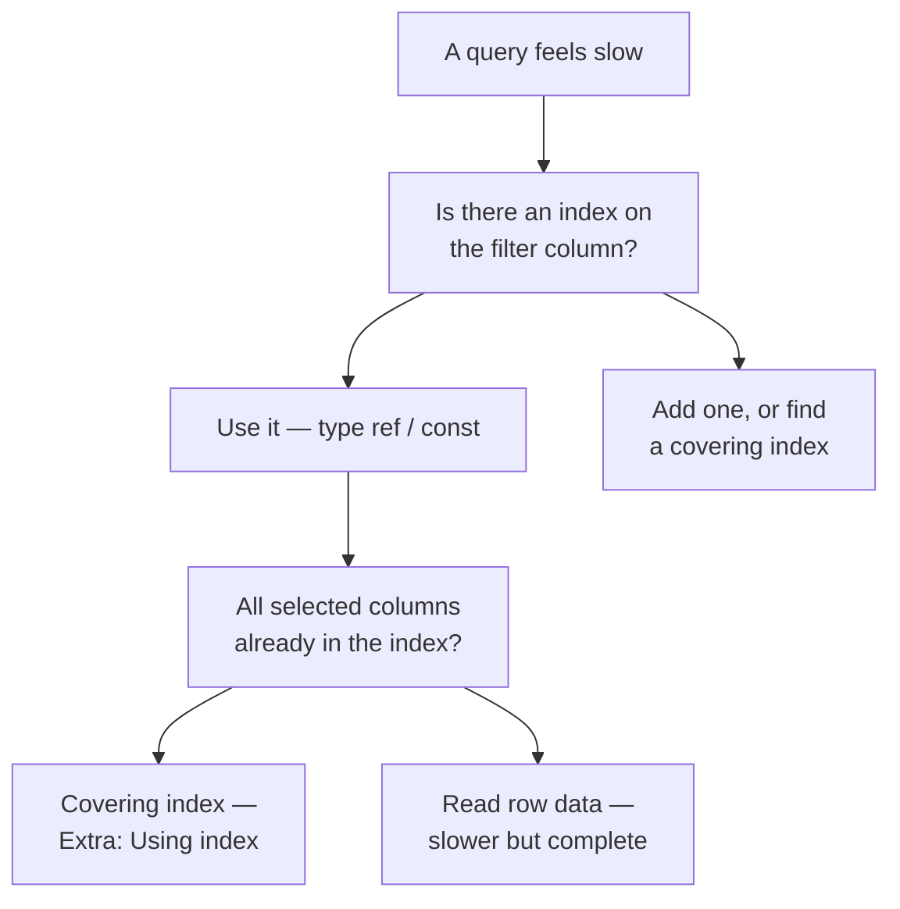

# Module 12 — Indexes & Views · Notes

## §1 Why this matters

If your query is slow, the database engine is probably reading every row in the table. An index is a sorted copy of one or more columns — it lets MySQL jump to the right rows instead of scanning the whole table. Views are just stored queries: write them once, use them everywhere, and keep your code DRY.

> 🎯 Goal | Learn when an index speeds up reading (and when writes pay for it). Build a covering index that answers a query entirely from the index — no row fetches at all. Save a complex SELECT as a view so you don't have to rewrite it each time you need it.
>
> 🚠️ Gotcha | Adding an index makes reads faster but slows down inserts, updates, and deletes (MySQL has to keep the index in sync). Views are materialised snapshots — they do not automatically refresh when base data changes.

## §2 The concept + diagram

An index is a sorted lookup structure on one or more columns. When MySQL finds an index that matches your query's `WHERE` clause, it uses binary search instead of a full table scan. Composite indexes can match on multiple columns at the same time (left-prefix matching only). A **covering index** includes all the columns your query selects — MySQL can answer from the index alone without touching row data.

A view is a named SELECT that you treat as if it were a real table: `CREATE VIEW` saves the definition, and any subsequent access to the view runs the underlying SELECT in its place.



**Vocabulary:**
- **Index name**: a unique identifier on a table (`idx_orders_status`).
- **Non-unique (B-tree) vs Unique (UNIQUE)**: non-unique indexes store one entry per matching row; UNIQUE indexes enforce the constraint.
- **Cardinality**: number of distinct values in an index — higher cardinality is usually more useful because it narrows the result set faster.
- **Covering index** (`Extra = Using index`): MySQL can satisfy a query entirely from the index without fetching rows, which is the fastest possible read path.
- **Composite (multi-column) index**: indexes on columns A, B; queries that filter on `(A)` or `(A, B)` can use it, but not `(B)` alone (left-prefix rule).

## §3 Worked example — 13 steps from a real database

**Step 1:** inspect the indexes already present on `orders` and `products`.
```sql
SELECT
  table_name,
  index_name,
  non_unique,
  seq_in_index,
  column_name
FROM information_schema.statistics
WHERE table_schema = 'shopdb'
  AND table_name IN ('orders', 'products')
ORDER BY table_name, index_name, seq_in_index;
```
| TABLE_NAME | INDEX_NAME | NON_UNIQUE | SEQ_IN_INDEX | COLUMN_NAME |
|---|---|---|---|---|
| orders | fk_order_customer | 1 | 1 | customer_id |
| orders | fk_order_store | 1 | 1 | store_id |
| orders | PRIMARY | 0 | 1 | order_id |
| products | fk_product_category | 1 | 1 | category_id |
| products | PRIMARY | 0 | 1 | product_id |
| products | sku | 0 | 1 | sku |

**Step 2:** an `EXPLAIN` plan on a filter for a column that has **no index**.
```sql
EXPLAIN SELECT *
FROM orders
WHERE status = 'paid';
```
| id | select_type | table | partitions | type | possible_keys | key | key_len | ref | rows | filtered | Extra |
|---|---|---|---|---|---|---|---|---|---|---|---|
| 1 | SIMPLE | orders | NULL | ALL | NULL | NULL | NULL | NULL | 8 | 25.00 | Using where |

`type = ALL` means MySQL is reading every row — that's what we want to fix.

**Step 3:** a lookup on the unique `sku` column already covered by an index.
```sql
EXPLAIN SELECT *
FROM products
WHERE sku = 'COF-002';
```
| id | select_type | table | partitions | type | possible_keys | key | key_len | ref | rows | filtered | Extra |
|---|---|---|---|---|---|---|---|---|---|---|---|
| 1 | SIMPLE | products | NULL | const | sku | sku | 82 | const | 1 | 100.00 | NULL |

`type = const` + `key = sku` — one row fetched via binary search on the index. Perfect.

**Step 4:** a lookup on a foreign-key column that is indexed (`fk_order_customer`).
```sql
EXPLAIN SELECT *
FROM orders
WHERE customer_id = 3;
```
| id | select_type | table | partitions | type | possible_keys | key | key_len | ref | rows | filtered | Extra |
|---|---|---|---|---|---|---|---|---|---|---|---|
| 1 | SIMPLE | orders | NULL | ref | fk_order_customer | fk_order_customer | 4 | const | 1 | 100.00 | NULL |

`type = ref` + `key = fk_order_customer` — index used, rows narrowed to exactly the matching customer's orders. Good performance.

**Step 5:** add an index on the unindexed column and re-check the plan.
```sql
CREATE INDEX idx_practice_orders_status ON orders (status);
ANALYZE TABLE orders;
EXPLAIN SELECT *
FROM orders
WHERE status = 'paid';
```
`ANALYZE TABLE` prints one metadata row: Table `shopdb.orders`, Op `analyze`, Msg_type `status`, Msg_text `OK`.

| id | select_type | table | partitions | type | possible_keys | key | key_len | ref | rows | filtered | Extra |
|---|---|---|---|---|---|---|---|---|---|---|---|
| 1 | SIMPLE | orders | NULL | ref | idx_practice_orders_status | idx_practice_orders_status | 1 | const | 4 | 100.00 | Using index condition |

`type = ref`, `key = idx_practice_orders_status`, and `rows = 4` (the four matching rows) — the scan is gone. **Aha:** MySQL chose to use the index but still needs row data, which it fetches one at last (`Using index condition`). This is better than a full scan, though we can do even better.

**Step 6:** read the new index back from the catalog and see its cardinality.
```sql
SELECT
  index_name,
  non_unique,
  column_name,
  cardinality
FROM information_schema.statistics
WHERE table_schema = 'shopdb'
  AND table_name = 'orders'
  AND index_name = 'idx_practice_orders_status';
```
| INDEX_NAME | NON_UNIQUE | COLUMN_NAME | CARDINALITY |
|---|---|---|---|
| idx_practice_orders_status | 1 | status | 4 |

Low cardinality (only four distinct statuses: `paid`, `shipped`, `pending`, `cancelled`) — the index still narrows to roughly a quarter of the rows, which is an improvement over scanning all eight.

**Step 7:** clean up for the next step.
```sql
DROP INDEX idx_practice_orders_status ON orders;
```

**Step 8:** build a covering index on a throwaway table and prove MySQL uses it.
```sql
DROP TABLE IF EXISTS practice_index_demo;
CREATE TABLE practice_index_demo (
  demo_id     INT AUTO_INCREMENT PRIMARY KEY,
  customer_id INT NOT NULL,
  status      VARCHAR(20) NOT NULL,
  note        VARCHAR(40)
) ENGINE = InnoDB;
INSERT INTO practice_index_demo (customer_id, status, note) VALUES
  (1, 'paid',    'a'),
  (1, 'shipped', 'b'),
  (2, 'paid',    'c'),
  (2, 'paid',    'd'),
  (3, 'pending', 'e');
CREATE INDEX idx_practice_demo_cover ON practice_index_demo (customer_id, status);
EXPLAIN SELECT customer_id, status
FROM practice_index_demo
WHERE customer_id = 1;
```

| id | select_type | table | partitions | type | possible_keys | key | key_len | ref | rows | filtered | Extra |
|---|---|---|---|---|---|---|---|---|---|---|---|
| 1 | SIMPLE | practice_index_demo | NULL | ref | idx_practice_demo_cover | idx_practice_demo_cover | 4 | const | 2 | 100.00 | Using index |

`Extra = Using index` is the gold mark — MySQL never touches row data at all; it answers entirely from the index on `(customer_id, status)`. Covering indexes are the fastest possible read path and the best investment when you query those columns frequently.

**Step 9:** clean up the practice table.
```sql
DROP TABLE practice_index_demo;
```

**Step 10:** create a view that joins products with their categories and query it.
```sql
CREATE OR REPLACE VIEW v_practice_product_catalog AS
SELECT
  p.product_id,
  p.name      AS product,
  c.name      AS category,
  p.unit_price
FROM products AS p
JOIN categories AS c ON c.category_id = p.category_id;

SELECT *
FROM v_practice_product_catalog
ORDER BY product_id;
```
| product_id | product | category | unit_price |
|---|---|---|---|
| 1 | Espresso Blend | Coffee | 12.50 |
| 2 | House Roast | Coffee | 10.00 |
| 3 | Decaf | Coffee | 11.25 |
| 4 | Green Tea | Tea | 8.00 |
| 5 | Earl Grey | Tea | 8.50 |
| 6 | Chai | Tea | 9.00 |
| 7 | Croissant | Bakery | 3.75 |
| 8 | Muffin | Bakery | 3.25 |
| 9 | Ceramic Mug | Merch | 14.00 |
| 10 | Tote Bag | Merch | 18.00 |

The view is a named SELECT — you can query it like any table, and MySQL runs the underlying join for you behind every access. **Aha:** if a query needs to be written more than once in your application code, save it as a view and let the database handle the maintenance.

**Step 11:** see what views look like in the catalog.
```sql
SELECT
  table_name,
  is_updatable,
  check_option
FROM information_schema.views
WHERE table_schema = 'shopdb'
  AND table_name = 'v_practice_product_catalog';
```
| TABLE_NAME | IS_UPDATABLE | CHECK_OPTION |
|---|---|---|
| v_practice_product_catalog | YES | NONE |

Views are listed in `information_schema.views`. They can be updatable (if the join is simple and single-table) — here MySQL would allow INSERT/UPDATE/DELETE through the view.

**Step 12:** replace a view with a completely different shape.
```sql
CREATE OR REPLACE VIEW v_practice_product_catalog AS
SELECT
  product_id,
  name AS product,
  unit_price,
  is_active
FROM products;

SELECT *
FROM v_practice_product_catalog
ORDER BY product_id;
```
| product_id | product | unit_price | is_active |
|---|---|---|---|
| 1 | Espresso Blend | 12.50 | 1 |
| 2 | House Roast | 10.00 | 1 |
| 3 | Decaf | 11.25 | 1 |
| 4 | Green Tea | 8.00 | 1 |
| 5 | Earl Grey | 8.50 | 1 |
| 6 | Chai | 9.00 | 1 |
| 7 | Croissant | 3.75 | 1 |
| 8 | Muffin | 3.25 | 1 |
| 9 | Ceramic Mug | 14.00 | 1 |
| 10 | Tote Bag | 18.00 | 1 |

`CREATE OR REPLACE VIEW` is the idential-safe way to update a view — it drops the old definition and writes the new one in one atomic step. Your application code querying `v_practice_product_catalog` keeps working without any changes.

**Step 13:** clean up, then confirm we left the database exactly as it was before we started (net-neutral).
```sql
DROP VIEW IF EXISTS v_practice_product_catalog;
SELECT COUNT(*) AS shopdb_tables
FROM information_schema.tables
WHERE table_schema = 'shopdb';
```
| shopdb_tables |
|---|
| 10 |

Ten tables — the exact same set as when we entered. Every index, every view, every temporary table got dropped in reverse order so this module can be run and undone without side effects.

## §4 How it works under the hood

- **Indexes are stored on disk** (InnoDB uses clustered B-tree; MyISAM uses a separate non-clustered tree). When you `CREATE INDEX`, MySQL walks every row, sorts the values, builds the tree, then writes it to disk — this is an O(n) full-table scan followed by a sort. That's why adding indexes takes time and storage space.

- **Queries use indexes when their WHERE clause can match from left-to-right on the index columns.** `(A)` uses an index on `(A, B)` or `(A)`. `(A, B)` uses an index on `(A, B)` but not one on just `(B)` — that's the left-prefix rule.

- **Covering indexes** eliminate row fetches entirely because every column in the SELECT list is already in the index. The `Extra = Using index` flag is your visual confirmation; when you see it, the query has been optimised to skip the biggest bottleneck (row data access) altogether.

- **Views are just stored text.** Every time you `SELECT * FROM my_view`, MySQL expands that name to the underlying SELECT and executes it fresh — they do not cache results. If performance matters for a frequently-run view, materialise the result in an actual table instead of a view (MySQL's `CREATE TABLE ... AS SELECT` plus scheduled refreshes).

## §5 Common errors & fixes

| Error | Cause | Fix |
|---|---|---|
| `ERROR 1061 (42000): Duplicate key name 'idx_dup'` | An index with that name already exists on the table. | Pick a different name, or `DROP INDEX` the old one first. |
| `ERROR 1072 (42000): Key column 'nope' doesn't exist in table` | You indexed a column that is not in the table. | Check the column name against `DESCRIBE tbl`. |
| `ERROR 1091 (42000): Can't DROP 'idx_nope'; check that column/key exists` | Dropping an index that does not exist. | Run `SHOW INDEX FROM tbl` first and use the real name. |
| `ERROR 1146 (42S02): Table 'shopdb.v_practice_nope' doesn't exist` | The view was never created (or was dropped). | Create it first (`CREATE VIEW …`), then query it. |
| `ERROR 1553 (HY000): Cannot drop index 'idx_err_cust': needed in a foreign key constraint` | The index supports a foreign key. | Keep a usable index on the FK column; you cannot drop its only one. |

## §6 Try it yourself

Each exercise is harder than the last. Write your answer in `solutions/01-exercises.sql`, then run it with
```bash
python3 dbctl.py sql --file modules/12-indexes-and-views/solutions/01-exercises.sql
```
Verify against the expected output (row count or a short check query). If you get stuck, read the hint in `exercises/README.md`.

## §7 Going deeper — L3 / L4 topics

- **Full-text indexes** (`FULLTEXT`) on VARCHAR/CHAR/TinyText columns: use `MATCH ... AGAINST` for natural-language search without LIKE.
- **Function-based (computed) indexes** in MySQL 8+ (`GENERATED ALWAYS`) to cache expensive expressions so they can be searched on the index.
- **Index fragmentation:** when inserts/deletes break up a B-tree, use `ALTER TABLE tbl ENGINE=InnoDB` or `OPTIMIZE TABLE` to defragment. The cost is high — only do it during maintenance.

## References

[`assets/indexes-and-views.md`](assets/indexes-and-views.md) · [`../../SYLLABUS.md`](../../SYLLABUS.md)