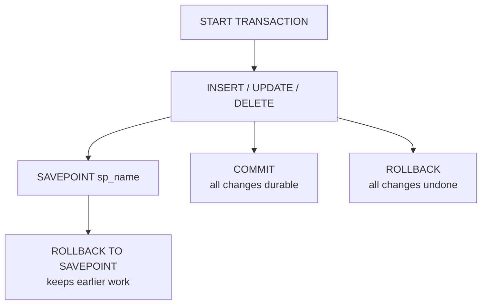

# Transaction flow at a glance

When you order a hot-beverage bottle and check out in a flash of time, four steps happen behind the scenes: start, modify, commit — or rollback on failure. The diagram below is that flow; remember it like a recipe for safe money-making.

The flow starts at **START TRANSACTION**, moves through **INSERT / UPDATE / DELETE** to modify rows, then either commits (**COMMIT**) or rolls back (**ROLLBACK**), optionally using a savepoint first.

## ACID — the four guarantees of a transaction

- **Atomicity** — every statement succeeds or none does; no half-applied state.
- **Consistency** — constraints and rules hold true after commit, before you read them back.
- **Isolation** — other transactions cannot see your in-progress work until you finish.
- **Durability** — committed changes survive crashes and restarts.

> 💡 Aha — ACID is what makes a transaction *atomic*; without it, an interrupted order could leave the user logged-in but with no payment record.

## COMMIT vs ROLLBACK

`COMMIT` writes every change made in the transaction to disk permanently; after commit you can read those rows from any other session and they survive even if your server restarts. `ROLLBACK` unders all changes since the last savepoint (or since start, if there is none), leaving the data exactly as it was before the transaction began — useful when a step fails or a user cancels a batch of updates.

## Savepoints — rolling back only the last piece of work

A `SAVEPOINT` marks a point inside an open transaction; you can roll back to that savepoint, undoing later work while preserving anything done earlier. This is safer than a full rollback: it lets you retry just the failing step without throwing away the whole transaction.

## Isolation levels

The isolation level determines what other concurrent transactions can see inside yours. Higher levels prevent more anomalies but cost more locking or snapshot overhead. The default on MySQL is **REPEATABLE READ**.

1. `READ UNCOMMITTED` — reads any row, including uncommitted ones from other sessions; cheapest but most vulnerable to dirty reads and phantom rows.
2. `READ COMMITTED` — reads only committed rows at the point in time they were committed; prevents dirty reads but still allows phantom inserts or deletes you might miss.
3. `REPEATABLE READ` (the MySQL default) — each SELECT sees a snapshot of the data as it existed when you first queried; later queries return identical results for the same tables, preventing phantoms on the read side.
4. `SERIALIZABLE` — every transaction behaves like an independent serial execution; no concurrent modifications can ever be seen. Most expensive.

## Row locks — protecting a row from concurrent modification

Use `SELECT ... FOR UPDATE` to lock a specific row (or set of rows) at the moment you read it, before your transaction finishes. The lock prevents another session modifying that row until you commit or rollback; on MySQL this is equivalent to an implicit shared lock followed by an exclusive lock upgrade inside a transaction.

Next: the worked example is in [`../notes.md`](../notes.md); the full course list is in
[`../../../SYLLABUS.md`](../../../SYLLABUS.md).
