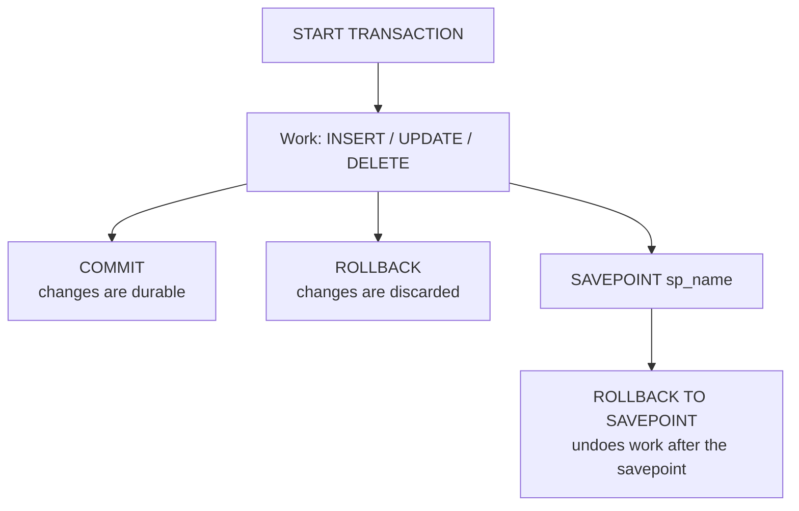

# Module 13 — Transactions & Concurrency · Notes

## §1 Why transactions matter at a café

Imagine you're running an online store and two customers both buy the same item from a queue — without protection, each customer could be assigned that same order number, creating duplicate entries in your database. A transaction solves this by treating several related changes as one atomic unit: either everything succeeds together or nothing happens at all. In a café setting, placing an order on the receipt book and adding a payment row are two actions that must happen simultaneously — if someone pays but the order isn't recorded, you've lost both the customer's name and the payment information.

## §2 The concept — flowchart + vocabulary



A transaction begins with `START TRANSACTION`. Inside it, any inserts, updates, or deletes you perform aren't visible to other connections — they stay in a temporary buffer. When you call `COMMIT`, those changes become permanent and visible everywhere. `ROLLBACK` discards them entirely. You can also create a `SAVEPOINT` partway through your work so that if something goes wrong, you don't have to undo everything — just the last step.

> 🎯 **Goal:** Learn how to group database changes so they either all succeed or all fail, protecting your data from partial updates and concurrent access conflicts.

### Vocabulary

- **Transaction** — A group of SQL statements treated as one unit. Either every statement succeeds together, or none do at all.
- `autocommit` — The default mode where MySQL automatically commits each individual statement. Transactions require turning this off temporarily with `START TRANSACTION`.
- `COMMIT` — Permanently saves the current transaction's changes so they're visible to other connections and survive a server restart.
- `ROLLBACK` — Discards every change made since the last commit (or since `START TRANSACTION`). No permanent effect on the database.
- `SAVEPOINT` — A named marker inside a transaction that lets you partially undo work with `ROLLBACK TO SAVEPOINT`.
- `ROLLBACK TO SAVEPOINT` — Undoes only the changes between the savepoint and either the end of the transaction or another rollback. Changes before the savepoint remain in place.
- **Isolation level** — A setting that controls what a transaction can see from other concurrent transactions, trading visibility for safety against anomalies like reading data that's about to be rolled back.
- **Row lock** — When MySQL marks a specific row as locked during `SELECT … FOR UPDATE`, preventing any other connection from modifying or locking the same row until the first connection releases it with `COMMIT` or `ROLLBACK`.

## §3 Worked example — 8 steps on a throwaway table

We'll walk through every transaction concept using a simple table we create just for this demonstration. Don't worry about losing data — we'll clean up at the end.

> ⚠️ **Gotcha:** In Step 5, you might expect all three inserted rows to remain after commit. The reality is that `AUTO_INCREMENT` values are consumed by the engine before the row actually lands in the table. The rolled-back insert still "used" its number even though the row itself was discarded — which is why the final list skips id 2 and goes straight from 1 to 3.

### Step 1 — Check defaults

```sql
SELECT
  @@autocommit            AS autocommit,
  @@transaction_isolation AS isolation_level;
```

| autocommit | isolation_level |
|---|---|
| 1 | REPEATABLE-READ |

By default, `autocommit` is set to 1 — MySQL commits every statement immediately. The isolation level defaults to REPEATABLE READ, which means once you read a row at the start of your transaction, subsequent reads see the same snapshot even if other transactions modify it later.

### Step 2 — Set up our practice table

```sql
DROP TABLE IF EXISTS practice_tx;
```

```sql
CREATE TABLE practice_tx (
  id    INT AUTO_INCREMENT PRIMARY KEY,
  label VARCHAR(40) NOT NULL
) ENGINE = InnoDB;
```

We use `InnoDB` because it's the only storage engine that supports transactions. The `AUTO_INCREMENT` column generates unique ids for each row automatically — you never need to supply one yourself (unless you want a specific value).

### Step 3 — Basic commit workflow

```sql
START TRANSACTION;
```

```sql
INSERT INTO practice_tx (label) VALUES ('committed');
```

```sql
COMMIT;
```

```sql
SELECT COUNT(*) AS after_commit FROM practice_tx;
```

| after_commit |
|---|
| 1 |

The `INSERT` isn't visible to the final `SELECT` until we call `COMMIT`. Between the two queries, nothing changed. After commit, the row is permanent — it would survive a server restart.

### Step 4 — Rollback example

```sql
START TRANSACTION;
```

```sql
INSERT INTO practice_tx (label) VALUES ('rolled back');
```

```sql
SELECT COUNT(*) AS inside_transaction FROM practice_tx;
```

| inside_transaction |
|---|
| 2 |

```sql
ROLLBACK;
```

```sql
SELECT COUNT(*) AS after_rollback FROM practice_tx;
```

| after_rollback |
|---|
| 1 |

Inside the transaction, the insert looks visible to your own connection. But once `ROLLBACK` executes, that row disappears entirely — it was never written to disk. This is the power of transactions: you can experiment freely and undo mistakes without leaving any permanent trace.

### Step 5 — Partial rollback with savepoint

```sql
START TRANSACTION;
```

```sql
INSERT INTO practice_tx (label) VALUES ('kept');
```

```sql
SAVEPOINT sp1;
```

```sql
INSERT INTO practice_tx (label) VALUES ('discarded');
```

```sql
ROLLBACK TO SAVEPOINT sp1;
```

```sql
COMMIT;
```

```sql
SELECT id, label
FROM practice_tx
ORDER BY id;
```

| id | label |
|---|---|
| 1 | committed |
| 3 | kept |

`SAVEPOINT` creates a checkpoint at the end of our transaction. `ROLLBACK TO SAVEPOINT sp1` undoes everything after that point — just the 'discarded' insert. The 'kept' row survives because it sits before savepoint, and the commit finalizes it. This is incredibly useful in long transactions where you might want to undo only the last step rather than starting over from scratch.

### Step 6 — Change isolation level (session-scoped)

```sql
SET SESSION TRANSACTION ISOLATION LEVEL READ COMMITTED;
```

```sql
SELECT @@transaction_isolation AS isolation_level;
```

| isolation_level |
|---|
| READ-COMMITTED |

```sql
SET SESSION TRANSACTION ISOLATION LEVEL REPEATABLE READ;
```

You can adjust the isolation level for your current session. Read Committed lets you see changes committed by other transactions (but not uncommitted ones). Repeatedly Reading restores the default — once you read a row, subsequent reads always show that same snapshot regardless of what others do. The `SET SESSION` modifier means this setting only affects your connection and doesn't touch the server's global configuration.

### Step 7 — Locking rows for safe updates

```sql
START TRANSACTION;
```

```sql
SELECT id, label
FROM practice_tx
WHERE id = 1
FOR UPDATE;
```

| id | label |
|---|---|
| 1 | committed |

```sql
COMMIT;
```

```sql
SELECT COUNT(*) AS rows_after_lock FROM practice_tx;
```

| rows_after_lock |
|---|
| 2 |

`FOR UPDATE` grabs an exclusive lock on the matching row. While you hold it, no other connection can modify that same row. When `COMMIT` releases the lock, everything proceeds normally. This prevents two transactions from modifying the same data simultaneously — a classic recipe for race conditions and corrupted state. In a real application, you might use this pattern before updating a product's price or an order's status to ensure consistency across all related calculations.

### Step 8 — Clean up

```sql
DROP TABLE IF EXISTS practice_tx;
```

```sql
SELECT COUNT(*) AS shopdb_tables
FROM information_schema.tables
WHERE table_schema = 'shopdb';
```

| shopdb_tables |
|---|
| 10 |

We drop the demo table so it doesn't clutter your database. You still have ten tables in `shopdb` — we'll cover those in Module 12 (indexing and views) where you'll learn how to speed up queries on them.

> 🧪 **Try it:** Create a simple orders table with columns for customer name, product name, and status (`'pending'`, `'paid'`). Write a transaction that checks whether a pending order already exists for the same customer-product pair before inserting one, then commit or rollback accordingly. This is exactly how an online store prevents duplicate purchases.

## §4 How it works

InnoDB maintains row-level locks (shared and exclusive) so that when you read with `FOR UPDATE`, no other connection can touch that row until your transaction finishes. A **row lock** protects the data from being modified by someone else at the same time — it's released automatically on commit or rollback, whichever ends your transaction first.

`autocommit` defaults to 1, meaning every statement completes immediately. To turn a sequence into a transaction, you `START TRANSACTION;` — this is effectively setting autocommit = 0 for that connection until the next `COMMIT`. Once started, all changes stay invisible to other connections and are safe to undo with `ROLLBACK`. A **savepoint** gives you fine-grained control: if something goes wrong partway through your work, you can rewind just back to where the savepoint was set instead of starting everything from scratch.

## §5 Common errors & fixes

| Error | Cause | Fix |
|---|---|---|
| `ERROR 1062 (23000): Duplicate entry '1' for key 'practice_err_tx.PRIMARY'` | Inserting a duplicate primary key. | Use a new key value, or `INSERT … ON DUPLICATE KEY UPDATE`. |
| `ERROR 1048 (23000): Column 'label' cannot be null` | Inserting `NULL` into a `NOT NULL` column. | Supply a value, or give the column a `DEFAULT`. |
| `ERROR 1305 (42000): SAVEPOINT sp_missing does not exist` | `ROLLBACK TO SAVEPOINT` names a savepoint that was never set. | Create it with `SAVEPOINT sp_missing;` first. |
| `ERROR 1213 (40001): Deadlock found when trying to get lock` | Two transactions lock rows in opposite order. | Retry the transaction; access rows in a consistent order. |

The most common mistake is forgetting that savepoints must exist before you try to roll back to them — MySQL won't let you undo past something you never marked. And deadlocks are InnoDB's built-in safeguard: if two transactions each wait for the other, it picks one at random, rolls it back so nobody hangs forever, and tells your application to retry (which is exactly what most ORM libraries do automatically).

## §6 Try it yourself

These queries let you verify your environment before writing any code. Run them in MySQL Workbench, command-line client, or whatever tool you're using — they should produce the exact same output everywhere.

```sql
SELECT @@transaction_isolation AS isolation_level;
```

| isolation_level |
|---|
| REPEATABLE-READ |

```sql
SELECT @@autocommit AS autocommit;
```

| autocommit |
|---|
| 1 |

```sql
SELECT COUNT(*) AS tables_n
FROM information_schema.tables
WHERE table_schema = 'shopdb';
```

| tables_n |
|---|
| 10 |

If any of these differ from the expected output, check that you're connected to MySQL version 9.2 and that your `shopdb` database is up with all its default tables (you should see ten of them). Once everything checks out, you can proceed with writing your own transactions — the patterns in this module will work identically everywhere.

> 🧪 **Try it:** Write a stored procedure called `cancel_order` that takes an order id as input and sets its status to `'cancelled'`. Use a transaction so that if the cancellation fails for any reason (the order doesn't exist, the status is already cancelled), nothing changes on disk. Call it with several invalid ids and watch the error messages — then call it with valid ones and verify the orders table shows them as cancelled.

## §7 Going deeper

- **Isolation levels** — `READ UNCOMmitted`, `Read Committed`, `Repeatable Read` (the default), and `Serializable`; higher levels trade concurrency for consistency by preventing different classes of anomalies.
- **MVCC** — InnoDB keeps row versions so plain `SELECT`s read a consistent snapshot without blocking writers; this is how MySQL achieves non-blocking reads on hot tables.
- **Deadlocks** — two transactions each waiting on the other's lock; InnoDB detects one and rolls it back (`ERROR 1213`). The retry pattern (catch the error, sleep briefly, try again) is standard practice.
- **Autocommit** — `SET autocommit = 0;` makes every statement wait for an explicit `COMMIT`, which can be useful in scripts where you want to batch operations together but should use transactions explicitly rather than relying on this session-level setting.

## References

- [Module 12 — Indexes & Views](../12-indexes-and-views/README.md)
- [Module 11 — Keys, Constraints & Relationships](../11-keys-constraints-relationships/README.md)
- [Course index](../../SYLLABUS.md)
