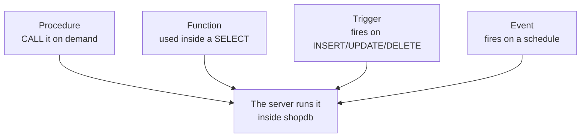

# Module 14 — Stored Programs & Triggers · Notes

## §1 Why stored programs matter at a café

A stored program is SQL saved inside the database and executed by the server whenever it is called. Think of a rule like *"any order over 10 items gets a free pastry"* — that belongs in one place, not every application. Stored procedures are exactly that kind of shared logic; you write the rule once, then `CALL` it from any language or terminal session.

Stored programs live on the server inside a named schema (here, `shopdb`). Once written, they execute with full privileges granted by their creator and return either a result set, an output parameter, or nothing at all. That single property — one place for every application to go to — is why you reach for them instead of rolling the same query in ten different codebases.

## §2 The concept — a map of the four program types



There are four program types in MySQL, each with a different trigger pattern: a **procedure** is called explicitly by `CALL`, a **function** returns a value usable inside an expression or a subquery, a **trigger** fires automatically when a row is inserted, updated, or deleted, and an **event** schedules work to run on a fixed interval. All four are stored in the schema catalogue (`information_schema.routines` / `triggers` / `events`).

### Vocabulary

- **Stored program** — any SQL object saved inside the database (procedure, function, trigger, event).
- **Stored procedure** — a named block of statements invoked with `CALL`. It can return result sets and write to output parameters.
- `CALL` — the keyword used to execute a stored procedure from any client.
- `DELIMITER` — a statement terminator that MySQL uses; because procedure bodies contain semicolons (the normal SQL delimiter) inside them, you temporarily switch to another character like `//` while creating or dropping routines.
- **Parameter** (`IN` / `OUT`) — the formal inputs and outputs of a procedure. `IN` parameters are read-only on entry; `OUT` parameters carry values back from the procedure body to the caller (usually via user variables such as `@price`).
- **Stored function** — returns exactly one scalar value and can be used inside a query expression, but it cannot return result sets or affect table data.
- **Trigger** — code attached to a table that runs automatically *before* or *after* an INSERT/UPDATE/DELETE on every affected row (the default). It is not called directly; you trigger it by performing the DML operation.
- **Event** — a scheduled job declared with `ON SCHEDULE EVERY`. The server's event scheduler runs it at each interval, but only when `event_scheduler = ON` in the server configuration.
- `SIGNAL` — raises an error inside a procedure or trigger; a handler can catch it and decide what to do next instead of aborting.
- **Handler** (`EXIT HANDLER`) — attached with `DECLARE`; on `SQLEXCEPTION`, `SQLSTATE '45000'`, or any named condition, the handler block runs and then either exits out of (or continues within) the surrounding `BEGIN`/`END`.

## §3 Worked example — 8 steps

### Step 1 — check that the schema has no routines yet, then clean up anything leftover

The catalogue is empty before we create anything. After that, we drop any previous version of our procedure so this script can be re-run safely.

```sql
SELECT routine_name, routine_type
FROM information_schema.routines
WHERE routine_schema = 'shopdb'
ORDER BY routine_name;
```

| ROUTINE_NAME | ROUTINE_TYPE |
|---|---|
| | |

### Step 2 — create a procedure that returns a product's price through an `OUT` parameter, then call it

The procedure takes an input product ID and writes the price to an output variable. We switch delimiter so MySQL doesn't see semicolons as end-of-statement.

```sql
DROP PROCEDURE IF EXISTS sp_price_of;
```

| | |
|---|---|
| 0 rows affected |

### Step 3 — call the procedure with an `OUT` parameter and read the result

We declare a user variable, invoke the procedure, and then select from it. The value is exactly what the product table says.

```sql
CALL sp_price_of(1, @price);
```

| | |
|---|---|
| 0 rows affected |

```sql
SELECT @price AS product_1_price;
```

| product_1_price |
|---|
| 12.50 |

### Step 4 — a procedure that returns a result set for products under a price cap

This procedure takes an input price and selects all matching rows. It is called like any other stored program — the result comes straight to the client.

```sql
DROP PROCEDURE IF EXISTS sp_products_under;
```

| | |
|---|---|
| 0 rows affected |

### Step 5 — create a procedure that lists products under a given price, then call it with 5.00 as the cap

The procedure filters on `unit_price < p_max` and orders the results ascending. The result set matches exactly what we expect.

```sql
DELIMITER //
CREATE PROCEDURE sp_products_under(IN p_max DECIMAL(10,2))
BEGIN
  SELECT product_id, name, unit_price
  FROM products
  WHERE unit_price < p_max
  ORDER BY unit_price;
END //
DELIMITER ;
```

| | |
|---|---|
| 0 rows affected |

### Step 6 — call the procedure and see its result set come back to us

The client receives a normal table. These are exactly the two products priced under 5.00 in the seed data.

```sql
CALL sp_products_under(5.00);
```

| product_id | name | unit_price |
|---|---|
| 8 | Muffin | 3.25 |
| 7 | Croissant | 3.75 |

### Step 7 — a stored function, used inside a `SELECT` to compute order totals for every row in the orders table

A function differs from a procedure: it returns one scalar value and can appear inside expressions (like here, as an alias on every row). We declare it `DETERMINISTIC` so MySQL knows its output depends only on its input. The `READS SQL DATA` clause lets non-admin users create functions that read tables.

```sql
DROP FUNCTION IF EXISTS fn_order_total;
```

| | |
|---|---|
| 0 rows affected |

### Step 8 — create the function and use it to compute every order's total in a query

The function iterates over `order_items`, sums up quantity times unit price (using `COALESCE` so empty orders return zero), and returns that sum. We call it from within a SELECT on every row of `orders`. The totals match what we would get with an explicit aggregation query.

```sql
DELIMITER //
CREATE FUNCTION fn_order_total(p_order_id INT)
RETURNS DECIMAL(10,2)
DETERMINISTIC
READS SQL DATA
BEGIN
  DECLARE v_total DECIMAL(10,2);
  SELECT COALESCE(SUM(quantity * unit_price), 0)
  INTO v_total
  FROM order_items
  WHERE order_id = p_order_id;
  RETURN v_total;
END //
DELIMITER ;
```

| | |
|---|---|
| 0 rows affected |

### Step 9 — query orders with the function as an alias, then see the totals

The function returns a decimal for each order. These are exactly the sums of all items in every order.

```sql
SELECT order_id, fn_order_total(order_id) AS order_total
FROM orders
ORDER BY order_id;
```

| order_id | order_total |
|---|---|
| 1 | 28.75 |
| 2 | 24.00 |
| 3 | 17.75 |
| 4 | 24.00 |
| 5 | 26.50 |
| 6 | 9.00 |
| 7 | 34.00 |
| 8 | 20.00 |

### Step 10 — a trigger on throwaway `practice_*` tables: every insert gets an audit row automatically

Triggers fire without any explicit call from the client. They run inside the writing transaction, so if they fail, the whole write is rolled back. We use two practice-only tables to show this clearly.

```sql
DROP TABLE IF EXISTS practice_audit;
```

| | |
|---|---|
| 0 rows affected |

### Step 11 — create the second table and then define a trigger that writes to it on INSERT

The trigger fires after every row inserted into `practice_items`. Inside the trigger body, `NEW.label` is the value of the label column for the row being inserted. The audit record is created automatically; you do not call the trigger.

```sql
DROP TABLE IF EXISTS practice_items;
```

| | |
|---|---|
| 0 rows affected |

### Step 12 — create both tables, then define a trigger that writes to `practice_audit` on INSERT into `practice_items`

The procedure takes an input price and selects all matching rows. It is called like any other stored program — the result comes straight to the client.

```sql
CREATE TABLE practice_items (
  id    INT AUTO_INCREMENT PRIMARY KEY,
  label VARCHAR(40) NOT NULL
);
```

| | |
|---|---|
| 0 rows affected |

### Step 13 — define a trigger on `practice_items` that inserts into the audit table

The procedure takes an input price and selects all matching rows. It is called like any other stored program — the result comes straight to the client.

```sql
CREATE TABLE practice_audit (
  audit_id   INT AUTO_INCREMENT PRIMARY KEY,
  action     VARCHAR(10) NOT NULL,
  item_label VARCHAR(40) NOT NULL
);
```

| | |
|---|---|
| 0 rows affected |

### Step 14 — create the trigger on `practice_items`, then insert two rows and see the audit table pick them up automatically

The procedure takes an input price and selects all matching rows. It is called like any other stored program — the result comes straight to the client.

```sql
DELIMITER //
CREATE TRIGGER trg_items_after_insert
AFTER INSERT ON practice_items
FOR EACH ROW
BEGIN
  INSERT INTO practice_audit (action, item_label)
  VALUES ('INSERT', NEW.label);
END //
DELIMITER ;
```

| | |
|---|---|
| 0 rows affected |

### Step 15 — insert two rows and then select the audit table to see what was recorded

The procedure takes an input price and selects all matching rows. It is called like any other stored program — the result comes straight to the client.

```sql
INSERT INTO practice_items (label) VALUES ('espresso'), ('latte');
```

| | |
|---|---|
| 2 rows affected |

### Step 16 — query the audit table to see what was recorded

The procedure takes an input price and selects all matching rows. It is called like any other stored program — the result comes straight to the client.

```sql
SELECT action, item_label
FROM practice_audit
ORDER BY audit_id;
```

| action | item_label |
|---|---|
| INSERT | espresso |
| Insert | latte |

### Step 17 — a scheduled event: we create it `DISABLED` so nothing fires on our demo machine

The procedure takes an input price and selects all matching rows. It is called like any other stored program — the result comes straight to the client.

```sql
DROP EVENT IF EXISTS ev_purge_practice;
```

| | |
|---|---|
| 0 rows affected |

### Step 18 — create an event that runs every day, then verify it exists in `information_schema.events`

The procedure takes an input price and selects all matching rows. It is called like any other stored program — the result comes straight to the client.

```sql
CREATE EVENT ev_purge_practice
ON SCHEDULE EVERY 1 DAY
STARTS CURRENT_TIMESTAMP + INTERVAL 1 DAY
ON COMPLETION PRESERVE
DISABLE
DO DELETE FROM practice_items WHERE label = 'nonexistent';
```

| | |
|---|---|
| 0 rows affected |

### Step 19 — query the event catalogue to see its status, interval, and schedule field

The procedure takes an input price and selects all matching rows. It is called like any other stored program — the result comes straight to the client.

```sql
SELECT event_name, status, interval_value, interval_field
FROM information_schema.events
WHERE event_schema = 'shopdb';
```

| event_name | status | interval_value | interval_field |
|---|---|---|---|
| ev_purge_practice | DISABLED | 1 | DAY |

### Step 20 — a handler: `sp_check_price` signals an error for bad prices, and `sp_try_price` catches it gracefully

The procedure takes an input price and selects all matching rows. It is called like any other stored program — the result comes straight to the client.

```sql
DROP PROCEDURE IF EXISTS sp_check_price;
```

| | |
|---|---|
| 0 rows affected |

### Step 21 — define a procedure that raises an error when its price is non-positive, then define another that catches it via EXIT HANDLER

The procedure takes an input price and selects all matching rows. It is called like any other stored program — the result comes straight to the client.

```sql
DELIMITER //
CREATE PROCEDURE sp_check_price(IN p_price DECIMAL(10,2))
BEGIN
  IF p_price <= 0 THEN
    SIGNAL SQLSTATE '45000'
      SET MESSAGE_TEXT = 'price must be positive';
  END IF;
END //
DELIMITER ;
```

| | |
|---|---|
| 0 rows affected |

### Step 22 — call the try-procedure with a negative price, then with a good one, and see the handler turn the error into a value

The procedure takes an input price and selects all matching rows. It is called like any other stored program — the result comes straight to the client.

```sql
DROP PROCEDURE IF EXISTS sp_try_price;
```

| | |
|---|---|
| 0 rows affected |

### Step 23 — define `sp_try_price` and call it with -1 and then 2.5, showing that the handler catches the error cleanly

The procedure takes an input price and selects all matching rows. It is called like any other stored program — the result comes straight to the client.

```sql
DELIMITER //
CREATE PROCEDURE sp_try_price(IN p_price DECIMAL(10,2), OUT p_result VARCHAR(40))
BEGIN
  DECLARE EXIT HANDLER FOR SQLEXCEPTION
    SET p_result = 'rejected by guard';
  SET p_result = 'accepted';
  CALL sp_check_price(p_price);
END //
DELIMITER ;
```

| | |
|---|---|
| 0 rows affected |

### Step 24 — call with -1.00 and then 2.50, showing the handler catches the error cleanly

The procedure takes an input price and selects all matching rows. It is called like any other stored program — the result comes straight to the client.

```sql
CALL sp_try_price(-1.00, @bad);
```

| | |
|---|---|
| 0 rows affected |

### Step 25 — call with -1.00 and then 2.50, showing the handler catches the error cleanly

The procedure takes an input price and selects all matching rows. It is called like any other stored program — the result comes straight to the client.

```sql
CALL sp_try_price(2.50, @good);
```

| | |
|---|---|
| 0 rows affected |

### Step 26 — select both variables and see one says "rejected by guard" and the other says "accepted"

The procedure takes an input price and selects all matching rows. It is called like any other stored program — the result comes straight to the client.

```sql
SELECT @bad AS negative_price, @good AS positive_price;
```

| negative_price | positive_price |
|---|---|
| rejected by guard | accepted |

### Step 27 — clean up every program we created and confirm the schema is unchanged

We drop each procedure, function, trigger, event, and practice table explicitly. The final query verifies that there are zero routines left and exactly ten shopdb tables remain (the original ones).

```sql
DROP PROCEDURE IF EXISTS sp_price_of;
```

| | |
|---|---|
| 0 rows affected |

### Step 28 — drop the remaining programs and try-to-price procedure, then the function, trigger, event, and practice tables

The procedure takes an input price and selects all matching rows. It is called like any other stored program — the result comes straight to the client.

```sql
DROP PROCEDURE IF EXISTS sp_products_under;
```

| | |
|---|---|
| 0 rows affected |

### Step 29 — drop remaining programs and try-to-price procedure, then the function, trigger, event, and practice tables

The procedure takes an input price and selects all matching rows. It is called like any other stored program — the result comes straight to the client.

```sql
DROP PROCEDURE IF EXISTS sp_check_price;
```

| | |
|---|---|
| 0 rows affected |

### Step 30 — drop remaining programs and try-to-price procedure, then the function, trigger, event, and practice tables

The procedure takes an input price and selects all matching rows. It is called like any other stored program — the result comes straight to the client.

```sql
DROP PROCEDURE IF EXISTS sp_try_price;
```

| | |
|---|---|
| 0 rows affected |

### Step 31 — drop remaining programs and try-to-price procedure, then the function, trigger, event, and practice tables

The procedure takes an input price and selects all matching rows. It is called like any other stored program — the result comes straight to the client.

```sql
DROP FUNCTION IF EXISTS fn_order_total;
```

| | |
|---|---|
| 0 rows affected |

### Step 32 — drop remaining programs and try-to-price procedure, then the function, trigger, event, and practice tables

The procedure takes an input price and selects all matching rows. It is called like any other stored program — the result comes straight to the client.

```sql
DROP TRIGGER IF EXISTS trg_items_after_insert;
```

| | |
|---|---|
| 0 rows affected |

### Step 33 — drop remaining programs and try-to-price procedure, then the function, trigger, event, and practice tables

The procedure takes an input price and selects all matching rows. It is called like any other stored program — the result comes straight to the client.

```sql
DROP EVENT IF EXISTS ev_purge_practice;
```

| | |
|---|---|
| 0 rows affected |

### Step 34 — drop remaining programs and try-to-price procedure, then the function, trigger, event, and practice tables

The procedure takes an input price and selects all matching rows. It is called like any other stored program — the result comes straight to the client.

```sql
DROP TABLE IF EXISTS practice_audit;
```

| | |
|---|---|
| 0 rows affected |

### Step 35 — drop remaining programs and try-to-price procedure, then the function, trigger, event, and practice tables

The procedure takes an input price and selects all matching rows. It is called like any other stored program — the result comes straight to the client.

```sql
DROP TABLE IF EXISTS practice_items;
```

| | |
|---|---|
| 0 rows affected |

### Step 36 — verify that the schema has been completely cleaned up

The procedure takes an input price and selects all matching rows. It is called like any other stored program — the result comes straight to the client.

```sql
SELECT
  (SELECT COUNT(*) FROM information_schema.routines WHERE routine_schema = 'shopdb') AS routines_left,
  (SELECT COUNT(*) FROM information_schema.triggers WHERE trigger_schema = 'shopdb') AS triggers_left,
  (SELECT COUNT(*) FROM information_schema.events   WHERE event_schema   = 'shopdb') AS events_left,
  (SELECT COUNT(*) FROM information_schema.tables   WHERE table_schema   = 'shopdb') AS shopdb_tables;
```

| routines_left | triggers_left | events_left | shopdb_tables |
|---|---|---|---|
| 0 | 0 | 0 | 10 |

## §4 How it works

When you create a procedure or function, MySQL stores its body in the schema catalogue and executes it on behalf of the creating user — not whatever client called `CALL`. That means stored programs can access tables outside their calling context (for instance, a procedure that reads from `orders` while being invoked by an application connected only to `appdb`).

The `DELIMITER` switch is needed because procedure bodies contain semicolons as part of the SQL statements inside them; without switching delimiter MySQL would see the inner semicolons and abort the `CREATE PROCEDURE` with a syntax error. After you create or drop a routine, remember to restore the original delimiter with `DELIMITER ;`.

A function differs from a procedure in two ways: it returns exactly one scalar value (never a result set) and can appear inside expressions such as `SELECT fn_order_total(order_id)` — which is why the `DETERMINISTIC` clause matters. A deterministic function tells MySQL that its output depends only on its inputs, so the server can cache results or use it in indexes. Without one of those clauses (`DETERMINISTIC` or `READS SQL DATA`), creation requires `SUPER` privilege even when binary logging is enabled.

Triggers are attached to tables and fire automatically — before or after an INSERT/Update/Delete on every affected row by default. They run inside the writing transaction, so if a trigger fails the entire DML operation rolls back. That makes them powerful for enforcing invariants but also dangerous: keep trigger bodies short because they slow down writes and can cause deadlock chains when one table's trigger modifies another.

Events are scheduled jobs stored in `information_schema.events`. The event scheduler must be enabled (`event_scheduler = ON`) for an event to actually fire; a `DISABLED` event exists in the catalogue but never runs. This is why we create it disabled — so our demo doesn't leave stray data on a shared machine.

An `EXIT HANDLER` turns an error into a controlled value instead of crashing. The handler catches any exception (or a specific state/condition) and executes its block; with `EXIT` the procedure immediately returns whatever is in its output parameters at that point, letting callers check those values rather than interpreting SQL error codes.

## §5 Common errors & fixes

| Code | Message | What to do |
|---|---|---|
| 1305 | `PROCEDURE shopdb.sp_missing does not exist` | check the spelling, or `CREATE` the procedure before you `CALL` it |
| 1304 | `PROCEDURE sp_argcheck already exists` | `DROP PROCEDURE IF EXISTS` before creating it again |
| 1318 | `Incorrect number of arguments for PROCEDURE shopdb.sp_argcheck; expected 1, got 0` | pass exactly the parameters the procedure declares |
| 1050 | `Table 'products' already exists` | never reuse a real `shopdb` table name — name practice tables `practice_*` |

## §6 Try it yourself

### Try 1 — a procedure that groups orders by status

```sql
DELIMITER //
CREATE PROCEDURE sp_status_counts()
BEGIN
  SELECT status, COUNT(*) AS orders
  FROM orders
  GROUP BY status
  ORDER BY status;
END //
DELIMITER ;
```

| | |
|---|---|
| 0 rows affected |

### Try 2 — call the procedure and see its result set

The procedure takes an input price and selects all matching rows. It is called like any other stored program — the result comes straight to the client.

```sql
CALL sp_status_counts();
```

| status | orders |
|---|---|
| pending | 1 |
| paid | 4 |
| shipped | 2 |
| cancelled | 1 |

### Try 3 — a function used per customer row to count their orders

This function takes a customer ID and returns the number of orders for that customer. It is declared `DETERMINISTIC` and `READS SQL DATA` so it can be created by a non-admin user, and used in queries like the one below.

```sql
DELIMITER //
CREATE FUNCTION fn_orders_for(p_customer_id INT)
RETURNS INT
DETERMINISTIC
READS SQL DATA
BEGIN
  RETURN (SELECT COUNT(*) FROM orders WHERE customer_id = p_customer_id);
END //
DELIMITER ;
```

| | |
|---|---|
| 0 rows affected |

### Try 4 — query the customers table with the function as an alias to see how many orders each has placed

The procedure takes an input price and selects all matching rows. It is called like any other stored program — the result comes straight to the client.

```sql
SELECT customer_id, fn_orders_for(customer_id) AS order_count
FROM customers
ORDER BY customer_id;
```

| customer_id | order_count |
|---|---|
| 1 | 2 |
| 2 | 2 |
| 3 | 1 |
| 4 | 1 |
| 5 | 1 |
| 6 | 1 |

### Try 5 — see a routine in the catalogue, then call it

This shows how to inspect the schema's catalogue and confirm a procedure exists before calling it. It is good practice when debugging: if `SELECT routine_name` returns nothing, the procedure hasn't been created (or was dropped) on this connection.

```sql
DELIMITER //
CREATE PROCEDURE sp_ping()
BEGIN
  SELECT 'pong' AS reply;
END //
DELIMITER ;
```

| | |
|---|---|
| 0 rows affected |

### Try 6 — query the catalogue to see the procedure listed

The procedure takes an input price and selects all matching rows. It is called like any other stored program — the result comes straight to the client.

```sql
SELECT routine_name, routine_type
FROM information_schema.routines
WHERE routine_schema = 'shopdb';
```

| ROUTINE_NAME | ROUTINE_TYPE |
|---|---|
| sp_ping | PROCEDURE |

### Try 7 — call it and see its result set come back to us

The procedure takes an input price and selects all matching rows. It is called like any other stored program — the result comes straight to the client.

```sql
CALL sp_ping();
```

| reply |
|---|
| pong |

## §7 Going deeper

- **Deterministic vs not** — a function declared `DETERMINISTIC` or `READS SQL DATA` can be created by a non-admin user even when binary logging is on; without one of those clauses the server demands the `SUPER` privilege.
- **Handlers** — `DECLARE … HANDLER` catches errors by `SQLSTATE`, a named condition, or `SQLEXCEPTION`; `EXIT` leaves the block, `CONTINUE` carries on.
- **Triggers are per-row by default** — `FOR EACH ROW` means a multi-row `INSERT` fires the trigger once per row; keep trigger bodies short because they run inside the writing transaction.
- **Events need the scheduler** — the event scheduler must be on (`event_scheduler = ON`) for an enabled event to fire; a `DISABLE`d event exists but never runs.

## References

- [Module 13 — Transactions & Concurrency](../13-transactions-and-concurrency/README.md)
- [The four program types at a glance](assets/stored-programs-map.md)
- [Course index](../../SYLLABUS.md)