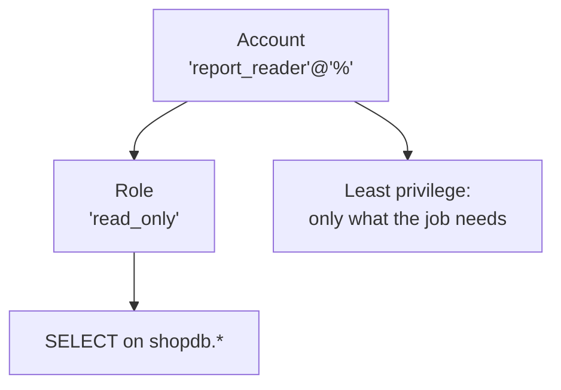

# The privilege model at a glance

Think of accounts as **people who can log in**, roles as **groups** that bundle permissions, privileges as **individual actions** you might be allowed to take (reading orders, paying for a purchase), and active roles as the things that actually apply while you're on the system. If every account had full access, any café employee could change another's password or wipe someone's payment history — that's why least privilege exists: each account gets only what it needs.

This is the memory aid you can draw from a whiteboard whenever you need to remember how MySQL checks access:

In words: the account `report_reader` connects from any host, is granted a role called `read_only`, and that role carries a single permission — `SELECT` against every object in `shopdb`. The account does not get write access or the ability to see other people's passwords; it gets only what it needs. That is the principle of least privilege: grant the minimum action, on the smallest possible set of objects, for the right time period.

## Accounts, roles and privileges

| Thing | What it is | How you create it |
|---|---|---|
| Account | a login and its host | `CREATE USER 'name'@'%' IDENTIFIED BY '…'` |
| Role | a named bundle of privileges | `CREATE ROLE 'name'` |
| Privilege | one allowed action on one object | `GRANT SELECT ON shopdb.* TO …` |
| Active role | a role that applies to this session | `SET DEFAULT ROLE …` or `SET ROLE …` |

These four lines are the entire model. Accounts and roles exist at the server level; privileges live on specific tables or databases; active roles only apply in the session you're working in, so one login can switch between a read-only role and a writer role without creating two accounts.

> ⚠️ Gotcha — `CREATE ROLE` does not create an account that anyone can log in with. A role is just a tag on existing users until you explicitly grant it to someone.

## How a privilege is checked

When MySQL receives a statement, the server checks three things before it runs anything: whether the connecting account has authenticated successfully, which roles are active for that session (via `SET ROLE` or the default), and whether the union of all active roles contains the requested privilege on the specific object. If any check fails the server returns an access-denied error immediately, without parsing, planning, executing, or returning a row.

This means you can safely write a stored procedure that reads from `customers`, but if it is executed by a session whose active roles do not include `SELECT ON shopdb.customers`, the query never runs — no information leakage through a long-running application connection.

## Prepared statements keep data out of SQL

The next topic in this module, covered fully in [`../notes.md`](../notes.md), walks you through how prepared statements save queries from injection by parsing the template once and binding values later so the engine can never confuse user input with SQL syntax. The technique is simple to use — `PREPARE`, `EXECUTE`, `DEALLOCATE` — and it works across every client library, which makes it the right choice for any dynamic query your application sends.

Next: the worked example is in [`../notes.md`](../notes.md); the full course list is in
[`../../../SYLLABUS.md`](../../../SYLLABUS.md).
