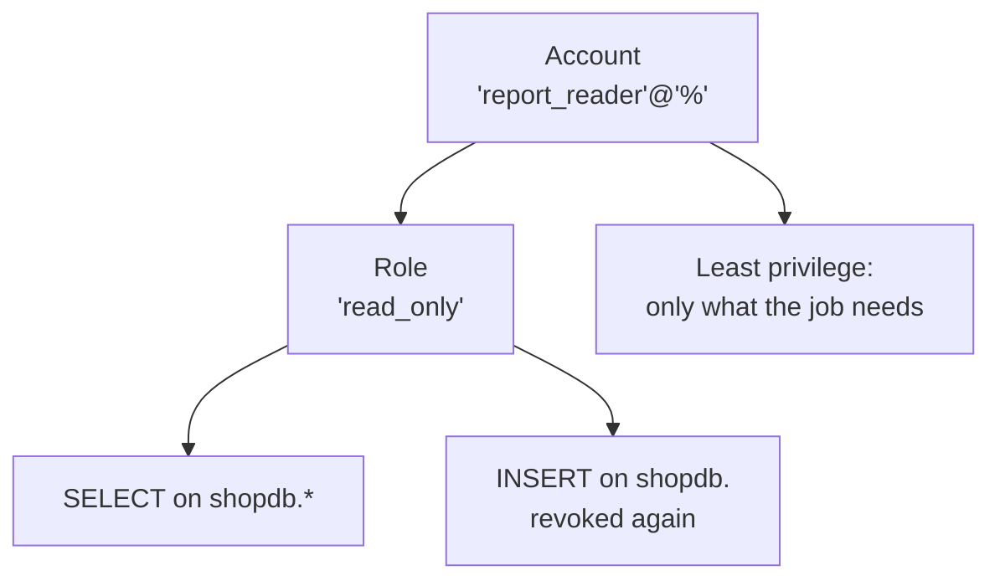

# Module 15 — Users, Privileges & Security · Notes

## §1 Why accounts and privileges matter at a café

Every café has dozens of people: guests, employees, supervisors, managers, staff who run the POS. Not everyone should see every order or payment record. A guest shouldn't be able to delete an employee; a supervisor shouldn't have write access to another store's payroll. Accounts let MySQL decide who is who and what each person can do — privileges are the door.

The principle of least privilege means you give someone only what their job needs. If a report-only user should never touch data, they get `SELECT` on one database. If an application writes orders, it gets exactly those write privileges. You grant to roles rather than to individual accounts so that every employee with the same access belongs to the same role and stays easy to audit.

## §2 The concept — accounts, roles and privileges



An **account** is a named login: `'report_reader'@'%'` means anyone from any host can connect as `report_reader`. An account has at least one **role** — MySQL checks the roles assigned to the connection against its privileges before deciding whether an action is allowed. A **privilege** (such as `SELECT ON shopdb.*`) describes what a role allows; you grant it with `GRANT` and remove it with `REVOKE`.

A **prepared statement** separates query code from data: the template is parsed once, then values are bound at execution time so they cannot be injected into SQL. This is the standard defence against **SQL injection**, where malicious input turns a harmless query into something dangerous by closing strings or appending clauses. The principle of least privilege and prepared statements together keep real applications safe — you give accounts only their own job's access, and you bind data instead of interpolating it.

**Vocabulary**

- **account** — a named login (`'user'@'host'`) with authentication credentials; MySQL checks the account before allowing any connection.
- **authentication** — proving an identity is real (username + password or other methods) before MySQL creates a session for that account.
- **privilege** — a permission such as `SELECT`, `INSERT`, `CREATE TABLE` that can be granted to roles and accounts; it controls what actions the connection may perform.
- **GRANT** — the SQL command (`GRANT PRIVILEGE ON db.table TO 'user'@'host'`) that adds privileges or roles to an account or role.
- **REVOKE** — the opposite of `GRANT` (`REVOKE PRIVILEGE ON db.table FROM 'user'@'host'`); it removes a privilege or role.
- **role** — a named collection of privileges; you grant privileges to a role and then assign roles to accounts, so one change updates every member.
- **default role** — the role that applies automatically when an account connects (`SET DEFAULT ROLE TO 'user'@'host'`); the session inherits it without any extra command.
- **least privilege** — grant only what a job actually needs; never give `ALL PRIVILEGES`, and prefer roles over per-account grants so you can audit and revoke cleanly.
- **prepared statement** — an SQL template with `?` placeholders that is parsed once; values are bound at `EXECUTE` time so they stay data, not code. This prevents injection attacks.

## §3 Worked example — 9 steps

### Step 1: Start from a clean slate (this file runs as `root`)
```sql
DROP USER IF EXISTS 'report_reader'@'%';
```
```sql
DROP ROLE IF EXISTS 'read_only';
```
If anything from a previous run exists, drop it so the script is safe to repeat.

### Step 2: Create a least-privilege account and a reusable role
```sql
CREATE USER 'report_reader'@'%' IDENTIFIED BY 'ReadOnly_2024';
```
```sql
CREATE ROLE 'read_only';
```
The account gets no privileges yet — it can only connect. The role is empty until you grant something to it.

### Step 3: Give the role read access only
```sql
GRANT SELECT ON shopdb.* TO 'read_only';
```
Now any user who receives `read_only` can query every table in `shopdb` but cannot write anything.

### Step 4: Hand the role to the account and make it the default role
```sql
GRANT 'read_only' TO 'report_reader'@'%';
```
```sql
SET DEFAULT ROLE 'read_only' TO 'report_reader'@'%';
```
The `DEFAULT ROLE` means that whenever this account connects, MySQL automatically assigns `read_only`. Without it, the user would need to run an extra command on every session.

### Step 5: Inspect what the account can do
```sql
SHOW GRANTS FOR 'report_reader'@'%';
```
| Grants |
|---|
| GRANT USAGE ON *.* TO `report_reader`@`%` |
| GRANT `read_only`@`%` TO `report_reader`@`%` |

Every account gets `USAGE` by default. The role grant shows the account now carries `read_only`.

### Step 6: Add write access to the role, then take it away
```sql
GRANT INSERT ON shopdb.* TO 'read_only';
```
```sql
SHOW GRANTS FOR 'read_only';
```
| Grants |
|---|
| GRANT USAGE ON *.* TO `read_only`@`%` |
| GRANT SELECT, INSERT ON `shopdb`.* TO `read_only`@`%` |

Now the role can read and insert into any table in `shopdb`. If we revoke the insert privilege:
```sql
REVOKE INSERT ON shopdb.* FROM 'read_only';
```
```sql
SHOW GRANTS FOR 'read_only';
```
| Grants |
|---|
| GRANT USAGE ON *.* TO `read_only`@`%` |
| GRANT SELECT ON `shopdb`.* TO `read_only`@`%` |

The role is back to read-only. Any user assigned this role immediately loses their insert permission for new sessions (and the current one).

### Step 7: A prepared statement binds a value as data
```sql
PREPARE price_query FROM
  'SELECT product_id, name, unit_price FROM products WHERE unit_price < ? ORDER BY unit_price';
```
```sql
SET @max_price = 5.00;
```
```sql
EXECUTE price_query USING @max_price;
```
| product_id | name | unit_price |
|---|---|---|
| 8 | Muffin | 3.25 |
| 7 | Croissant | 3.75 |

The `?` placeholder means the value is bound as data, not interpolated into SQL. The query template is parsed once; values are injected safely at execution time. Clean up:
```sql
DEALLOCATE PREPARE price_query;
```

### Step 8: A malicious-looking value stays data because it is bound
```sql
PREPARE name_query FROM 'SELECT COUNT(*) AS matches FROM products WHERE name = ?';
```
```sql
SET @evil = "' OR 1=1";
```
```sql
EXECUTE name_query USING @evil;
```
| matches |
|---|
| 0 |

If you had interpolated `@evil` instead, the query would become:
`SELECT COUNT(*) AS matches FROM products WHERE name = '' OR 1=1`, which counts all rows. With binding, `' OR 1=1'` is just a string value — no injection happens. Clean up:
```sql
DEALLOCATE PREPARE name_query;
```

### Step 9: Clean up the account and role and confirm
```sql
REVOKE 'read_only' FROM 'report_reader'@'%';
```
```sql
DROP USER IF EXISTS 'report_reader'@'%';
```
```sql
DROP ROLE IF EXISTS 'read_only';
```
```sql
SELECT
  (SELECT COUNT(*) FROM mysql.user WHERE user = 'report_reader')                       AS report_reader_accounts,
  (SELECT COUNT(*) FROM mysql.user WHERE user IN ('report_reader', 'read_only'))       AS leftovers,
  (SELECT COUNT(*) FROM information_schema.tables WHERE table_schema = 'shopdb')       AS shopdb_tables;
```
| report_reader_accounts | leftovers | shopdb_tables |
|---|---|---|
| 0 | 0 | 10 |

Nothing remains — the account, role and all their grants are gone. `shopdb` still has its ten tables.

## §4 How it works

**Per-connection checks.** When a client connects as `'report_reader'@'%'`, MySQL loads that account's roles (including the default role) and builds an internal privilege cache for every object in the system. Every statement is checked against this cache before execution — `SELECT` on `shopdb.orders` passes because `read_only` has it; `INSERT` fails because the role was revoked.

**Roles beat repeating GRANTs.** Without roles you would need a separate `GRANT SELECT ON shopdb.* TO 'employee1'@'localhost';` for each employee, and revoking read access means hunting down dozens of lines. With a role, one `REVOKE INSERT ON shopdb.* FROM 'read_only';` updates every member instantly.

**SET DEFAULT ROLE decides which roles apply.** If an account has multiple granted roles, only the default role applies at connection time unless the session runs `SET ROLE`. This is why the example sets it — otherwise a new connection would have no privileges except the bare minimum (USAGE).

**Prepared statements keep data out of SQL text.** A prepared statement parses the template once with its own syntax checker; bound values are sent to the server as separate parameters at execution time. The server can never treat a bound value as part of an identifier or keyword, so `' OR 1=1'` stays a string — it is the mechanism that makes parameterised queries safe.

## §5 Common errors & fixes

| Code | Message | What to do |
|---|---|---|
| 1227 | `Access denied; you need (at least one of) the SUPER or SYSTEM_VARIABLES_ADMIN privilege(s) for this operation` | server settings need an admin — connect as `root` |
| 1227 | `Access denied; you need (at least one of) the CREATE USER privilege(s) for this operation` | only a user with `CREATE USER` can add accounts |
| 1396 | `Operation CREATE USER failed for 'report_reader'@'%'` | the account already exists — `DROP USER IF EXISTS` first |
| 1410 | `You are not allowed to create a user with GRANT` | `CREATE USER` first; `GRANT` does not create accounts |

## §6 Try it yourself

### Try 1: A fresh account has no privileges but USAGE
```sql
CREATE USER 'auditor'@'%' IDENTIFIED BY 'Audit_2024';
```
```sql
SHOW GRANTS FOR 'auditor'@'%';
```
| Grants |
|---|
| GRANT USAGE ON *.* TO `auditor`@`%` |

(Drop before and after: `DROP USER IF EXISTS 'auditor'@'%';`)

### Try 2: Grant and revoke a table-level privilege
```sql
GRANT SELECT ON shopdb.products TO 'sales'@'%';
```
```sql
SHOW GRANTS FOR 'sales'@'%';
```
| Grants |
|---|
| GRANT USAGE ON *.* TO `sales`@`%` |
| GRANT SELECT ON `shopdb`.`products` TO `sales`@`%` |

```sql
REVOKE SELECT ON shopdb.products FROM 'sales'@'%';
```
```sql
SHOW GRANTS FOR 'sales'@'%';
```
| Grants |
|---|
| GRANT USAGE ON *.* TO `sales`@`%` |

### Try 3: A prepared statement with a bound limit
```sql
PREPARE p FROM 'SELECT name, unit_price FROM products WHERE unit_price < ? ORDER BY unit_price';
```
```sql
SET @lim = 4.00;
```
```sql
EXECUTE p USING @lim;
```
| name | unit_price |
|---|---|
| Muffin | 3.25 |
| Croissant | 3.75 |

```sql
DEALLOCATE PREPARE p;
```

## §7 Going deeper

- **Least privilege** — grant the smallest set of privileges that still lets the job be done, and grant to roles rather than to people.
- **Roles are dormant until activated** — a granted role does nothing until it is the default role or the session runs `SET ROLE`.
- **Privileges are checked per connection** — a `GRANT` takes effect for new connections (and for the current one) but never widens what an existing role already allows.
- **Prepared statements separate code from data** — the query template is parsed once with `?` placeholders, and values are bound at `EXECUTE` time, so they can never become SQL.

## References

- [Module 14 — Stored Programs & Triggers](../14-stored-programs-and-triggers/README.md)
- [The privilege model at a glance](assets/privilege-model.md)
- [Course index](../../SYLLABUS.md)