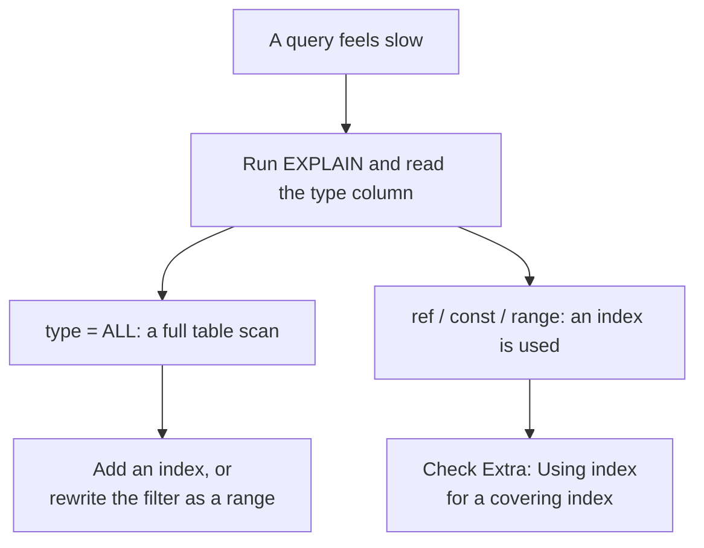

# Query-tuning cheatsheet

This file is a one-screen memory aid for the common patterns you'll see when a query feels slow. The worked example — with full EXPLAIN output and index changes — lives in [`../notes.md`](../notes.md). If something here feels unclear, that page will show it step by step.

> 💡 Aha: "Slow" means MySQL is doing more work than you can see. EXPLAIN tells you exactly what that work is.

The diagram above maps your instinct ("this feels slow") to the concrete steps MySQL will take and the action you need. When EXPLAIN shows `type = All`, the engine is reading every row — that's what you fix with an index or by turning a list of values into a range filter. When it shows `ref` or `const`, MySQL found matching rows through an index; then look at the Extra column to see if it did row lookups (`Using WHERE`) or avoided them entirely (`Using index`).

## The EXPLAIN type you'll meet

| `type` | What MySQL is doing | Seen in the worked example |
|---|---|---|
| `const` | one row, found by a unique or primary-key lookup | `products.sku = 'COF-002'` |
| `ref` | matching rows found with a non-unique index | `orders.customer_id = 3` |
| `range` | a slice of an index, between two bounds | `created_at` between 2024-06-01 and 2024-07-01 |
| `index` | a full scan of the index only, no row lookups | `YEAR(created_at) = 2024` after indexing `created_at` |
| `All` | a full table scan — the thing to fix | `orders.status = 'paid'` with no index |

## Composite indexes and the left-prefix rule

MySQL can combine multiple columns into one composite index. The catch is that the engine always reads from the left, so every column in an index must be used **in order** before MySQL skips ahead. If your filter is `WHERE category_id = 2 AND created_at >= 2024-15-00`, then the index `(category_id, created_at)` helps fully but `(created_at, category_id)` does not — because the engine can't jump from the first column to a specific value of the second.

> 🧪 Try it: write `CREATE INDEX idx_cat_date ON products (category_id, created_at);` and compare its EXPLAIN on this filter against one with only a single-column index on `created_at`.

## Query smells to fix

- **Full table scan on a filtered column.** If `EXPLAIN` shows `type = All`, look at the Where clause. Most of the time there's an indexed column you can turn into a range: instead of `WHERE status = 'paid'` (which forces MySQL to check every row), write `WHERE created_at >= 2024-15-00 AND created_at <= 2024-16-00`. The engine reads only the matching slice.

- **Subqueries in joins.** When a subquery produces intermediate rows, each iteration can be expensive. Rewrite it as an `INNER JOIN` or use a window function; MySQL handles these differently and often faster.

- **Functions on indexed columns.** Wrapping an indexed column inside `UPPER()`, `YEAR()`, or a mathematical expression prevents the index from being used. Create a virtual generated column (a `VIRTUAL GENERATED` column in MySQL 8) that stores the pre-computed value, then index it instead.

Next: the worked example is in [`../notes.md`](../notes.md); the full course list is in
[`../../../SYLLABUS.md`](../../../SYLLABUS.md).
