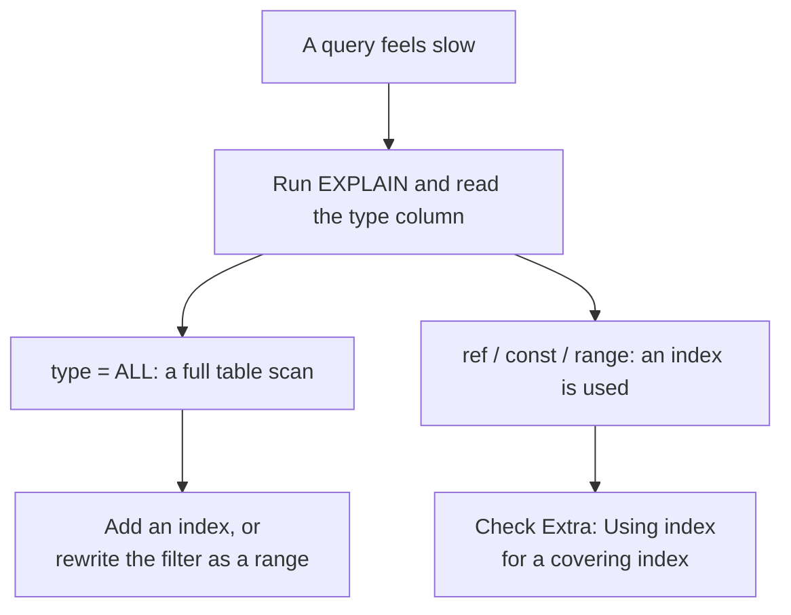

# Module 16 — Performance & Query Tuning · Notes

## §1 Why a slow query deserves a plan

Your café has been growing every week. The customer count is climbing, the store list is long, and an order summary that used to open in milliseconds now takes several minutes. Something is wrong — but not with your hardware.

The culprit is almost always a full table scan: MySQL has read every row it can find instead of following an index. You can see this happening by running `EXPLAIN` on the query that feels slow, then reading the plan. Once you know what the engine would actually do, the path to fixing the query becomes obvious and often simple.

> 🎯 Goal — learn how to read a query plan, choose indexes that genuinely help, and recognise the schema and query smells that force MySQL to work far more than it needs to.

## §2 Reading a query plan with EXPLAIN



`EXPLAIN` does not execute anything — it shows you what MySQL would do. The `type` column is the most important part of that output. It tells you whether the engine reads every row (the worst) or skips rows entirely using an index (the best). Between those extremes lies a spectrum: range scans, key lookups, and full table scans.

Below are the terms you will see in these plans.

- **index** — MySQL's data structure that maps values to one or more primary keys; it lets the engine find matching rows without reading every row in the table.
- **full table scan** — `type = ALL` in an `EXPLAIN` plan; every row is read, which scales linearly with table size and is almost always a problem on real tables (hundreds or thousands of rows).
- **EXPLAIN** — a SQL command that shows the planned execution steps for a query without running it. Its output includes a `type` column that tells you how each table will be accessed.
- **type** — a single letter in an `EXPLAIN` plan describing *how* a particular table is accessed: full scan (`ALL`, `table_scan`), index range (`range`), key lookup (`ref`, `eq_ref`, `const`), or no access needed (`NULL`).
- **key** — the name of the index (if any) that `EXPLAIN` says MySQL will actually use for this query. If it is `NULL`, no available index was chosen.
- **cardinality** — a number in the statistics view telling you how many distinct values exist in an index column; high cardinality means the index can narrow down quickly, low cardinality means it narrows only slightly and may not be worth using at all.
- **covering index** — when every column MySQL needs to return or filter on is stored inside a single secondary index so that no primary key lookup (no "bookmark back into the table") is needed. `EXPLAIN` flags this as `Using index`.
- **left-prefix rule** — an index on `(A, B)` can serve queries that filter on `A` alone or on both `A` and `B`, but never only on `B`; the leading column must appear in the predicate for the index to be used.
- **range scan** — `type = range`: MySQL reads a contiguous slice of an index bounded by a lower and upper bound (for example, a date range or `LIKE 'abc%'`). It is far faster than a full table scan but slower than an exact key lookup (`ref` / `const`).
- **correlated subquery** — a subquery that references columns from its outer query and therefore executes once per outer row; the classic N+1 shape. It often turns an O(n) join into O(n²) work.
- **query smell** — any filter, JOIN condition, or `SELECT` list that defeats available indexes (for example: a function wrapping an indexed column, or selecting all columns when only one is needed), forcing MySQL to do extra work it could avoid with a different plan or schema change.

## §3 Worked example — 15 steps

### Step 1
You can start by seeing what indexes already exist on the two tables that matter most: orders and products. This tells you which columns are indexable today and which are not.

```sql
SELECT
  table_name,
  index_name,
  non_unique,
  seq_in_index,
  column_name,
  cardinality
FROM information_schema.statistics
WHERE table_schema = 'shopdb'
  AND table_name IN ('orders', 'products')
ORDER BY table_name, index_name, seq_in_index;
```

| table_name | index_name | non_unique | seq_in_index | column_name | cardinality |
|---|---|---|---|---|---|
| orders | fk_order_customer | 1 | 1 | customer_id | 6 |
| orders | fk_order_store | 1 | 1 | store_id | 2 |
| orders | PRIMARY | 0 | 1 | order_id | 8 |
| products | fk_product_category | 1 | 1 | category_id | 4 |
| products | Primary | 0 | 1 | product_id | 10 |
| products | sku | 0 | 1 | sku | 10 |

*You can see that `orders` has a foreign-key index on `customer_id`, one on `store_id`, and the primary key on `order_id`. Products has no filter-friendly index; its only non-primary key is `sku`, which is unique but not used for look-by-category.*

### Step 2
Now look at the real query that feels slow: filtering orders by their status. The column `status` is an ENUM and there is **no** index on it.

```sql
EXPLAIN SELECT order_id, customer_id
FROM orders
WHERE status = 'paid';
```

| id | select_type | table | partitions | type | possible_keys | key | key_len | ref | rows | filtered | Extra |
|---|---|---|---|---|---|---|---|---|---|---|---|
| 1 | SIMPLE | orders | NULL | ALL | NULL | NULL | NULL | NULL | 8 | 25.00 | Using where |

*`type = All` confirms a full table scan. Every row in `orders` must be read and the filter evaluated — fine for eight rows, terrible when it reaches tens of thousands.*

### Step 3
A lookup on the unique column `sku` behaves very differently because the index can skip every non-matching row at once.

```sql
EXPLAIN SELECT product_id, name, unit_price
FROM products
WHERE sku = 'COF-002';
```

| id | select_type | table | partitions | type | possible_keys | key | key_len | ref | rows | filtered | Extra |
|---|---|---|---|---|---|---|---|---|---|---|---|
| 1 | SIMPLE | products | NULL | const | sku | sku | 82 | const | 1 | 100.00 | NULL |

*`type = const`: exactly one row, found instantly through the `sku` index. The engine never touches rows 2–10.*

### Step 4
Foreign-key columns also benefit from their indexes. The lookup on `customer_id = 3` is a textbook `ref`.

```sql
EXPLAIN SELECT order_id, order_date
FROM orders
WHERE customer_id = 3;
```

| id | select_type | table | partitions | type | possible_keys | key | key_len | ref | rows | filtered | Extra |
|---|---|---|---|---|---|---|---|---|---|---|---|
| 1 | SIMPLE | orders | NULL | ref | fk_order_customer | fk_order_customer | 4 | const | 1 | 100.00 | NULL |

*`type = ref`: one index lookup finds the matching rows — much faster than reading all eight.*

### Step 5
Now add the missing status index, refresh statistics so MySQL knows about it, and re-read the plan. This is the fix you would ship in production: `CREATE INDEX`, then `ANALYZE TABLE` (or wait for autostop), then re-check with `EXPLAIN`.

```sql
CREATE INDEX idx_practice_orders_status ON orders (status);
```
```sql
ANALYZE TABLE orders;
```
```sql
EXPLAIN SELECT order_id, customer_id
FROM orders
WHERE status = 'paid';
```

| id | select_type | table | partitions | type | possible_keys | key | key_len | ref | rows | filtered | Extra |
|---|---|---|---|---|---|---|---|---|---|---|---|
| 1 | SIMPLE | orders | NULL | ref | idx_practice_orders_status | idx_practice_orders_status | 1 | const | 4 | 100.00 | Using index condition |

*`type = ref` now, `key = idx_practice_orders_status`. The engine finds the matching rows through the index instead of scanning every row — a dramatic improvement.*

### Step 6
You can also read the new index back with its cardinality, so you know how selective it is. This matters because an index on a low-cardinality column like `status` (only four values) may not be worth creating at all.

```sql
SELECT
  index_name,
  non_unique,
  column_name,
  cardinality
FROM information_schema.statistics
WHERE table_schema = 'shopdb'
  AND table_name = 'orders'
  AND index_name = 'idx_practice_orders_status';
```

| index_name | non_unique | column_name | cardinality |
|---|---|---|---|
| idx_practice_orders_status | 1 | status | 4 |

*Cardinality 4 means only four distinct values. The index can skip rows, but not dramatically so — it would help a lot on ten-thousand-row tables and less on a few hundred.*

### Step 7
Always drop the practice index once you are done experimenting, to keep `shopdb` exactly as seeded.

```sql
DROP INDEX idx_practice_orders_status ON orders;
```

*This cleans up your work so that every subsequent lesson starts from known state.*

### Step 8
On a small table like `orders`, the difference between an index and a full scan is hard to feel. Build a practice table with five thousand rows instead, so the real trade-offs are visible. This script creates the table in one go using a recursive CTE and inserts data that cycles through statuses and customers.

```sql
SET SESSION cte_max_recursion_depth = 20000;
```
```sql
DROP TABLE IF EXISTS practice_perf_demo;
```
```sql
CREATE TABLE practice_perf_demo (
  demo_id     INT AUTO_INCREMENT PRIMARY KEY,
  customer_id INT NOT NULL,
  status      VARCHAR(20) NOT NULL,
  created_at  DATE NOT NULL,
  note        VARCHAR(40)
) ENGINE = InnoDB;
```
```sql
INSERT INTO practice_perf_demo (customer_id, status, created_at, note)
WITH RECURSIVE seq (n) AS (
  SELECT 1
  UNION ALL
  SELECT n + 1 FROM seq WHERE n < 5000
)
SELECT
  (n % 200) + 1,
  ELT((n % 4) + 1, 'pending', 'paid', 'shipped', 'cancelled'),
  DATE_ADD('2024-01-01', INTERVAL (n % 365) DAY),
  CONCAT('row ', n)
FROM seq;
```
```sql
ANALYZE TABLE practice_perf_demo;
```

*You now have a five-thousand-row table that mirrors the real `orders` schema. The next steps will make it obvious why some filters use an index and others do not.*

### Step 9
Run exactly the same `EXPLAIN` as before, but against this larger table with still no status index.

```sql
EXPLAIN SELECT demo_id
FROM practice_perf_demo
WHERE status = 'paid';
```

| id | select_type | table | partitions | type | possible_keys | key | key_len | ref | rows | filtered | Extra |
|---|---|---|---|---|---|---|---|---|---|---|---|
| 1 | SIMPLE | practice_perf_demo | NULL | ALL | NULL | NULL | NULL | NULL | 5000 | 10.00 | Using where |

*`type = All`, `rows = 5000`. Every row is read and filtered — on a real database this would take seconds.*

### Step 10
Create the index, refresh statistics, and re-read the plan. This time you can see the dramatic change that an index makes when the table gets large.

```sql
CREATE INDEX idx_practice_demo_status ON practice_perf_demo (status);
```
```sql
ANALYZE TABLE practice_perf_demo;
```
```sql
EXPLAIN SELECT demo_id
FROM practice_perf_demo
WHERE status = 'paid';
```

| id | select_type | table | partitions | type | possible_keys | key | key_len | ref | rows | filtered | Extra |
|---|---|---|---|---|---|---|---|---|---|---|---|
| 1 | SIMPLE | practice_perf_demo | NULL | ref | idx_practice_demo_status | idx_practice_demo_status | 82 | const | 1250 | 100.00 | Using index |

*`type = ref`, `key = idx_practice_demo_status`. The engine reads the index to find the matching rows — no full scan, only about 1,250 index entries instead of five thousand.*

### Step 11
A higher-cardinality column is far more selective. This query filters on `customer_id` (which has 200 distinct values), so the index can narrow even further.

```sql
CREATE INDEX idx_practice_demo_customer ON practice_perf_demo (customer_id);
```
```sql
ANALYZE TABLE practice_perf_demo;
```
```sql
EXPLAIN SELECT demo_id, customer_id
FROM practice_perf_demo
WHERE customer_id = 42;
```

| id | select_type | table | partitions | type | possible_keys | key | key_len | ref | rows | filtered | Extra |
|---|---|---|---|---|---|---|---|---|---|---|---|
| 1 | SIMPLE | practice_perf_demo | NULL | ref | idx_practice_demo_customer | idx_practice_demo_customer | 4 | const | 25 | 100.00 | Using index |

*Only twenty-five rows now — the engine found them through a single lookup on the `customer_id` index.*

### Step 12
A query smell: wrapping an indexed column in a function hides the index entirely because MySQL has to evaluate the function for every row first.

```sql
EXPLAIN SELECT demo_id
FROM practice_perf_demo
WHERE YEAR(created_at) = 2024;
```

| id | select_type | table | partitions | type | possible_keys | key | key_len | ref | rows | filtered | Extra |
|---|---|---|---|---|---|---|---|---|---|---|---|
| 1 | SIMPLE | practice_perf_demo | NULL | All | NULL | NULL | NULL | NULL | 5000 | 100.00 | Using where |

*Even though there is an index on `created_at`, the `YEAR()` function means MySQL cannot use it — full scan again.*

### Step 13
Add the date index and then compare a function filter with a range filter side-by-side. The range version can use the index as a slice, which is much faster than reading every row of an index and evaluating a function on each value.

```sql
CREATE INDEX idx_practice_demo_date ON practice_perf_demo (created_at);
```
```sql
ANALYZE TABLE practice_perf_demo;
```
```sql
EXPLAIN SELECT demo_id
FROM practice_perf_demo
WHERE YEAR(created_at) = 2024;
```

| id | select_type | table | partitions | type | possible_keys | key | key_len | ref | rows | filtered | Extra |
|---|---|---|---|---|---|---|---|---|---|---|---|
| 1 | SIMPLE | practice_perf_demo | NULL | index | NULL | idx_practice_demo_date | 3 | NULL | 5000 | 100.00 | Using where; Using index |

*`type = index`: MySQL *can* use the date index, but only as an index scan — it still reads every row of the index and applies `YEAR()` to each value.*

```sql
EXPLAIN SELECT demo_id
FROM practice_perf_demo
WHERE created_at >= '2024-06-01'
  AND created_at < '2024-07-01';
```

| id | select_type | table | partitions | type | possible_keys | key | key_len | ref | rows | filtered | Extra |
|---|---|---|---|---|---|---|---|---|---|---|---|
| 1 | SIMPLE | practice_perf_demo | NULL | range | idx_practice_demo_date | idx_practice_demo_date | 3 | NULL | 420 | 100.00 | Using where; Using index |

*`type = range`: MySQL reads only the slice of the index between '2024-06-01' and '2024-07-01'. Only about four hundred rows instead of five thousand.*

### Step 14
The N+1 shape — a correlated subquery is re-executed once per outer row, so this query runs the inner count 8 times (once for each order).

```sql
EXPLAIN SELECT
  o.order_id,
  (SELECT COUNT(*) FROM order_items AS oi WHERE oi.order_id = o.order_id) AS item_count
FROM orders AS o;
```

| id | select_type | table | partitions | type | possible_keys | key | key_len | ref | rows | filtered | Extra |
|---|---|---|---|---|---|---|---|---|---|---|---|
| 1 | PRIMARY | o | NULL | index | NULL | fk_order_customer | 4 | NULL | 8 | 100.00 | Using index |
| 2 | DEPENDENT SUBQUERY | oi | NULL | ref | fk_item_order | fk_item_order | 4 | shopdb.o.order_id | 1 | 100.00 | Using index |

*Step 2 runs eight times — once for each outer row (step 1). The `DEPENDENT SUBQUERY` keyword is a clear warning.*

```sql
EXPLAIN SELECT
  o.order_id,
  COUNT(oi.order_item_id) AS item_count
FROM orders AS o
LEFT JOIN order_items AS oi ON oi.order_id = o.order_id
GROUP BY o.order_id;
```

| id | select_type | table | partitions | type | possible_keys | key | key_len | ref | rows | filtered | Extra |
|---|---|---|---|---|---|---|---|---|---|---|---|
| 1 | SIMPLE | o | NULL | index | Primary,fk_order_customer,fk_order_store | Primary | 4 | NULL | 8 | 100.00 | Using index |
| 1 | SIMPLE | oi | NULL | ref | fk_item_order | fk_item_order | 4 | shopdb.o.order_id | 1 | 100.00 | Using index |

*A single `LEFT JOIN` with `GROUP BY` does the same work in one pass — much faster.*

### Step 15
Clean up and confirm that `shopdb` is back to exactly ten tables, as seeded.

```sql
DROP TABLE practice_perf_demo;
```
```sql
SELECT COUNT(*) AS shopdb_tables
FROM information_schema.tables
WHERE table_schema = 'shopdb';
```

| shopdb_tables |
|---|
| 10 |

*You are left in a clean state — every lesson can start from the same known schema.*

> ⚠️ Gotcha — Step 13 teaches you to write your filter so it matches the index. If you change `WHERE YEAR(created_at) = 2024` to a range, MySQL uses the index as a slice instead of scanning every row of an index and applying a function.

## §4 How it works

When MySQL receives a query, the optimizer looks at what indexes are available, consultes statistics (cardinality estimates), and then decides on a plan: which order to join tables, whether to use a particular index or do a full scan, and so on. The `EXPLAIN` output is your view into that decision — it tells you every table's access method (`type`), the chosen key (`key`), how many rows are estimated to be scanned (`rows`), and any extra notes about what MySQL can skip (like `Using index`).

Cardinality matters above all. An index on a column with 200 distinct values lets the engine narrow from thousands of rows down to perhaps twenty — an obvious win. By contrast, an index on `status`, which has only four values, might save you reading every row, but not dramatically so; for very large tables it still helps because it avoids touching the actual table data and its size is smaller than the heap-organized full table.

Wrapping a column in a function (or casting it to text) defeats an index because MySQL has to evaluate that expression for every single row before comparing the result. Similarly, selecting `*` when you need only one column forces a secondary-key lookup into the primary key and then back into the heap — a covering index avoids this extra step by storing the needed columns directly on the leaf level of the secondary index, which is why MySQL flags it as "Using index."

Finally, one join beats a correlated subquery. In Step 14 you saw that a dependent subquery runs once per outer row (the N+1 shape), so an eight-row outer query triggers eight inner lookups. A `LEFT JOIN` with `GROUP BY` does the same aggregation in a single pass over both tables, which is dramatically faster as the table grows.

> 💡 Aha — when you see a correlated subquery, ask yourself whether it can be rewritten as a join. Most of the time the answer is yes and the performance gain is enormous.

## §5 Common errors & fixes

| Code | Message | What to do |
|---|---|---|
| 1061 | `Duplicate key name 'idx_dup'` | an index with that name already exists on the table — pick another name or `DROP INDEX` it first |
| 1072 | `Key column 'no_such_col' doesn't exist in table` | you indexed a column that is not there — check the name with `DESCRIBE tbl` |
| 1091 | `Can't DROP 'idx_nope'; check that column/key exists` | the index you are dropping does not exist — list it with `SHOW INDEX FROM tbl` first |
| 1553 | `Cannot drop index 'ix_oid': needed in a foreign key constraint` | the index backs a foreign key — keep one usable index on that column |

## §6 Try it yourself

**Try 1 — list the indexes on `orders`**
```sql
SELECT
  index_name,
  non_unique,
  column_name
FROM information_schema.statistics
WHERE table_schema = 'shopdb'
  AND table_name = 'orders'
ORDER BY index_name, seq_in_index;
```

| INDEX_NAME | NON_UNIQUE | COLUMN_NAME |
|---|---|---|
| fk_order_customer | 1 | customer_id |
| fk_order_store | 1 | store_id |
| Primary | 0 | order_id |

**Try 2 — a filter that already uses a foreign-key index**
```sql
EXPLAIN SELECT order_item_id, quantity
FROM order_items
WHERE product_id = 7;
```

| id | select_type | table | partitions | type | possible_keys | key | key_len | ref | rows | filtered | Extra |
|---|---|---|---|---|---|---|---|---|---|---|---|
| 1 | SIMPLE | order_items | NULL | ref | fk_item_product | fk_item_product | 4 | const | 2 | 100.00 | NULL |

**Try 3 — a filter with no index: a full scan**
```sql
EXPLAIN SELECT product_id, name, unit_price
FROM products
WHERE unit_price < 5;
```

| id | select_type | table | partitions | type | possible_keys | key | key_len | ref | rows | filtered | Extra |
|---|---|---|---|---|---|---|---|---|---|---|---|
| 1 | SIMPLE | products | NULL | All | NULL | NULL | NULL | NULL | 10 | 33.33 | Using where |

> 🧪 Try it — look at the `type` column in each plan and notice how a filter that already has an index (`product_id`) gets `ref`, while one without (`unit_price < 5`) falls to a full scan.

## §7 Going deeper

- **`EXPLAIN ANALYZZE`** runs the query and reports real per-step timings, not just estimates — it is the next tool once plain `EXPLAIN` says "this should be fast".
- **The index that never gets used**: when a filter matches most of the table (low cardinality), the optimizer may prefer a full scan, because reading the index and then the rows costs more than reading once.
- **Composite indexes follow the left-prefix rule** — an index on `(customer_id, status)` serves a filter on `customer_id` or on `(customer_id, status)`, but not on `status` alone.
- **Write the filter to match the index** — `WHERE created_at >= '2024-06-01' AND created_at < '2024-07-01'` can use the index as a range, while `WHERE YEAR(created_at) = 2024` cannot.

## References

- [Module 15 — Users, Privileges & Security](../15-users-privileges-security/README.md)
- [Query-tuning cheatsheet](assets/query-tuning.md)
- [Course index](../../SYLLABUS.md)
