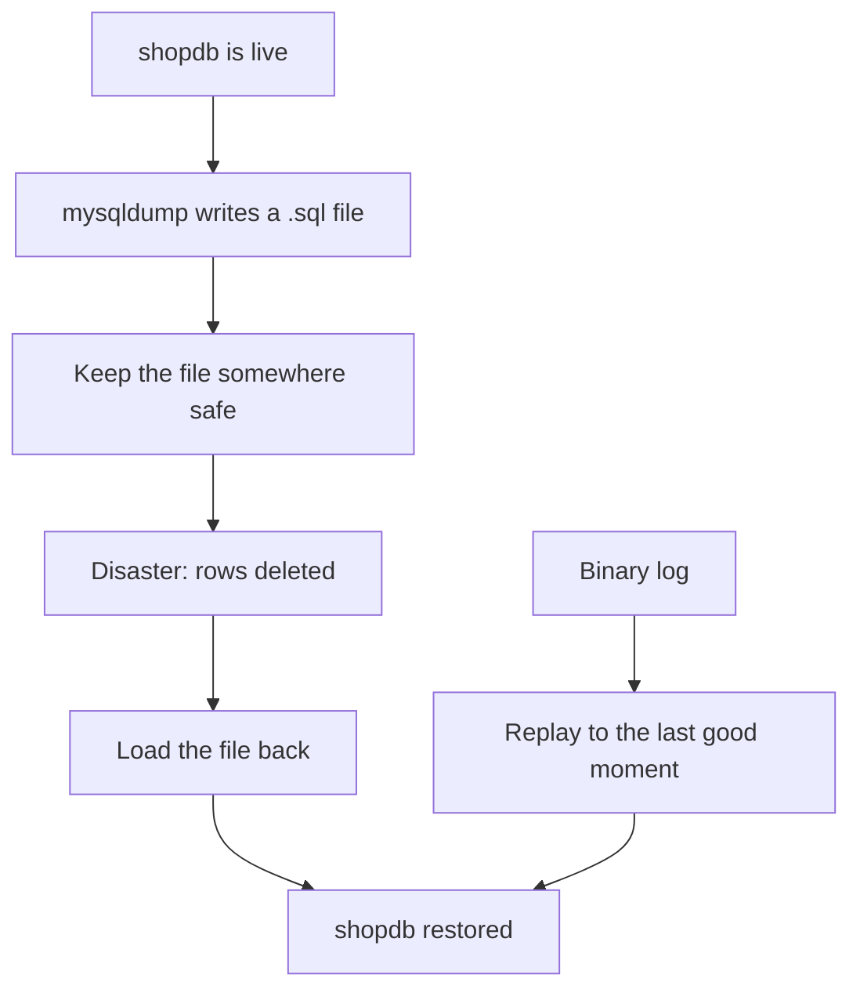

# Backup & recovery at a glance

Every café chain has one guiding question: *if the server dies tomorrow, what do we keep?* The answer is not "hope for the best" — it is to back `shopdb` up with mysqldump and be done. A backup is a single `.sql` file containing every CREATE and INSERT in your database, written by mysqldump to disk. If you have that file, you can restore the whole shop, even if the machine has been wiped clean.

> 💡 Aha Think of a backup as a **cold night on ice** — you pull it off and read the past, then warm the room back up with the live data. mysqldump is exactly that for your database: a snapshot you can pull out later.

The diagram above shows a single story in six steps. mysqldump reads every table from `shopdb` and writes them into a `.sql` file — plain text, with CREATE tables followed by INSERT rows. That file must be kept somewhere safe (an off-line drive, an object store). If disaster happens and rows are lost, the restore step is simply loading that file back; it creates every table and every row again. The binary log offers a parallel path: instead of a full snapshot you replay changes from the log to recover only up to the last good moment after a mistake.

## Logical vs physical

| | Logical (`mysqldump`) | Physical (copy the data files) |
|---|---|---|
| What it is | SQL text: `CREATE` + `INSERT` | the raw InnoDB files on disk |
| Portable? | yes — any MySQL server | same version and platform only |
| Restore speed | slower on large data | fast |
| Good for | small/medium data, moving between servers | large data, disaster recovery |

Logical backups are a dump of SQL text. They are portable across machines but slow to restore on very large databases. Physical backups copy the raw InnoDB files directly from disk — they are fast but tied to the same MySQL version and platform. For `shopdb` at roughly 10 tables you will always use mysqldump; physical backups become relevant when a dataset reaches gigabytes or terabytes.

## The restore drill

A backup is only real once you have restored it and checked the counts. Do this every time: back up, create an empty database, load the dump (`mysql --database=shopdb < backup.sql`), then run `SELECT COUNT(*) FROM orders; SELECT COUNT(*) FROM payments;`. If those numbers match what you expect on the live shop, your backup is good. If they do not, something went wrong with the dump and you must fix it before relying on it — a broken restore is worse than nothing because it looks like success.

## Point-in-time recovery

The mysqldump restores to exactly one moment: whatever was committed at the time of the dump. The binary log replays every change that happened since then, up to just before the mistake you want to undo (you can stop replay right after the wrong DELETE). The point-in-time workflow is therefore two steps: restore from the most recent logical backup, then run `mysqlbinlog` against the binlog to select only the transactions you want to keep. This combination — dump + binary log — means you can recover not just "the last full version" but any transaction that happened between versions, which is what makes a café's payment records reliable when an employee accidentally deletes them in a panic.

Next: the worked example is in [`../notes.md`](../notes.md); the full course list is in
[`../../../SYLLABUS.md`](../../../SYLLABUS.md).
