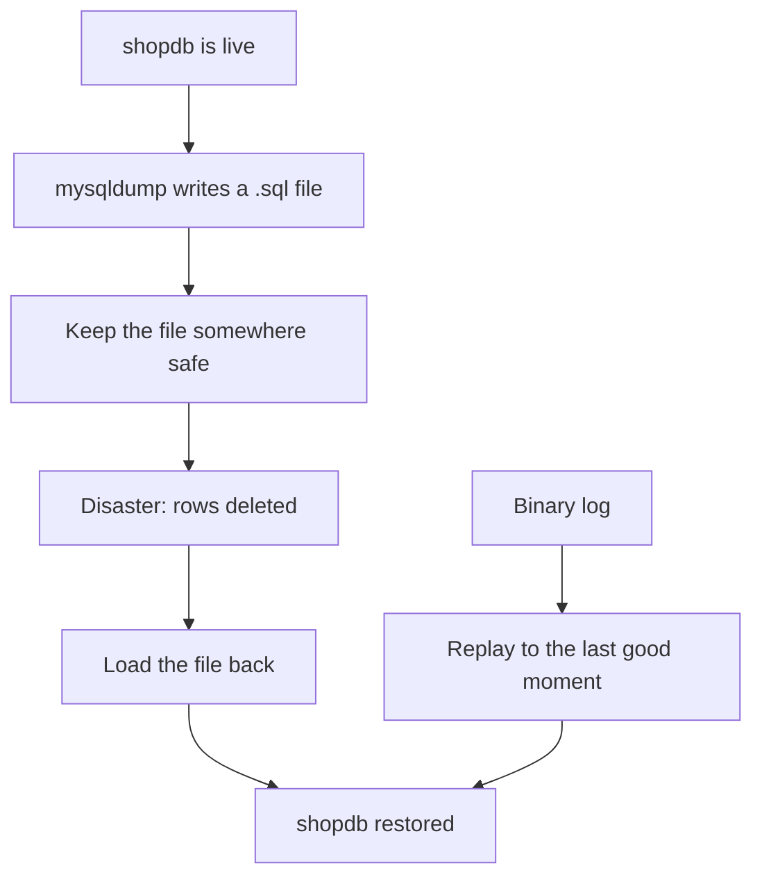

# Module 17 — Backup & Recovery · Notes

## §1 Why backups are the café's insurance

One careless `DELETE` can wipe a day of orders, payments and receipts — all the data that keeps Aisha's customers happy. The next step is always to back it up before you change anything. That backup is your insurance: when something goes wrong, the disaster turns into a long recovery instead of a lost customer.

Backups are not optional for a real business database. `shopdb` runs every time someone swipes at a point-of-sale device, and that data needs to survive even if the server crashes tomorrow. A backup you never restore is only a hope — schedule a **restore drill** so you can prove it works.

## §2 The concept — logical and physical backups



**Logical backups** export the database as SQL text. `mysqldump` is the tool that turns every row back into an `INSERT`, along with all table definitions, views and stored programs. The output is portable — you can open it in any editor or send it to another server — but restoring a big dump takes minutes.

**Physical backups** copy the raw data files on disk. They are fast to write and restore, but they tie you to the same MySQL version and operating system. In practice, most people reach for logical backups with `--single-transaction` so that no table is locked while the dump runs.

> 🎯 Goal — learn the restore drill before the next production deployment.

### Vocabulary

**Logical backup.** A text file of SQL statements (table definitions + data) produced by a tool such as `mysqldump`. It can be restored on any compatible server regardless of disk layout or version. Logical backups are slow for large databases and portable across platforms.

**Physical backup.** A copy of the raw database files (InnoDB `.ibd` pages, log files, etc.) taken directly from storage. Physical backups restore in seconds but tie you to the same MySQL version and platform. They do not include views or stored programs.

**mysqldump.** The command-line tool that generates logical dumps for InnoDB tables (`--single-transaction`) as well as MyISQL/CSV files. It can dump an entire database, a single table, or only specific rows with `WHERE`. Always back up the whole database — partial dumps lose foreign-key integrity and are almost impossible to restore safely.

**Binary log.** Also called *binlog*, this is MySQL's write-ahead record of every change to the database (INSERTs, UPDATEs, DELETEs). It lives in a series of numbered files under the `datadir`. A binlog can be replayed forward to reconstruct any earlier state — that is what point-in-time recovery is.

**Position.** A byte offset inside a binary-log file marking where you would start replaying. `SHOW BINARY LOG STATUS` tells you the current position; a restore drill uses that number as its starting point for the binlog replay.

**Point-in-time recovery.** Using the binary log to advance from a dump (or physical backup) back to any exact moment in history — for instance, "just before I ran `DELETE FROM order_items`". You need both a baseline backup and the binlogs that covered the time between it and your mistake.

**Restore drill.** The act of restoring a known-good backup onto an empty or clean database and verifying row counts. A restore drill is what proves your backup strategy works — without running one, you have only a hope.

## §3 Worked example — 9 steps

### Step 1 — the server's backup posture in one row.

```sql
SELECT
  @@log_bin        AS binlog_on,
  @@binlog_format  AS binlog_format,
  @@server_id      AS server_id,
  @@gtid_mode      AS gtid_mode,
  @@datadir        AS data_dir,
  @@secure_file_priv AS secure_file_priv;
```

| binlog_on | binlog_format | server_id | gtid_mode | data_dir | secure_file_priv |
|---|---|---|---|---|---|
| 1 | ROW | 1 | OFF | /var/lib/mysql/ | /var/lib/mysql-files/ |

### Step 2 — the current binary-log file and position.

```sql
SHOW BINARY LOG STATUS;
```

| File | Position | Binlog_Do_DB | Binlog_Ignore_DB | Executed_Gtid_Set |
|---|---|---|---|---|
| binlog.000003 | 1085642 |  |  |  |

### Step 3 — every binary-log file the server keeps.

```sql
SHOW BINARY LOGS;
```

| Log_name | File_size | Encrypted |
|---|---|---|
| binlog.000001 | 2997070 | No |
| binlog.000002 | 144157 | No |
| binlog.000003 | 1085642 | No |

### Step 4 — what a logical backup stores for `payments`.

```sql
SHOW CREATE TABLE payments;
```

```text
CREATE TABLE `payments` (
  `payment_id` int NOT NULL AUTO_INCREMENT,
  `order_id` int NOT NULL,
  `paid_at` datetime NOT NULL,
  `amount` decimal(10,2) NOT NULL,
  `method` enum('card','cash','transfer') NOT NULL DEFAULT 'card',
  PRIMARY KEY (`payment_id`),
  KEY `fk_payment_order` (`order_id`),
  CONSTRAINT `fk_payment_order` FOREIGN KEY (`order_id`) REFERENCES `orders` (`order_id`)
) ENGINE=InnoDB AUTO_INCREMENT=7 DEFAULT CHARSET=utf8mb4 COLLATE=utf8mb4_0900_ai_ci
```

### Step 5 — create a tiny "live" table to practise the restore drill on.

```sql
DROP TABLE IF EXISTS practice_backup_demo;
```

```sql
CREATE TABLE practice_backup_demo (
  demo_id INT AUTO_INCREMENT PRIMARY KEY,
  item    VARCHAR(30) NOT NULL,
  qty     INT NOT NULL
) ENGINE = InnoDB;
```

```sql
INSERT INTO practice_backup_demo (item, qty) VALUES
  ('Espresso Blend', 3),
  ('House Roast',    2),
  ('Croissant',      5);
```

```sql
SELECT * FROM practice_backup_demo ORDER BY demo_id;
```

| demo_id | item | qty |
|---|---|---|
| 1 | Espresso Blend | 3 |
| 2 | House Roast | 2 |
| 3 | Croissant | 5 |

### Step 6 — take a point-in-time copy of the rows.

```sql
DROP TABLE IF EXISTS practice_backup_demo_snap;
```

```sql
CREATE TABLE practice_backup_demo_snap AS
SELECT *
FROM practice_backup_demo;
```

> ⚠️ Gotcha — `mysqldump` does this under the hood: a consistent snapshot via InnoDB's MVCC. The snapshot is invisible to live transactions and avoids locking any table.

### Step 7 — now "damage" the live table.

```sql
DELETE FROM practice_backup_demo
WHERE item = 'House Roast';
```

```sql
UPDATE practice_backup_demo
SET qty = 999
WHERE item = 'Croissant';
```

```sql
SELECT * FROM practice_backup_demo ORDER BY demo_id;
```

| demo_id | item | qty |
|---|---|---|
| 1 | Espresso Blend | 3 |
| 3 | Croissant | 999 |

### Step 8 — restore the rows from the snapshot.

```sql
DELETE FROM practice_backup_demo;
```

```sql
INSERT INTO practice_backup_demo (demo_id, item, qty)
SELECT demo_id, item, qty
FROM practice_backup_demo_snap;
```

```sql
SELECT * FROM practice_backup_demo ORDER BY demo_id;
```

| demo_id | item | qty |
|---|---|---|
| 1 | Espresso Blend | 3 |
| 2 | House Roast | 2 |
| 3 | Croissant | 5 |

### Step 9 — clean up both practice tables.

```sql
DROP TABLE practice_backup_demo_snap;
```

```sql
DROP TABLE practice_backup_demo;
```

> 💡 Aha — the snapshot is an exact copy of the rowset at that moment in time. Even if you drop it afterward, the rows you inserted from it are safe as long as the parent transaction holds a lock on them. In practice you dump to disk instead of creating tables and never need the snapshot table again.

```sql
SELECT COUNT(*) AS shopdb_tables
FROM information_schema.tables
WHERE table_schema = 'shopdb';
```

| shopdb_tables |
|---|
| 10 |

## §4 How it works — the real backup drill

A logical dump (`mysqldump`) is portable and easy to read but slow on a big database; a physical copy of the data files restores in seconds but ties you to the same MySQL version and operating system. Point-in-time recovery needs both: the binary log records every change since the dump so that you can replay it forward to just before a mistake. The `--single-transaction` flag takes a consistent InnoDB snapshot without locking any table, so a live café keeps taking orders while the dump runs.

A backup you never restore is only a hope — **schedule a restore drill**, exactly like Step 8, and check the row counts.

```bash
# 1. Back up shopdb to a file on your machine (uses the password from the container's environment).
docker compose exec -T mysql sh -c 'mysqldump -uroot -p"$MYSQL_ROOT_PASSWORD" --single-transaction --routines --triggers --databases shopdb' > shopdb-backup.sql
```

```bash
# 2. Prove it is a real dump: it starts with the mysqldump header.
head -3 shopdb-backup.sql
```

```bash
# 3. Simulate an accident on the live database.
python3 dbctl.py sql --sql "DELETE FROM order_items WHERE order_item_id > 10"
```

```bash
# 4. Restore the dump over the live database.
docker compose exec -T mysql sh -c 'mysql -uroot -p"$MYSQL_ROOT_PASSWORD"' < shopdb-backup.sql
```

```bash
# 5. Confirm the lost rows are back (14 order items again).
python3 dbctl.py sql --sql "SELECT COUNT(*) AS order_items FROM order_items"
```

## §5 Common errors & fixes

| Code | Message | What to do |
|---|---|---|
| 1064 | `You have an error in your SQL syntax … near 'MASTER STATUS'` | `SHOW MASTER STATUS` was removed in MySQL 8.4 — use `SHOW BINARY LOG STATUS` |
| 1227 | `Access denied; you need (at least one of) the SUPER, REPLICATION CLIENT privilege(s) …` | reading binary-log state needs `REPLICATION CLIENT` — connect as the admin (`root`) |
| 1045 | `Access denied for user 'shop'@'localhost' (using password: YES)` | the credentials are wrong — check `.env` and the container is the one you think it is |
| 1227 | `Access denied; you need (at least one of) the FILE privilege(s) …` | `SELECT … INTO OUTFILE` needs `FILE`; use a client-side dump (`mysqldump`) instead |

## §6 Try it yourself

**Try 1 — list the binary logs (run as `root`)**

```sql
SHOW BINARY LOGS;
```

| Log_name | File_size | Encrypted |
|---|---|---|
| binlog.000001 | 2997070 | No |
| binlog.000002 | 144157 | No |
| binlog.000003 | 1085642 | No |

**Try 2 — how long the server keeps binary logs**

```sql
SELECT
  @@binlog_expire_logs_seconds AS expire_seconds,
  @@log_bin AS binlog_on;
```

| expire_seconds | binlog_on |
|---|---|
| 2592000 | 1 |

**Try 3 — what a dump stores for `products`**

```sql
SHOW CREATE TABLE products;
```

```text
CREATE TABLE `products` (
  `product_id` int NOT NULL AUTO_INCREMENT,
  `category_id` int NOT NULL,
  `name` varchar(80) NOT NULL,
  `sku` varchar(20) NOT NULL,
  `unit_price` decimal(10,2) NOT NULL,
  `is_active` tinyint(1) NOT NULL DEFAULT '1',
  PRIMARY KEY (`product_id`),
  UNIQUE KEY `sku` (`sku`),
  KEY `fk_product_category` (`category_id`),
  CONSTRAINT `fk_product_category` FOREIGN KEY (`category_id`) REFERENCES `categories` (`category_id`)
) ENGINE=InnoDB AUTO_INCREMENT=11 DEFAULT CHARSET=utf8mb4 COLLATE=utf8mb4_0900_ai_ci
```

## §7 Going deeper

- **Logical vs physical.** `mysqldump` writes SQL text — portable and easy to read, but slow to restore on a big database. A physical backup copies the data files themselves — fast, but tied to the same server version and platform.
- **Point-in-time recovery.** A dump restores the database to the moment it was taken; the binary log records every change since, so you can replay it forward to just before a mistake.
- **Verify your backups.** A backup you have never restored is only a hope — schedule a **restore drill**, exactly like Step 8, and check the row counts.
- **`--single-transaction`** takes a consistent InnoDB snapshot without locking the tables, so a live café keeps taking orders while the dump runs.

## References

- [Module 16 — Performance & Query Tuning](../16-performance-and-query-tuning/README.md)
- [Backup & recovery at a glance](assets/backup-and-recovery.md)
- [Course index](../../SYLLABUS.md)
