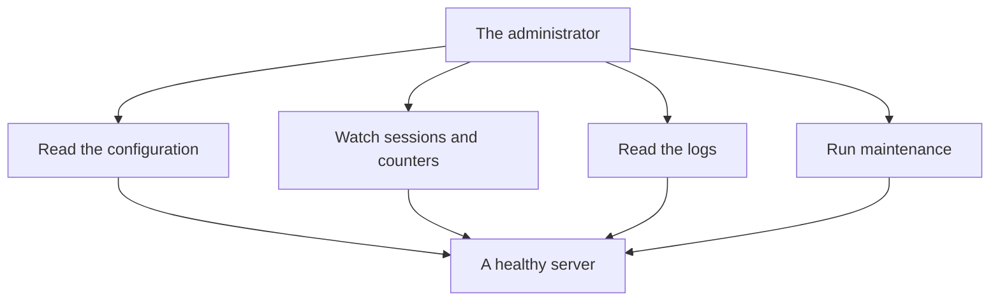

# Server operations at a glance

This page is not about writing queries — it is about the server itself. Every admin keeps this one screen in their memory as a quick map of where to look, and the detailed reasoning lives in [`notes.md`](../notes.md).

The diagram above is the mental map every admin keeps in their memory. The administrator reads configuration to understand what the server has, watches sessions and counters to spot problems early, reads logs to diagnose issues, and runs maintenance so tables stay fast and intact — all of it points back to a healthy server.

> 💡 Aha: this is the same map that appears at the top of `notes.md`. The two pages complement each other — one gives you a quick card to keep in your memory, the other walks you through every step with worked examples.

## What you watch

| What you look at | Where | Example value |
|---|---|---|
| Configuration in effect | `SELECT @@…` / `SHOW GLOBAL VARIABLES` | `max_connections = 151` |
| Who is connected | `information_schema.processlist` | one session, `command = Query` |
| Live counters | `performance_schema.global_status` | `Slow_queries`, `Threads_connected` |
| Table sizes | `information_schema.tables` | `data_length`, `index_length` |
| Storage engines | `information_schema.engines` | `InnoDB` is `DEFAULT` and does transactions |

## Maintenance

Three commands keep tables healthy — you do not need to know how they work internally, just that you run them when a table starts growing or after data changes. `ANALYZE TABLE` refreshes the statistics the optimizer uses for query plans (safe and quick on most tables). `CHECK TABLE` verifies a table's data and its indexes are not corrupted — always run it before any restore. `OPTIMIZE TABLE` rebuilds the table and its indexes, defragmenting and reclaiming space; for InnoDB that means "recreate + analyze."

## Storage engines

| Engine | Transactions | Use it for |
|---|---|---|
| InnoDB | yes | the default — café orders and payments |
| MyISAM | no | read-mostly tables that never need a rollback |
| MEMORY | no | small, fast, temporary, in-memory data |
| ARCHIVE | no | compressed, append-only history |

Next: the worked example is in [`../notes.md`](../notes.md); the full course list is in [`../../../SYLLABUS.md`](../../../SYLLABUS.md).