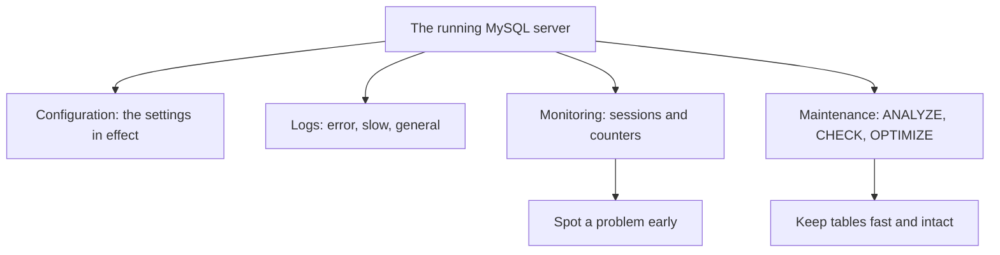

# Module 18 — Server Administration & Operations · Notes

## §1 Why the server needs a caretaker

The café chain runs on one MySQL server. Behind every order, payment and sales report is that process listening on port 3306 — but it does not look after itself. A wrong buffer pool size can cause spills; a stuck session can freeze checkout; a table left unanalyzed can slow the daily sales graph for hours. An administrator watches and tunes: they read the settings in effect, see who is connected, keep tables healthy. Administration is care, not just queries.

## §2 The knobs, sessions and counters



The diagram above is the mental map every admin keeps in their memory. The server reads its configuration file at startup (or on `SIGHUP`), opens logs, starts threads for connected clients, and maintains internal counters for queries processed, connections opened and so on — all of it can be inspected with built-in SQL commands.

**Vocabulary.**
- **Configuration file** — the text file (`/etc/my.cnf`) that sets defaults; the server reads it at startup to determine things like `innodb_buffer_pool_size`, `max_connections` and where data is stored (`@@datadir`). You can see what it has chosen with `SELECT @@…`.
- **Server variable** — a setting whose value you read with `SELECT @@variable_name`. Variables come from the config file (then defaults) but many can be changed at runtime. Every variable falls into either `GLOBAL` scope (the server-wide setting) or `SESSION` scope (the copy each client made when it connected).
- **Error log** — records server events like startup messages, warnings and fatal errors. In the course container you read it with `docker compose logs --tail=8 mysql`.
- **Slow-query log** — a file that records queries slower than `long_query_time` (in seconds). Turn it on when things feel slow so you can find the offending statements.
- **General log** — every SQL statement is written to this file; off by default because it is very noisy. Useful for debugging but keep it turned off in production.
- **Session / connection** — a client's link to the server, with its own thread and a copy of global variables at connect time (`@@long_query_time`, `SELECT @@user`, etc.).
- **Status counter** — values like `Slow_queries`, `Threads_connected`, `Uptime` that the server increments or decrements as it handles requests. Read them from `performance_schema.global_status`.
- **Storage engine** — the plugin that implements a table's data and indexes (InnoDB is the default; MyISAM, MEMORY, ARCHIVE exist too). Only InnoDB does transactions.
- **`ANALYZE TABLE` / `CHECK TABLE` / `OPTIMIZE TABLE`** — maintenance commands: ANALYZE refreshes statistics used by the optimizer, CHECK verifies a table and its indexes are not corrupted, OPTIMIZE rebuilds the table and indexes to reclaim space (for InnoDB it means "recreate + analyze").

## §3 Worked example — 17 steps

### Step 1
The server's identity and where it keeps its data.

```sql
SELECT
  VERSION()                AS server_version,
  @@version_comment        AS build_comment,
  @@default_storage_engine AS default_engine,
  @@datadir                AS data_dir,
  @@port                   AS port;
```

| server_version | build_comment | default_engine | data_dir | port |
|---|---|---|---|---|
| 8.4.11 | MySQL Community Server - GPL | InnoDB | /var/lib/mysql/ | 3306 |

### Step 2
The storage engines this build ships, and which of them do transactions.

```sql
SELECT
  engine,
  support,
  transactions
FROM information_schema.engines
ORDER BY engine;
```

| engine | support | transactions |
|---|---|---|
| ARCHIVE | YES | NO |
| BLACKHOLE | YES | NO |
| CSV | YES | NO |
| FEDERATED | NO | NULL |
| InnoDB | DEFAULT | YES |
| MEMORY | YES | NO |
| MRG_MYISAM | YES | NO |
| MyISAM | YES | NO |
| ndbcluster | NO | NULL |
| ndbinfo | NO | NULL |
| PERFORMANCE_SCHEMA | YES | NO |

### Step 3
The operational settings in effect (the config file, then the defaults).

```sql
SELECT
  @@innodb_buffer_pool_size AS buffer_pool_bytes,
  @@max_connections         AS max_connections,
  @@long_query_time         AS slow_threshold_s,
  @@slow_query_log          AS slow_log_on;
```

| buffer_pool_bytes | max_connections | slow_threshold_s | slow_log_on |
|---|---|---|---|
| 134217728 | 151 | 10.000000 | 0 |

### Step 4
Who is connected to the server right now (the ids and times change every run).

```sql
SELECT
  id,
  user,
  host,
  db,
  command,
  time,
  state
FROM information_schema.processlist
ORDER BY id;
```

| id | user | host | db | command | time | state |
|---|---|---|---|---|---|---|
| 5 | event_scheduler | localhost | NULL | Daemon | 10 | Waiting on empty queue |
| 12 | root | localhost | shopdb | Query | 0 | executing |

### Step 5
A few live counters the server keeps for you (the values move constantly).

```sql
SELECT
  variable_name,
  variable_value
FROM performance_schema.global_status
WHERE variable_name IN ('Uptime', 'Threads_connected', 'Queries', 'Slow_queries')
ORDER BY variable_name;
```

| variable_name | variable_value |
|---|---|
| Queries | 64 |
| Slow_queries | 0 |
| Threads_connected | 1 |
| Uptime | 11 |

### Step 6
Turn the slow log on and lower the threshold so even a quick query counts.

```sql
SET GLOBAL slow_query_log = ON;
```

```sql
SET GLOBAL long_query_time = 0;
```

### Step 7
Run a query. Surely it is "slow" now?

```sql
SELECT
  COUNT(*) AS paid_orders
FROM orders
WHERE status = 'paid';
```

| paid_orders |
|---|
| 4 |

### Step 8
Read the counter back. Still 0! `SET GLOBAL` did not change the value this session already copied when it connected — this session is still at 10.

```sql
SHOW GLOBAL STATUS LIKE 'Slow_queries';
```

| Variable_name | Value |
|---|---|
| Slow_queries | 0 |

### Step 9
Fix it for this session too.

```sql
SET SESSION long_query_time = 0;
```

### Step 10
Run the same query again; this one really is recorded.

```sql
SELECT
  COUNT(*) AS paid_orders
FROM orders
WHERE status = 'paid';
```

| paid_orders |
|---|
| 4 |

### Step 11
Now the counter has moved (every statement after the change counts, so it jumps by several).

```sql
SHOW GLOBAL STATUS LIKE 'Slow_queries';
```

| Variable_name | Value |
|---|---|
| Slow_queries | 4 |

### Step 12
Put the slow-log settings back exactly as we found them.

```sql
SET SESSION long_query_time = 10;
```

```sql
SET GLOBAL slow_query_log = OFF;
```

```sql
SET GLOBAL long_query_time = 10;
```

### Step 13
Refresh the optimizer's statistics for the busiest tables (safe and quick).

```sql
ANALYZE TABLE orders, order_items, products, payments;
```

| Table | Op | Msg_type | Msg_text |
|---|---|---|---|
| shopdb.orders | analyze | status | OK |
| shopdb.order_items | analyze | status | OK |
| shopdb.products | analyze | status | OK |
| shopdb.payments | analyze | status | OK |

### Step 14
Check that a table's data and indexes are not corrupted.

```sql
CHECK TABLE orders, products;
```

| Table | Op | Msg_type | Msg_text |
|---|---|---|---|
| shopdb.orders | check | status | OK |
| shopdb.products | check | status | OK |

### Step 15
`OPTIMIZE` rebuilds a table and its indexes: it defragments and reclaims space (for InnoDB that means "recreate + analyze").

```sql
OPTIMIZE TABLE orders;
```

| Table | Op | Msg_type | Msg_text |
|---|---|---|---|
| shopdb.orders | optimize | note | Table does not support optimize, doing recreate + analyze instead |
| shopdb.orders | optimize | status | OK |

### Step 16
The size of every `shopdb` table: rows, data bytes and index bytes. `TABLE_ROWS` is an estimate from the optimizer's statistics, not a `COUNT(*)`.

```sql
SELECT
  table_name,
  engine,
  table_rows,
  data_length,
  index_length
FROM information_schema.tables
WHERE table_schema = 'shopdb'
ORDER BY (data_length + index_length) DESC;
```

| table_name | engine | table_rows | data_length | index_length |
|---|---|---|---|---|
| employees | InnoDB | 5 | 16384 | 49152 |
| order_items | InnoDB | 14 | 16384 | 32768 |
| orders | InnoDB | 8 | 16384 | 32768 |
| products | InnoDB | 10 | 16384 | 32768 |
| addresses | InnoDB | 12 | 16384 | 16384 |
| categories | InnoDB | 4 | 16384 | 16384 |
| customers | InnoDB | 6 | 16384 | 16384 |
| payments | InnoDB | 6 | 16384 | 16384 |
| persons | InnoDB | 12 | 16384 | 16384 |
| stores | InnoDB | 2 | 16384 | 0 |

### Step 17
Confirm `shopdb` is unchanged: still 10 tables.

```sql
SELECT COUNT(*) AS shopdb_tables
FROM information_schema.tables
WHERE table_schema = 'shopdb';
```

| shopdb_tables |
|---|
| 10 |

## §4 How it works — the admin drill

Where configuration lives matters: a change to `/etc/my.cnf` takes its value from that file at startup, but `SET GLOBAL` changes the running server (until you also `SET SESSION`). The three logs help you operate without guesswork. The error log records startups and warnings so you can see when something broke during boot; the slow-query log finds queries that are taking too long — turn it on right before your customer complains about a frozen cart; the general log is every statement written to disk, which is very useful for debugging but also very noisy, so leave it off.

You do not need to memorise these commands — keep them in an alias or shell script:

```bash
# 1. The configuration file the server reads from inside the container.
docker compose exec -T mysql sh -c 'ls -1 /etc/my.cnf /etc/mysql/conf.d/'
```

```bash
# 2. Read one setting as the server actually has it now (config file plus defaults).
python3 dbctl.py sql --sql "SHOW GLOBAL VARIABLES LIKE 'max_connections'"
```

```bash
# 3. Recent server events (startup, warnings) from the error log — to stderr in this container.
docker compose logs --tail=8 mysql
```

```bash
# 4. The slow-query log the server writes when the slow log is on.
docker compose exec -T mysql sh -c 'tail -n 8 /var/lib/mysql/*-slow.log'
```

Command one lists the files so you know which config to edit; command two reads a setting as the server actually has it (not what you might think a file says); command three shows recent error log lines so you can see if something broke at startup or during load; command four looks at the last eight slow-query log entries.

## §5 Common errors & fixes

| Code | Message | What to do |
|---|---|---|
| 1227 | `Access denied; you need (at least one of) the SUPER, SYSTEM_VARIABLES_ADMIN privilege(s) for this operation` | `SET GLOBAL` changes server-wide settings — connect as the admin (`root`) |
| 1064 | `You have an error in your SQL syntax … near 'slow_query_log = ON'` | it is `SET GLOBAL slow_query_log = ON`, not `SET slow_query_log = ON` |
| 1193 | `Unknown system variable 'long_query_timer'` | a typo in a variable name — check it with `SHOW GLOBAL VARIABLES LIKE 'long_query%'` |
| 1146 | `Table 'shopdb.order_item' doesn't exist` | `ANALYZE`/`CHECK` need the real table name — `order_item` is really `order_items` |

## §6 Try it yourself

**Try 1 — how many connections are open right now**
```sql
SHOW GLOBAL STATUS LIKE 'Threads_connected';
```
| Variable_name | Value |
|---|---|
| Threads_connected | 1 |

**Try 2 — the buffer pool size in megabytes**
```sql
SELECT @@innodb_buffer_pool_size / 1024 / 1024 AS buffer_pool_mb;
```
| buffer_pool_mb |
|---|
| 128.00000000 |

**Try 3 — check one table's health**
```sql
CHECK TABLE stores;
```
| Table | Op | Msg_type | Msg_text |
|---|---|---|---|
| shopdb.stores | check | status | OK |

## §7 Going deeper

- **Config file, then defaults.** Settings come from the server's configuration file first and its built-in defaults after that; `SET GLOBAL` changes many of them live — but a session keeps the value it copied at connect until you also `SET SESSION`, exactly as Step 8 showed.
- **The three logs.** The error log records startups and warnings, the slow-query log records queries slower than `long_query_time`, and the general log records every statement (off by default because it is noisy).
- **Maintenance you can trust.** `ANALYZE TABLE` refreshes the statistics the optimizer uses, `CHECK TABLE` verifies a table and its indexes, and `OPTIMIZE TABLE` rebuilds them.
- **Right engine for the job.** InnoDB is the transactional default; MyISAM and MEMORY trade safety for specific needs — for a café that takes money, keep InnoDB.

## References

- [Module 17 — Backup & Recovery](../17-backup-and-recovery/README.md)
- [Server operations at a glance](assets/server-operations.md)
- [Course index](../../SYLLABUS.md)