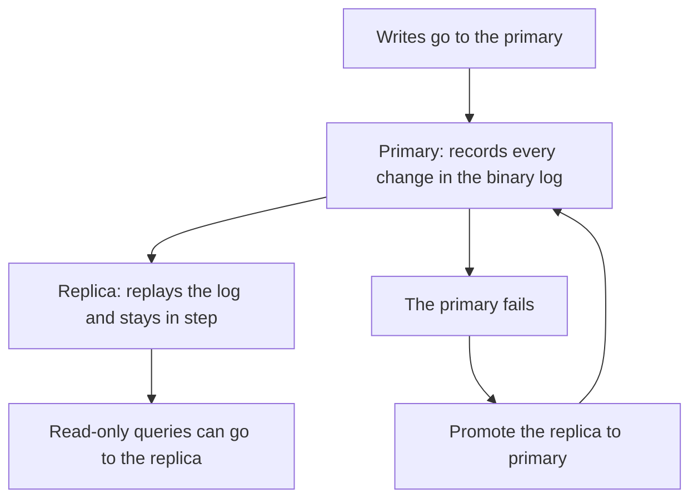

# Replication at a glance

A one-screen memory aid: the diagram, tables and failover command below are everything you need to remember about this module. The detailed worked example is in [`notes.md`](../notes.md) — here we keep only what fits on one page.

**Primary vs replica.** The primary accepts all writes and records every change as a row-level event in its binary log. A replica connects, asks for that log starting at a particular position, and replays every event to stay identical — it stays read-only by default so you don't accidentally write on both machines. If the primary fails, promote a replica by stopping replication and clearing `read_only` so it can accept writes again from the last committed transaction.

> 💡 **Aha:** the two servers never talk to each other after replication starts — they are entirely decoupled. The IO thread reads events one by one and replays them on its own storage without any application-level hooks or `COMMIT` notifications.

### Primary vs replica

| | Primary (source) | Replica |
|---|---|---|
| Accepts writes? | yes | no (kept read-only in practice) |
| Keeps a log? | the binary log of every change | a relay log of what it receives |
| Used for | all changes | read-only queries, backups, failover |

### Async vs semi-sync

| | Asynchronous | Semi-synchronous |
|---|---|---|
| Commit returns after | the primary writes its own log | at least one replica acknowledges |
| Risk | a lagging replica can miss the last change | slower commits, but less to lose |
| Default? | yes | no |

### Failover in one breath

When the primary fails you stop replication on a replica and clear `read_only` so it can accept writes again. In practice: `STOP REPLICA; SET GLOBAL read_only = 0;` — after that, any client connecting to the promoted replica will start receiving new writes from the last committed transaction (which may be less than the primary had if the crash happened before a write could finish).

Next: the worked example is in [`../notes.md`](../notes.md); the full course list is in
[`../../../SYLLABUS.md`](../../../SYLLABUS.md).