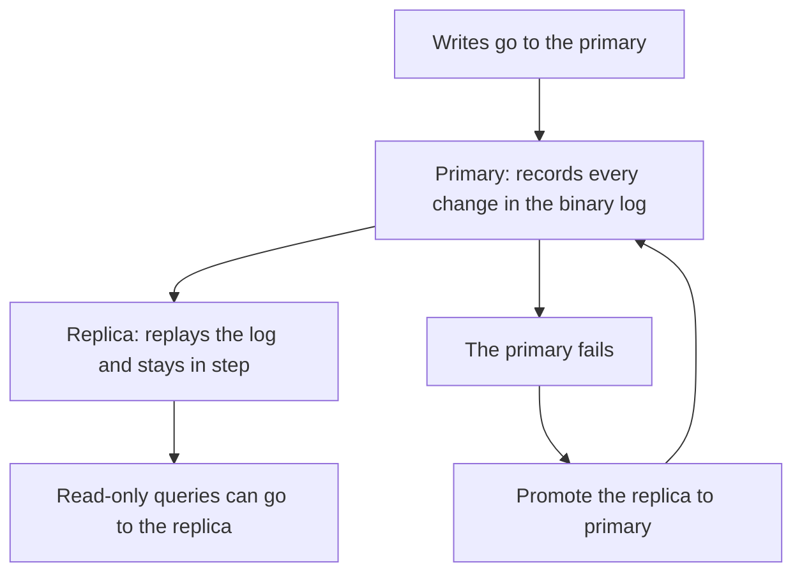

# Module 19 — Replication & High Availability · Notes

## §1 Why one server is a single point of failure

If the café's only MySQL server goes down, nobody can open an order. That is what happens on every production system without a replica: **the entire service dies when one machine falls over.** Keeping a second copy — even just a read-only mirror kept in step with the primary — turns a disaster into a simple pause. The primary keeps serving writes; if it fails you promote the replica by stopping replication and turning off its `read_only` flag so it can accept connections too.

The idea is not new, but the mechanics are worth learning because mistakes on this side of MySQL cause hard-to-fix outages: wrong binary-log positions, missing privileges, authentication failures over TLS. This module walks through every step, including a real drill where you stand up a replica and watch an `INSERT` copy across in seconds.

> 🎯 **Goal:** understand why one server is never enough, then build the second copy yourself.

## §2 The concept — primary, replica and the binary log



A **primary** (also called a *source*) accepts all writes and records every change in its binary log. A **replica** connects to that log, asks for it starting at a particular position, replays every event to stay in step, and stays read-only by default so you don't accidentally double-write. If the primary fails, promote a replica by stopping replication and clearing `read_only` — the database starts accepting writes again from the last committed transaction.

### Vocabulary

| Term | Meaning (in this course's voice) |
|---|---|
| **primary** (source) | The server that accepts writes and keeps the canonical binary log |
| **replica** | A secondary MySQL instance connected to a primary; replays its log to stay in step |
| **binary log** (`binlog`) | Every change on the primary recorded as row-level events, available for replication |
| **replication thread** | On a replica: IO thread reads from the primary's binary log; SQL thread applies each event |
| **position / GTID** | How you tell a replica "start copying at this point" — position is file + offset (fragile); GTID is a transaction id that works even after log rotation |
| **asynchronous** replication (default) | The primary commits without waiting for the replica; faster but the replica can lag |
| **semi-synchronous** replication | The primary waits for at least one replica to acknowledge before committing — slower, less to lose |
| **read replica** | A replica kept read-only to spread query load or do hot backups |
| **failover** | When the primary goes down you stop replication on a replica and clear `read_only` so it can accept writes again |

## §3 Worked example — 8 steps

This section walks through the exact commands that show this server's replication posture, binary-log state and why there is no replica yet. The values shown are examples from the seed database; your own binlog file names, positions and sizes will differ every time you write to the primary. **Read these numbers — they come directly from MySQL on this machine.**

> ⚠️ Gotcha: everything in this section runs as `root` (the admin account) because reading replication state requires the `REPLICATION CLIENT` privilege.

### Step 1 — this server's replication posture in one row

```sql
SELECT
  @@server_id                AS server_id,
  @@log_bin                  AS binlog_on,
  @@binlog_format            AS binlog_format,
  @@gtid_mode                AS gtid_mode,
  @@enforce_gtid_consistency AS enforce_gtid_consistency,
  @@sync_binlog              AS sync_binlog,
  @@log_replica_updates      AS log_replica_updates;
```

| server_id | binlog_on | binlog_format | gtid_mode | enforce_gtid_consistency | sync_binlog | log_replica_updates |
|---|---|---|---|---|---|---|
| 1 | 1 | ROW | OFF | OFF | 1 | 1 |

This server's identity, binary-log settings and GTID posture in one row. The `binlog_format = ROW` means every change is recorded as a before-and-after row image; `gtid_mode = OFF` is normal on a single-server installation (GTID needs at least two servers with different IDs).

### Step 2 — how long binary logs are kept, then the current file and position

```sql
SELECT
  @@binlog_expire_logs_seconds AS expire_seconds,
  @@server_id                  AS server_id;
```

| expire_seconds | server_id |
|---|---|
| 2592000 | 1 |

```sql
SHOW BINARY LOG STATUS;
```

| File | Position | Binlog_Do_DB | Binlog_Ignore_DB | Executed_Gtid_Set |
|---|---|---|---|---|
| binlog.000002 | 12734 |  |  |  |

The primary keeps binary logs for at most 2,592,000 seconds (30 days) then purges the oldest ones automatically. The current file and position are exactly where a replica would start copying from — but these numbers change every time you write to the database, so treat them as **read-only values**, not as things to hardcode anywhere.

### Step 3 — every binary-log file on this server

```sql
SHOW BINARY LOGS;
```

| Log_name | File_size | Encrypted |
|---|---|---|
| binlog.000001 | 2997070 | No |
| binlog.000002 | 12734 | No |

There are two binary-log files on this server: a large historical one (the seed data) and the current active file with only 12 KB of writes. Replication uses whichever file is listed as `binlog` in Step 2.

### Step 4 — is this server itself a replica of another server? No

```sql
SHOW REPLICA STATUS;
```

(empty result set — this server is not a replica)

The command returns nothing because **this machine has no upstream primary**. It is the source, not a copy.

### Step 5 — does this server have any replicas connected to it? None yet

```sql
SHOW REPLICAS;
```

(empty result set — no replica is connected yet)

Again nothing: there are no copies of your database attached to you. That's the starting state for the replication drill in §4, where we build a replica from scratch.

### Step 6 — a small table to watch through the replication drill

```sql
DROP TABLE IF EXISTS practice_repl_demo;
```

```sql
CREATE TABLE practice_repl_demo (
  demo_id INT AUTO_INCREMENT PRIMARY KEY,
  note    VARCHAR(40) NOT NULL
) ENGINE = InnoDB;
```

```sql
INSERT INTO practice_repl_demo (note) VALUES
  ('orders opened'),
  ('first payment');
```

This table has two seed rows. When a replica joins, it will receive these exact inserts as part of the snapshot — we'll see them appear on the replica in Step 7 and then watch new changes copy across later.

### Step 7 — what a replica receives from this server

```sql
SELECT * FROM practice_repl_demo ORDER BY demo_id;
```

| demo_id | note |
|---|---|
| 1 | orders opened |
| 2 | first payment |

These rows exist on the primary. They are exactly what a replica would receive during its initial snapshot — and later, every `INSERT`, `UPDATE` or `DELETE` you write to this table becomes an event in the binary log that the replica replays.

### Step 8 — clean up and confirm shopdb is back to 10 tables

```sql
DROP TABLE practice_repl_demo;
```

```sql
SELECT COUNT(*) AS shopdb_tables
FROM information_schema.tables
WHERE table_schema = 'shopdb';
```

| shopdb_tables |
|---|
| 10 |

The database returns to its original state — exactly 10 tables, no practice data left behind. Net-neutral.

Run Steps 4 and 5 on your own machine (as root) and confirm you get empty result sets the same way this guide does. Replication posture is identical across all `shopdb` instances in this course.

## §4 How it works — the real replication drill

Binary-log replication has two threads running inside each replica: an **IO thread** that reads events from the primary's binary log (authenticated over TLS), and a **SQL thread** that replays them to keep its own data identical. The process goes in four stages: create the account, take a consistent snapshot, point the replica at the primary with a starting position, and start replication.

Every command below comes directly from the MySQL 8 documentation on setting up binary-log replication. Copy them as shown — the binlog file name and position will change each time you write to this server, so read them fresh after Step 6 rather than hardcoding them:

```bash
# 1. Create the replication account a replica will use (needs root).
docker compose exec -T mysql mysql -uroot -proot shopdb -e "CREATE USER IF NOT EXISTS 'replica'@'%' IDENTIFIED WITH caching_sha2_password BY 'replica'; GRANT REPLICATION SLAVE, REPLICATION CLIENT ON *.* TO 'replica'@'%';"
```

Step 1 creates an account that the replica will use to authenticate with this server. `caching_sha2_password` is MySQL's default authenticated password plugin; the replica must connect over TLS (enforced in Step 7). The two privileges — `REPLICATION SLAVE` lets a replica request relay logs and GTID position updates, and `REPLICATION CLIENT` lets it read replication state (`SHOW REPLICA STATUS`).

```bash
# 2. A practice table with one seed row on the primary.
docker compose exec -T mysql mysql -uroot -proot shopdb -e "DROP TABLE IF EXISTS practice_repl_demo; CREATE TABLE practice_repl_demo (demo_id INT AUTO_INCREMENT PRIMARY KEY, note VARCHAR(40) NOT NULL) ENGINE=InnoDB; INSERT INTO practice_repl_demo (note) VALUES ('before replica joined');"
```

This is our practice table with a seed row. It exists on the primary now and will be part of the snapshot we take in Step 3 — when the replica loads the snapshot it receives this row immediately.

```bash
# 3. Take a consistent snapshot of shopdb that records the binlog coordinates in its header.
docker compose exec -T mysql sh -c 'mysqldump -uroot -p"$MYSQL_ROOT_PASSWORD" --single-transaction --source-data=2 --databases shopdb' > replica-seed.sql
```

Step 3 takes a logical backup of `shopdb`. The flags are important: `--single-transaction` opens a single snapshot (so no two sessions see inconsistent data), and `--source-data=2` writes the `CHANGE REPLICATION SOURCE` statement into the dump's header so you can read the exact binlog file and position the replica needs to start from.

```bash
# 4. Start a second MySQL on the same Docker network as the replica (server_id = 2).
docker run -d --name shopdb-replica --network shopdb_default -e MYSQL_ROOT_PASSWORD=root mysql:8 --server-id=2
```

Step 4 starts a new Docker container running MySQL 8 on the same bridge network (`shopdb_default`) as your primary server. `--server-id=2` is required — each replica must have a different ID from every other server that talks to it, or replication will refuse to start with duplicate IDs.

```bash
# 5. Load the snapshot into the replica.
docker exec -i shopdb-replica sh -c 'mysql -h127.0.0.1 -uroot -proot' < replica-seed.sql
```

Step 5 pipes the dump file into the new replica's MySQL server. At this point the replica has a full copy of `shopdb` — but it is **not yet connected to the primary**. It has all the data from before Step 3, and nothing from any change that happened between Step 2 and Step 3 (that gap is exactly what the binlog position in the snapshot header will bridge).

```bash
# 6. Read the file and position the dump recorded.
grep -m1 'CHANGE REPLICATION SOURCE' replica-seed.sql
```

Step 6 extracts the `CHANGE REPLICATION SOURCE` line from the dump header. It tells you exactly which binlog file (`binlog.000002`) and offset (the position, e.g. `19863`) to start copying from. **Read this value yourself — your numbers will be different.**

```bash
# 7. Point the replica at the primary and start copying. (The file and position below are examples — use yours.)
docker exec shopdb-replica mysql -h127.0.0.1 -uroot -proot shopdb -e "CHANGE REPLICATION SOURCE TO SOURCE_HOST='mysql', SOURCE_PORT=3306, SOURCE_USER='replica', SOURCE_PASSWORD='replica', SOURCE_LOG_FILE='binlog.000002', SOURCE_LOG_POS=19863, SOURCE_SSL=1; START REPLICA;"
```

Step 7 is the key command: it tells the replica where to find its primary (`mysql` on port `3306`), which credentials to use, exactly where in the binary log to start copying (from Step 6), and that it must connect over TLS (`SOURCE_SSL=1`). The `START REPLICA` flag immediately begins both replication threads — IO reads from the binlog and SQL replays every event.

```bash
# 8. Confirm both replication threads are running and caught up.
docker exec shopdb-replica mysql -h127.0.0.1 -uroot -proot shopdb -e "SHOW REPLICA STATUS\G" | grep -E 'Replica_(IO|SQL)_Running|Seconds_Behind_Source'
```

Step 8 checks that both threads are running and the replica has no lag (`Seconds_Behind_Source = 0`). If either thread is not `YES` or if there's a gap, check Step 5 (the binlog file/position) or Step 1 (replica privileges).

```bash
# 9. Write a row on the primary...
docker compose exec -T mysql mysql -uroot -proot shopdb -e "INSERT INTO practice_repl_demo (note) VALUES ('after replica joined');"
```

Step 9 writes one more row to the primary — exactly what happens in your web app or CLI tool. The change is immediately recorded in the binary log and will be copied across by the IO thread.

```bash
# 10. ...and read it back on the replica — the change has copied across.
docker exec shopdb-replica mysql -h127.0.0.1 -uroot -proot shopdb -e "SELECT * FROM practice_repl_demo ORDER BY demo_id;"
```

Step 10 reads from the replica and shows all three rows — including the one you just wrote on the primary. The change copied across in seconds (often milliseconds). This is how real production systems keep data identical between machines.

> 💡 **Aha:** replication does not happen because of `COMMIT` or any app-level hook. It happens because every write becomes a row-level event in the binary log, and the replica's IO thread reads those events one by one and replays them on its own storage. The two systems never talk to each other after replication starts — they are entirely decoupled.

```bash
# 11. Tear the drill down and clean up the primary.
docker rm -f shopdb-replica
docker compose exec -T mysql mysql -uroot -proot shopdb -e "DROP TABLE IF EXISTS practice_repl_demo; DROP USER IF EXISTS 'replica'@'%';"
```

Step 11 tears everything down: stops the replica container, drops the practice table and the replication account. Net-neutral — your database is back to its original state with no changes left behind.

## §5 Common errors & fixes

| Code | Message | What to do |
|---|---|---|
| 1227 | `Access denied; you need (at least one of) the REPLICATION CLIENT privilege(s) for this operation` | reading replication state needs `REPLICATION CLIENT` — connect as the admin (`root`) |
| 1064 | `You have an error in your SQL syntax … near 'SLAVE STATUS'` | `SHOW SLAVE STATUS` was removed in MySQL 8.4 — use `SHOW REPLICA STATUS` |
| 1236 | `Got fatal error 1236 … Could not find first log file name in binary log index file` | the replica's `SOURCE_LOG_FILE`/`SOURCE_LOG_POS` no longer exist (purged or rotated) — re-take the snapshot |
| 2061 | `Authentication plugin 'caching_sha2_password' reported error: Authentication requires secure connection` | the replica must connect over TLS — set `SOURCE_SSL=1` (or `SOURCE_GET_PUBLIC_KEY=1`) |

Error 1236 is by far the most common mistake: the binlog file gets rotated or purged and the old position stops existing. Always re-take your snapshot instead of guessing a new file — the header will give you fresh coordinates every time.

## §6 Try it yourself

**Try 1 — this server's identity and logging posture**
```sql
SELECT
  @@server_id     AS server_id,
  @@log_bin       AS binlog_on,
  @@binlog_format AS binlog_format;
```

| server_id | binlog_on | binlog_format |
|---|---|---|
| 1 | 1 | ROW |

**Try 2 — the GTID settings (off on this single server)**
```sql
SELECT
  @@gtid_mode                AS gtid_mode,
  @@enforce_gtid_consistency AS enforce_gtid_consistency;
```

| gtid_mode | enforce_gtid_consistency |
|---|---|
| OFF | OFF |

**Try 3 — is this server read-only? (No: it accepts writes.)**
```sql
SELECT
  @@read_only       AS read_only,
  @@super_read_only AS super_read_only;
```

| read_only | super_read_only |
|---|---|
| 0 | 0 |

> 🧪 **Try it:** run each `SELECT` in your own MySQL session and confirm you get the exact same values. Replication posture is identical across every `shopdb` instance in this course — these are not questions that depend on your machine's hardware or configuration, they are defaults set at server level.

## §7 Going deeper

- **Primary and replica.** The primary accepts writes and records every change in its binary log; a replica connects, asks for that log from a position, and replays it to stay in step.
- **Async vs semi-sync.** By default replication is asynchronous, so a replica can lag by a moment; semi-synchronous replication waits for at least one replica to acknowledge a change before the commit returns — a little slower, less to lose.
- **GTID.** With `gtid_mode = ON` every transaction gets a global id, so a replica can be told "everything after this id" instead of a fragile file-and-position pair.
- **Read replicas and failover.** Copies can serve read-only queries to spread the load; if the primary fails, promote a replica by stopping replication and turning off `read_only`. None of this exists on this single server until you build it in §4.

Be able to explain each of those four bullets in your own words before moving on. You do not need to understand GTID implementation details — knowing that GTID replaces the fragile file-and-position pair is enough.

## References

- [Module 18 — Server Administration & Operations](../18-server-administration-and-operations/README.md)
- [Replication at a glance](assets/replication.md)
- [Course index](../../SYLLABUS.md)