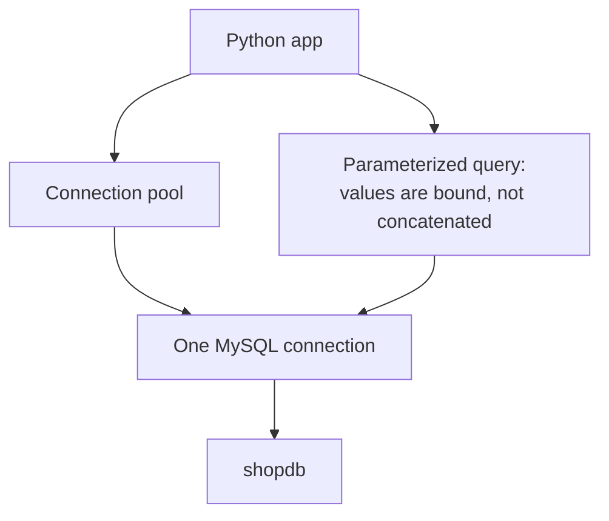

# App connectivity at a glance

This is a one-screen memory aid; the reasoning lives in [`../notes.md`](../notes.md).

The diagram shows the flow: your Python app speaks to a **connection pool**, which hands out warm connections; each connection talks to exactly one MySQL server session in `shopdb`; and parameterized queries bind values separately from SQL so they can never be read as code.

## Bound parameters vs string splicing

| | Bound parameter | String splicing |
|---|---|---|
| Looks like | `WHERE category_id = :cat` | `WHERE category_id = ` + value |
| Safe against SQL injection? | yes | no |
| Server parses it | once, reusable | every time |
| Use it for | every user value | never |

## Pooling

Opening a TCP connection and authenticating is far more expensive than the query itself. A **connection pool** keeps a small number of warm connections ready so your app stays fast under load — instead of opening and closing on every request, it reuses them.

## The least-privilege account

The app connects as `shop`, never `root`. This account can read and write `shopdb` but cannot manage users or other databases, so a bug in the code can't become a catastrophe.

Next: the worked example is in [`../notes.md`](../notes.md); the full course list is in
[`../../../SYLLABUS.md`](../../../SYLLABUS.md).
