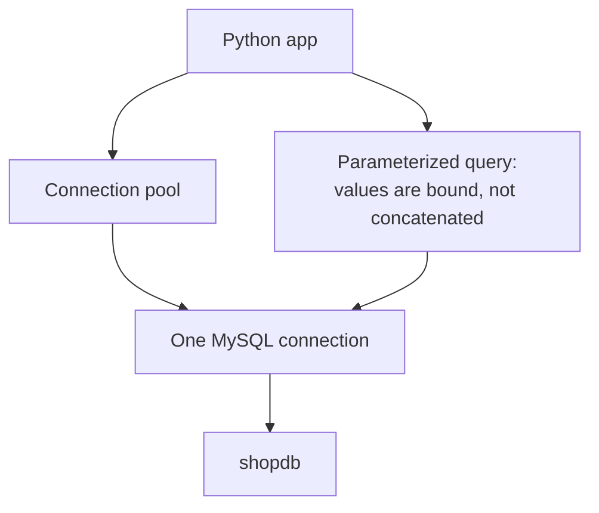

# Module 20 — MySQL from Applications · Notes

## §1 Why the app talks to the database

The café's website and till both talk to the same `shopdb`. When a customer orders online, the order data must land in that very same database so the till can later look it up. The application opens a connection, sends SQL commands, and reads rows back — all from Python code. Think of it as a new waiter handing you a dish: they open a path to the kitchen (the database), place an order (send SQL), and wait for the food (rows returned).

## §2 The concept — connections, pools and parameters



The diagram shows the path: your Python app speaks to a **connection pool**, which hands out warm connections; each connection talks to exactly one MySQL server session; and parameterized queries bind values separately from SQL.

**Vocabulary**

- **Connection** — a TCP link plus authentication between an application and a MySQL server. It has a unique ID, a user identity, and the database it's talking to.
- **Connection pool** — keeps a small number of open connections ready so your app doesn't have to authenticate from scratch on every request. Opening a connection is expensive; reusing one is fast.
- **Driver** — the library that translates Python code into MySQL protocol messages. Here we use PyMySQL, which speaks directly to MySQL.
- **ORM (SQLAlchemy)** — an Object–Relational Mapper. It lets you write queries in Python and converts them to SQL behind the scenes. The toolkit is SQLAlchemy; the driver is PyMySQL.
- **Parameterized statement** — a query with placeholders (`?` or `:name`) where values are bound separately from the SQL text. The server parses the structure once, then binds new values for each execution.
- **Placeholder / binding** — the mechanism that passes user input to the server without ever touching it as part of the SQL string. SQLAlchemy uses `:cat`; MySQL's `PREPARE` uses `?`.
- **SQL injection** — when an attacker injects malicious SQL by splicing values directly into a query string (e.g., `' OR 1=1 --`). Binding prevents this entirely.
- **Least privilege** — connect as an account that only needs what it does: the `shop` user can read and write `shopdb`, but cannot manage users or other databases, so bugs can't become catastrophes.
- **Prepared statement** — a server-side compiled query plan. You prepare the SQL once with placeholders, then execute it multiple times with different bound values. The server reuses the plan; only the parameter values change.

## §3 Worked example — 8 steps

> 💡 Aha: The connection ID and session details change on every run — your own output will differ slightly from these examples. That's normal.

**Step 1** — the connection an application holds: who it is and what it is talking to.

```sql
SELECT
  CONNECTION_ID()      AS connection_id,
  USER()               AS authenticated_as,
  CURRENT_USER()       AS effective_user,
  DATABASE()           AS current_db,
  @@version            AS server_version;
```

| connection_id | authenticated_as | effective_user | current_db | server_version |
|---|---|---|---|---|
| 12 | shop@localhost | shop@% | shopdb | 8.4.11 |

**Step 2** — the server-side limits an application's connection pool must respect.

```sql
SELECT
  @@wait_timeout       AS idle_timeout_s,
  @@max_connections    AS max_connections,
  @@thread_cache_size  AS thread_cache;
```

| idle_timeout_s | max_connections | thread_cache |
|---|---|---|
| 28800 | 151 | 9 |

**Step 3** — a server-side prepared statement: the server binds the parameters, not your string.

```sql
PREPARE find_products FROM 'SELECT product_id, name, unit_price FROM products WHERE category_id = ? ORDER BY product_id';
```

```sql
SET @category_id = 1;
```

```sql
EXECUTE find_products USING @category_id;
```

| product_id | name | unit_price |
|---|---|---|
| 1 | Espresso Blend | 12.50 |
| 2 | House Roast | 10.00 |
| 3 | Decaf | 11.25 |

**Step 4** — reuse the SAME prepared statement with another value: bound, not re-parsed.

```sql
SET @category_id = 2;
```

```sql
EXECUTE find_products USING @category_id;
```

| product_id | name | unit_price |
|---|---|---|
| 4 | Green Tea | 8.00 |
| 5 | Earl Grey | 8.50 |
| 6 | Chai | 9.00 |

**Step 5** — release the prepared statement when the application is done with it.

```sql
DEALLOCATE PREPARE find_products;
```

**Step 6** — an application table to write to (dropped again at the end).

```sql
DROP TABLE IF EXISTS practice_app_demo;
```

```sql
CREATE TABLE practice_app_demo (
  demo_id  INT AUTO_INCREMENT PRIMARY KEY,
  label    VARCHAR(40) NOT NULL,
  qty      INT NOT NULL
) ENGINE = InnoDB;
```

**Step 7** — an app-style parameterized insert: the values are bound, never concatenated.

```sql
INSERT INTO practice_app_demo (label, qty)
VALUES ('bound parameter', 3);
```

```sql
SELECT * FROM practice_app_demo ORDER BY demo_id;
```

| demo_id | label | qty |
|---|---|---|
| 1 | bound parameter | 3 |

**Step 8** — clean up and confirm `shopdb` is back to 10 tables.

```sql
DROP TABLE practice_app_demo;
```

```sql
SELECT COUNT(*) AS shopdb_tables
FROM information_schema.tables
WHERE table_schema = 'shopdb';
```

| shopdb_tables |
|---|
| 10 |

## §4 How it works — the real Python app

The example app uses SQLAlchemy (the toolkit) with the PyMySQL driver. It connects as the `shop` user to `shopdb`, runs a parameterized read, writes to a throwaway table with bound parameters, then drops that table so the database is unchanged. The connection defaults are `127.0.0.1:3310`, user `shop`, password `shop`, database `shopdb` — overridable by environment variables.

First install the two dependencies, then run the app:

```bash
python3 -m pip install -r modules/20-mysql-from-applications/requirements-app.txt
```

```bash
python3 modules/20-mysql-from-applications/app/query_shop.py
```

```text
category 1 products:
  1  Espresso Blend  12.50
  2  House Roast  10.00
  3  Decaf  11.25
practice_app_demo rows: 2
shopdb tables: 10
```

## §5 Common errors & fixes

| Code | Message | What to do |
|---|---|---|
| 1045 | `Access denied for user 'shop'@'localhost' (using password: YES)` | the credentials are wrong — check `DB_USER`/`DB_PASSWORD` and that the container is the one you think it is |
| 2003 | `Can't connect to MySQL server on '127.0.0.1' (port 3310)` | the container is not up or the port is wrong — run `python3 dbctl.py up` and check the mapped port |
| 1054 | `Unknown column 'cat' in 'where clause'` | a placeholder was spliced into the SQL instead of bound — pass parameters through `text(...)` bindings/`?`, never by string-joining |
| 1064 | `You have an error in your SQL syntax … near '?'` | some positions cannot be bound (for example a table name or `LIMIT` in a server-side `PREPARE`) — only *values* can be parameters |

## §6 Try it yourself

**Try 1 — the server's connection limits**

```sql
SELECT
  @@wait_timeout    AS idle_timeout_s,
  @@max_connections AS max_connections;
```

| idle_timeout_s | max_connections |
|---|---|
| 28800 | 151 |

**Try 2 — how many clients are connected right now**

```sql
SHOW GLOBAL STATUS LIKE 'Threads_connected';
```

| Variable_name | Value |
|---|---|
| Threads_connected | 1 |

**Try 3 — the server you are talking to**

```sql
SELECT
  VERSION() AS server_version,
  @@port   AS port;
```

| server_version | port |
|---|---|
| 8.4.11 | 3306 |

## §7 Going deeper

- **Connections are expensive.** Opening a TCP connection and authenticating costs far more than the query itself; a **connection pool** keeps a few warm connections and hands them out, so the app stays fast under load.
- **Parameters, not string-joining.** A value bound with `:name` (SQLAlchemy) or `?` (server-side `PREPARE`) can never be read as SQL — this is what makes an app safe against **SQL injection**.
- **Connect as the least-privilege account.** The app uses `shop`, which may read and write `shopdb` but cannot manage users or other databases, so a bug cannot become a catastrophe.
- **One toolkit, many drivers.** SQLAlchemy is the toolkit; the driver (here **PyMySQL**) is what actually speaks to MySQL. Swapping the driver changes the URL prefix (`mysql+pymysql://`), not the queries.

## References

- [Module 19 — Replication & High Availability](../19-replication-and-high-availability/README.md)
- [App connectivity at a glance](assets/app-connectivity.md)
- [Course index](../../SYLLABUS.md)
