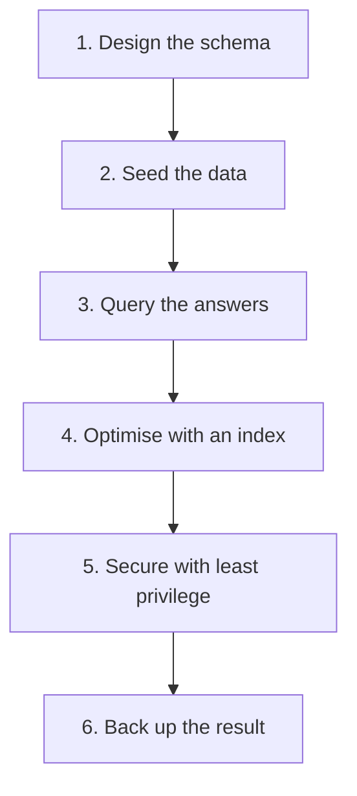

# The capstone at a glance

This one-screen memory aid shows the six stages of an end-to-end database project. The reasoning lives in [`../notes.md`](../notes.md); this is just the map.

This diagram shows a linear workflow: you start by designing your schema, then populate it with realistic data (seed). You query to answer business questions — joins and aggregation are essential here. Before moving on, measure performance with `EXPLAIN`, add an index if needed (`range` beats `ALL`), then secure the system with least-privilege roles. Finally, back up everything so you have a restorable copy for disaster recovery.

## The six stages

| Stage | What you do | Tool |
|---|---|---|
| 1 · Design | tables, keys, types, relationships | `CREATE TABLE` |
| 2 · Seed | load realistic rows | `INSERT` |
| 3 · Query | answer the business question | `SELECT` · `JOIN` · `GROUP BY` |
| 4 · Optimise | measure, then index | `EXPLAIN` · `CREATE INDEX` |
| 5 · Secure | least privilege for the reader | `CREATE ROLE` · `GRANT SELECT` |
| 6 · Back up | keep a restorable copy | `mysqldump` |

## Definition of done

The project is finished when the schema is designed, seeded, queried, optimised, secured and backed up — and the database is left exactly as it was seeded. Every practice table and role you create must be dropped; net-neutral means no orphan data behind you.

Next: the walked-through example is in [`../notes.md`](../notes.md); the full course list is in
[`../../../SYLLABUS.md`](../../../SYLLABUS.md).
