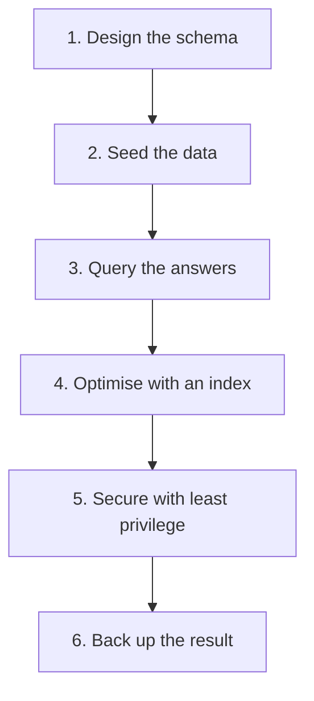

# Module 21 — Capstone · Notes

## §1 Why an end-to-end project

Every skill in the course meets here. You build a tiny system the way you would in a real job: design, seed, query, optimise, secure, back up — then leave everything tidy. The café is your lab; every regular's loyalty card is a table you write and test.

## §2 The project — design to backup



This diagram shows the six stages of a small, end-to-end database project. You start by designing tables and relationships, then populate them with realistic data. Next you query for business answers — joins and aggregation are your friends. Before moving on, read an `EXPLAIN` plan; if it scans everything (`ALL`), add an index to turn it into a range lookup (`range`). Then secure the system with a least-privilege role that can only read. Finally, back up the whole database so you have a restorable copy.

### Vocabulary

| Term | Meaning |
|---|---|
| **schema design** | choosing tables, columns, keys and types before writing data |
| **normalisation** | organising data to avoid duplication and inconsistency (you'll see it in the foreign key) |
| **seed data** | realistic rows inserted into tables so queries have something to work with |
| **index** | a B-tree that speeds up lookups by column; `EXPLAIN` shows whether one is being used |
| **query plan (`EXPLAIN`)** | MySQL's explanation of how it will execute your query — type, key, rows scanned |
| **least privilege** | giving users the minimum permissions they need; a read-only role can't change or delete data |
| **role** | a named set of privileges in MySQL 8 that you grant to applications or users |
| **backup** | a dump of all tables and structure that you can reload with the `mysql` client |
| **restore drill** | loading the backup back into a clean database; confirms it works before disaster strikes |
| **definition of done** | the project is finished when every step above is complete and the database has exactly 10 tables again |

## §3 Worked example — 7 steps

### Step 1 — DESIGN: two related tables for a café loyalty programme.

First, drop any stale practice table from earlier runs, then create the members table with an auto-incrementing primary key and foreign-key-ready structure, and finally create visits that reference members by `member_id`.

```sql
DROP TABLE IF EXISTS practice_loyalty_visits;
```

```sql
CREATE TABLE practice_loyalty_members (
  member_id INT AUTO_INCREMENT PRIMARY KEY,
  name      VARCHAR(60) NOT NULL,
  email     VARCHAR(120) NOT NULL,
  joined_on DATE NOT NULL
) ENGINE = InnoDB;
```

```sql
CREATE TABLE practice_loyalty_visits (
  visit_id   INT AUTO_INCREMENT PRIMARY KEY,
  member_id  INT NOT NULL,
  visited_at DATE NOT NULL,
  spend      DECIMAL(8,2) NOT NULL,
  CONSTRAINT fk_practice_visit_member FOREIGN KEY (member_id) REFERENCES practice_loyalty_members (member_id)
) ENGINE = InnoDB;
```

### Step 2 — SEED: a few members and their visits.

Insert four regulars with realistic dates and emails, then seed eight visits with varying spend amounts to simulate real loyalty behaviour.

```sql
INSERT INTO practice_loyalty_members (name, email, joined_on) VALUES
  ('Aisha Khan',  'aisha@example.com', '2024-01-05'),
  ('Bilal Ahmed', 'bilal@example.com', '2024-02-11'),
  ('Chen Wei',    'chen@example.com',  '2024-03-02'),
  ('Dana Ortiz',  'dana@example.com',  '2024-03-20');
```

```sql
INSERT INTO practice_loyalty_visits (member_id, visited_at, spend) VALUES
  (1, '2024-04-01', 12.50),
  (1, '2024-04-15', 8.00),
  (2, '2024-04-02', 10.00),
  (2, '2024-05-01', 14.00),
  (3, '2024-04-20', 3.75),
  (4, '2024-05-03', 18.00),
  (4, '2024-05-10', 9.00),
  (4, '2024-05-22', 7.50);
```

### Step 3 — QUERY: visits and total spend per member.

A `LEFT JOIN` ensures every member appears even with zero visits; `GROUP BY` aggregates counts and sums; sorting by descending spend shows the top regulars. The output confirms Dana is your most valuable customer at £34.50, followed by Bilal at £24.00.

```sql
SELECT
  m.member_id,
  m.name,
  COUNT(v.visit_id)      AS visits,
  ROUND(SUM(v.spend), 2) AS total_spend
FROM practice_loyalty_members AS m
LEFT JOIN practice_loyalty_visits AS v ON v.member_id = m.member_id
GROUP BY m.member_id, m.name
ORDER BY total_spend DESC;
```

| member_id | name | visits | total_spend |
|---|---|---|---|
| 4 | Dana Ortiz | 3 | 34.50 |
| 2 | Bilal Ahmed | 2 | 24.00 |
| 1 | Aisha Khan | 2 | 20.50 |
| 3 | Chen Wei | 1 | 3.75 |

### Step 4 — OPTIMISE: the plan for a date-range lookup before any index.

Before adding an index, run `EXPLAIN` on a common query pattern. The output shows `type = ALL` (full table scan) and 8 rows examined; without an index, MySQL must read every row to find matches. This is why you measure first — the plan tells you exactly what's happening.

```sql
EXPLAIN SELECT visit_id, member_id, spend
FROM practice_loyalty_visits
WHERE visited_at >= '2024-05-01'
  AND visited_at < '2024-06-01';
```

| id | select_type | table | partitions | type | possible_keys | key | key_len | ref | rows | filtered | Extra |
|---|---|---|---|---|---|---|---|---|---|---|---|
| 1 | SIMPLE | practice_loyalty_visits | NULL | ALL | NULL | NULL | NULL | NULL | 8 | 12.50 | Using where |

### Step 5 — add the index, refresh statistics, and re-read the plan (`ALL` → `range`).

Create an index on `visited_at`, run `ANALYZE TABLE` to update statistics so MySQL knows about the new index, then run `EXPLAIN` again. The type changes from `ALL` to `range`, the key is now `idx_practice_visits_date`, and only 4 rows are examined — half as many, with zero code change.

```sql
CREATE INDEX idx_practice_visits_date ON practice_loyalty_visits (visited_at);
```

```sql
ANALYZE TABLE practice_loyalty_visits;
```

```sql
EXPLAIN SELECT visit_id, member_id, spend
FROM practice_loyalty_visits
WHERE visited_at >= '2024-05-01'
  AND visited_at < '2024-06-01';
```

| id | select_type | table | partitions | type | possible_keys | key | key_len | ref | rows | filtered | Extra |
|---|---|---|---|---|---|---|---|---|---|---|---|
| 1 | SIMPLE | practice_loyalty_visits | NULL | range | idx_practice_visits_date | idx_practice_visits_date | 3 | NULL | 4 | 100.00 | Using index condition |

### Step 6 — SECURE: a read-only role for the reporting tool, least privilege only.

Create a new MySQL role (MySQL 8 feature), then grant `SELECT` on both practice tables to that role. The final `SHOW GRANTS` confirms it has no write permissions — exactly what a reporting application needs and nothing more. This is least privilege: if someone compromises the reporting tool, they can only read data.

```sql
CREATE ROLE IF NOT EXISTS practice_loyalty_reader;
```

```sql
GRANT SELECT ON shopdb.practice_loyalty_members TO practice_loyalty_reader;
```

```sql
GRANT SELECT ON shopdb.practice_loyalty_visits TO practice_loyalty_reader;
```

```sql
SHOW GRANTS FOR practice_loyalty_reader;
```

```text
GRANT USAGE ON *.* TO `practice_loyalty_reader`@`%`
GRANT SELECT ON `shopdb`.`practice_loyalty_members` TO `practice_loyalty_reader`@`%`
GRANT SELECT ON `shopdb`.`practice_loyalty_visits` TO `practice_loyalty_reader`@`%`
```

### Step 7 — TEARDOWN: drop the role and both practice tables; `shopdb` stays at 10 tables.

Drop the role, then drop the two practice tables (children first, so no foreign key blocks the drop). The final count confirms `shopdb` has exactly 10 tables — your net-neutral guarantee is met.

```sql
DROP ROLE IF EXISTS practice_loyalty_reader;
```

```sql
DROP TABLE practice_loyalty_visits;
```

```sql
DROP TABLE practice_loyalty_members;
```

```sql
SELECT COUNT(*) AS shopdb_tables
FROM information_schema.tables
WHERE table_schema = 'shopdb';
```

| shopdb_tables |
|---|
| 10 |

## §4 How it works — the backup and the wrap-up

The lifecycle is a circle: design → seed → query → optimise → secure → back up, then repeat. The database starts with exactly 10 tables; after all seven steps (and teardown), it ends with exactly 10 tables. You leave no orphaned practice data behind.

### backup drill

```bash
# 1. Back up shopdb to a file on your machine (your capstone work would be inside it).
docker compose exec -T mysql sh -c 'mysqldump -uroot -p"$MYSQL_ROOT_PASSWORD" --single-transaction --databases shopdb' > shopdb-backup.sql
```

```bash
# 2. Prove it is a real dump: it starts with the mysqldump header.
head -3 shopdb-backup.sql
```

```bash
# 3. Prove the backup is restorable by loading it back.
docker compose exec -T mysql sh -c 'mysql -uroot -p"$MYSQL_ROOT_PASSWORD"' < shopdb-backup.sql
```

- **Step 1** creates a single-file dump of all databases using `--single-transaction` for a consistent snapshot without locking tables; the shell redirect (`>`) writes it to `shopdb-backup.sql`.
- **Step 2** shows the header — if you see something other than `-- MySQL dump`, the backup tool isn't running correctly.
- **Step 3** pipes the SQL file back into the database, proving it can be restored without corruption.

## §5 Common errors & fixes

| Code | Message | What to do |
|---|---|---|
| 1050 | `Table 'practice_loyalty_members' already exists` | a practice table from an earlier run is still there — start the script with `DROP TABLE IF EXISTS` |
| 1452 | `Cannot add or update a child row: a foreign key constraint fails` | the visit's `member_id` has no matching member — insert the members before the visits |
| 1061 | `Duplicate key name 'idx_practice_visits_date'` | the index already exists — pick another name or `DROP INDEX` it first |
| 1396 | `Operation CREATE ROLE failed for 'practice_loyalty_reader'@'%'` | the role already exists — drop it first, or use `CREATE ROLE IF NOT EXISTS` |

## §6 Try it yourself

**Try 1 — how many products the café sells**

```sql
SELECT COUNT(*) AS products
FROM products;
```

| products |
|---|
| 10 |

**Try 2 — orders by status**

```sql
SELECT
  status,
  COUNT(*) AS orders
FROM orders
GROUP BY status
ORDER BY status;
```

| status | orders |
|---|---|
| cancelled | 1 |
| paid | 4 |
| pending | 1 |
| shipped | 2 |

**Try 3 — confirm the database is back to its baseline**

```sql
SELECT COUNT(*) AS shopdb_tables
FROM information_schema.tables
WHERE table_schema = 'shopdb';
```

| shopdb_tables |
|---|
| 10 |

## §7 Going deeper

- **Design before you type.** Choosing tables, keys and types on paper is cheap; fixing a bad schema after it holds data is not.
- **Measure, don't guess.** `EXPLAIN` shows whether a query scans the whole table or seeks an index — read it before and after each change, exactly as Steps 4–5 do.
- **Least privilege from the start.** A reporting role with `SELECT` only cannot change or drop data, so a compromised tool is a nuisance, not a disaster.
- **A backup you have never restored is only a hope.** Schedule the restore drill (Step 4 of the drill) and check the row counts, so the day you need it is not the day you find it broken.

## References

- [Module 20 — MySQL from Applications](../20-mysql-from-applications/README.md)
- [The capstone at a glance](assets/capstone-project.md)
- [Course index](../../SYLLABUS.md)
